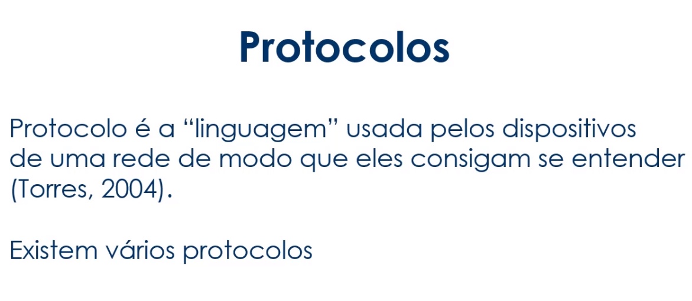
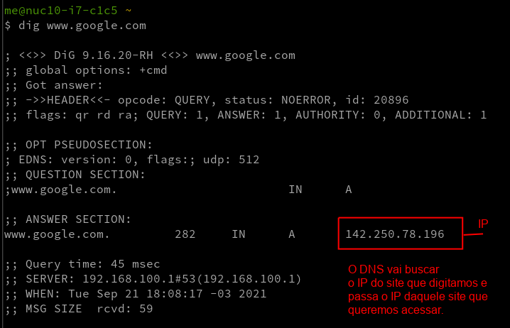
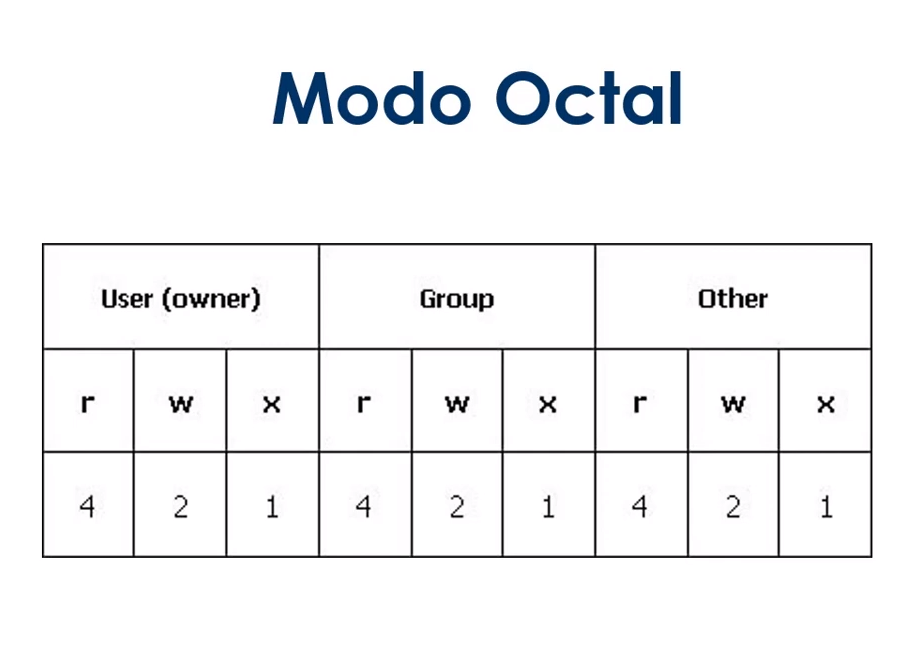
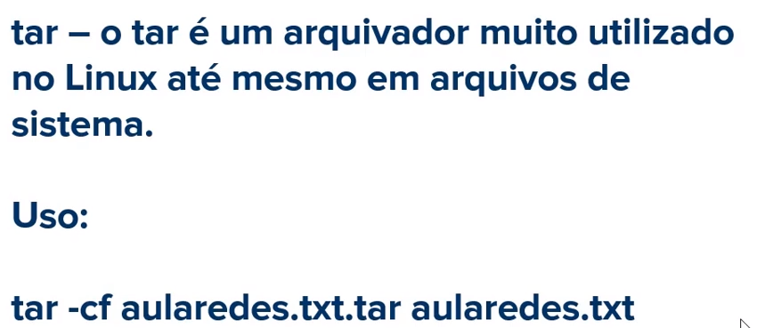
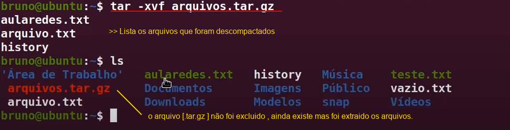

# LINUX FEDORA - CONHECENDO A COMAND-LINE (Linha de comandos)
( Curso base das anotações )https://web.digitalinnovation.one/course/linux-a-introducao-ao-sistema-operacional/learning/e7f619cd-dda9-482a-bd09-88e9b1d26098/ 

># 1 TÓPICO - Introdução ao Linux e configuração inicial

>>**MANIPULANDO O TERMINAL**

***alt+space(TeclaDeEspaço)*** e digita 'terminator' = abre um terminal.

***Ctrl+T*** = abre novas guias de terminal dentro de um terminal já em execução.

***Ctrl+Super*** + 'Setas De Movimentação' < ou > = alterna entre as guias que estão abertas no terminal (a tecla super é a tecla com a logo do Windows).

***Ctrl+W*** = fecha a guia do terminal,mas se caso houver várias guias abertas , esse comando fecha uma guia por vez. 

***Ctrl+Q*** = fecha todas as guias do terminal que estiverem abertas de uma única vez (diferente do Ctrl+W que fecha uma por vez).

***Ctrl+Shift+I*** = Abre um terminal com várias guias contendo vários ramos de desenvolvimento da liferay.

***exit*** = fecha o terminal. 

***clear ou crtl+L*** = limpa o termnal.

>>**Duas formas de Representar /home/me** 

    [Usuario administrador]
    [local/usuario]

    [home/me]             "são os mesmos caminhos 
    [~]             representados de formas diferentes"

-----------------------------------------------------------

    [~] = significa pasta pessoal (~ é o mesmo que >>> /home/me) 

    [/] = onde se encontra o diretório raiz do sistema linux , para guarda as informacões de programas instalados no sistema e também pastas de funcionamento do próprio sistema linux.

***pwd*** = mostra qual o caminho/diretório que está atualmente. 

***history*** = traz o histórico de todos os comandos utilizados em execução do terminal.

***history -c*** = limpa o histórico dos comandos.

***seta ^ 'para Cima Do Teclado'*** = se apertarmos na seta para cima do nosso teclado conseguimos navegar entre esse histórico de comandos - ele vai alternando e mostrando no terminal.

***!!*** = vai repetir o último comando digitado no terminal

***'nome do comando' --help*** =  traz ajuda sobre determinado comando. 

***'nome do comando' --manual*** = traz o manual do comando com as opcões.

***alias 'NomeQueDesejaUsar'='NomeAtualdoComando' / com isso modificamos o comando*** = vai dar um nome ao comando ,podemos através desse comando mudar o comando e personalizá-lo.

># 2 TOPICO - Conhecendo o terminal Linux e seus atalhos

>>**ATALHOS PARA UTILIZAR DENTRO DO TERMINAL**

    Quando entramos em algum editor de texto pelo terminal por exemplo e queremos sair, qual tecla de atalho utilizar ? 
***Ctrl+C*** = cancela o comando atual em funcionamento 

***Ctrl+Z*** = pausa o comando atual, colocando ele em segundo plano, fechando o terminal

***Ctrl+D*** = faz logout da sessao atual, sai do terminal

***exit***= sai do terminal assim como o Crtl+d

>>**Escrevendo no terminal e manipulando O QUE FOI ESCRITO**

***Ctrl+W*** = apaga uma palavra na linha atual

***Ctrl+U*** = apaga a linha inteira

***Ctrl+R*** = busca um comando recente

***!!*** = repete o ultimo comando

>>**NAVEGANDO ENTRE DIRETORIOS(PASTAS)/ARQUIVOS**

***cd 'NomeDaPasta'*** =  Vai mover entre os diretórios/pastas 

***cd ..*** = os dois pontos indica que queremos voltar uma pasta, (retornar). 

***cd*** ou ***[cd ~]*** = se for o comando apenas com cd + espaco em branco  ele vai retornar para o diretório /home/me

***cd /*** = vai retornar para o diretorio raiz do Linux 

    [man cd] ou  [cd --help] = manual do comando - vai listar todas as opcões do comando 

>>**LISTANDO OS DIRETÓRIOS (PASTAS)/ARQUIVOS**

***ls*** = Lista as pastas de uma Diretório que estamos acessando

***ls -la ou la*** = lista os diretórios e os arquivos existentes na pasta, tanto as pastas/arquivos visiveis, quanto ocultos que inicia o nome com (.)

***ls -l*** = lista diretorios e arquivos com detalhes assim com o -la , so que nao mostra arquivos ocultos 

    outra opcão- pode ser usado junto com o nome da pasta que voce deseja listar , exemplo abaixo 
***ls 'NomeDiretorio'*** - nesse caso não vai entrar na pasta ele apenas vai listar a pasta que foi especificada e continua no local atual

    [man ls] ou  [ls --help] = manual do comando - vai listar todas as opcões do comando.

>>**CRIANDO DIRETÓRIOS(PASTAS) E EXCLUINDO**

***mkdir 'NomeDaPasta'*** =  cria pastas (diretórios) 

***rmdir*** = especifico para remover um diretório , se existir arquivos dentro da pasta ele não funciona, só funciona para pastas vazias.

***rm -r*** = remove diretórios com a opcão -r (recursiva)forca a remocão, nesse segundo caso conseguimos apagar a pasta com os arquivos dentro.

    [rm -r *]  apaga todos os arquivos de uma pasta.

>>**RENOMEANDO E MOVENDO DIRETÓRIOS(PASTAS) E ARQUIVOS**

***mv 'NomeDaPastaOuArquivo'*** [mv NomeAtual novoNome]= Vai renomear uma pasta ou arquivo

***mv NomeDaPasta caminho*** [mv Nome/ caminho da pasta] - vai receber o arquivo vai mover um arquivo/diretorio(pasta)atual para o caminho que ficou determinado.

>>**CRIANDO ARQUIVOS, COPIANDO, EDITANDO,VISUALIZANDO E REMOVENDO**

***touch 'Nome'*** = cria arquivos vazios

***echo "conteudo do arquivo" > NomedoArquivo*** = escreve um conteudo e coloca dentro do arquivo , se o arquivo já existe ele coloca o contéudo dentro, se o arquivo ainda não existia ele cria na hora.

***cat 'Nomedoarquivo' ou more 'Nomedoarquivo'*** = esses dois comando podem ser utilizados para mostrar no terminal o conteudo de um arquivo de texto

***nl NomedoArquivo*** =  mostra o conteudo do arquivo assim como o [cat] , mas ele tras a numeracão das linhas.

    Outra forma de ver o numero de linhas de um arquivo é com o comando [wc -l NomedoArquivo] , vai contar com as linhas em branco, diferente do nl que tras o numero de linhas que tem algo escrito, sem contar as linhas em branco.

***wc -l NomedoArquivo*** = traz os números de linhas , contando com as linhas em branco. 

    mais informacoes em [wc --help]

***rm 'NomedoArquivo'*** = remove um arquivo

***cp 'Nomedoarquivo' 'Diretorio' ou 'nome ao arquivo'*** = se colocar o diretorio para onde quer copiar ele vai com o nome do arquivo original , mas se usar no lugar de um diretorio o nome do arquivo , ele copia e nomeia com aquele nome que voce escolheu. [cp NomedoArquivo 'nome']

    >>> RESUMO DOS COMANDOS <<< 

># 3 TOPICO - Comandos para manipulação de arquivos e textos e redirecionamento

>>**MANIPULANDO ARQUIVOS PELO TERMINAL**

**EDITORES**

NANO = ***nano***

VIM = ***vi***

SUBLIME = ***osub***

ViSUAL STUDIO CODE = ***code .***

>>**[COMANDOS DE MANIPULACAO]**

***cat 'nome do arquivo'*** =  mostra o conteudo do arquivo na tela do terminal 

***tac'nome do arquivo'*** = tambem mostra o contéudo na tela, mas esse comando inverte as linhas do texto.

***head'nome do arquivo'*** = mostra as 10 primeiras linhas de um arquivo

***tail'nome do arquivo'*** = mostra as 10 ultimas linhas de um arquivo

>>**[COMANDOS DE REDIRECIONAMENTO]** criando novos arquivos

***head 'nome do arquivo' > NomeDoArquivoNovoque VaiserCriado***

 ou 

***tail 'nome do arquivo' > NomeDoArquivoNovoque VaiserCriado*** = vai pegar as 10 linhas e colocar dentro desse arquivo novo, criando um novo arquivo com aquele contéudo que foi listado.

>>**[REDIRECIONANDO INFORMACõES DE COMANDOS]**

***cal*** =  mostra o calendario 

e se quisermos criar um arquivo com isso que foi impresso no terminal, como fazer ? com REDIRECIONAMENTO ! :)

***cal > 'NomeDoArquivo'*** = é criado um arquivo com a informacão que o comando mostra no terminal.

 nesse caso vai mostrar o calendario, mas pode ser utilizado por qualquer comando que traga informacoes na tela do terminal

>>**[ADICIONANDO INFORMACOES A UM ARQUIVO EXISTENTE]**

***date*** = mostra a data

e se quisermos colocar a informação que esse comando trouxe , dentro do arquivo que foi criado anteriormente com as informações do calendario ? utilizamos o comando seguido de >> e o nome do arquivo

***date >> 'NomeDoArquivo'***  =  vai colocar as informações de ***date*** dentro do arquivo que já existia

>>**[SUBSTITUINDO INFORMAçõES DE UM ARQUIVO EXISTENTE]**

***cal 2021 > 'NomeDoArquivoExistente'*** vai substitui as informacões que ja existiam em um arquivo pelas informacoes novas do comando que foi utilizado para mostrar o conteudo no terminal.

QUANDO PEGAMOS UMA SAIDA , E EXIBIMOS O CONTEUDO  

    *SE QUISERMOS CRIAR UM ARQUIVO OU SUBSTITUIR UTILIZA O [>]

    *SE QUISERMOS ADICIONAR COISAS A UM ARQUIVO JÁ EXISTENTE [>>]

>>**[OPERADORES DE REDIRECIONAMENTO - UTILIZANDO A BARRA '|' PARA FAZER O USO DE 2 COMANDOS]**

***grep 'nome do termo quer pesquisar' 'nomedoarquivo.txt'***

***cat 'NomeDoArquivo' | grep 'nome do termo quer pesquisar'*** =  o comando grep vai fazer uma busca por algum termo dentro do arquivo e vai exibir os termos encontrados.

    FOI UTILIZADO 2 COMANDOS , O *cat* PARA MOSTRAR O ARQUIVO , E O *grep* PARA BUSCAR UM TERMO DENTRO DO ARQUIVO e exibi-lo.

***cat 'NomeDoArquivo' | more*** = vai mostrar o conteudo paginado,e logo embaixo aparece uma informaÇão [mais]indicando que existe mais contéudo para ser rolado descendo.

    Voce vai descendo o texto com as setas do teclado, e o arquivo vai passando pelas páginas até se findar e volta para o terminal.

***cat 'NomeDoArquivo' | less*** = também faz a paginacão,a diferenca é que ele nao mostra o [mais]indicando que existe mais conteudo descendo, fica mostrando : - e quando chega no final ele nao volta para o terminal.

    e para sair desse modo , tem que utilizar o ***Crtl + Z***vai parar a exibição e  voltar ao terminal.

>>**[OPERADORES DE REDIRECIONAMENTO - UTILIZANDO & / && ]**

***cat 'NomeDoArquivo' & cat 'NomeDoArquivo'*** = separa por linha de terminal o resultado , quando digitarmos Enter ele finaliza.

***cat 'NomeDoArquivo' && cat 'NomeDoArquivo'*** = uma unica linha de de terminal exibindo os resultados.

***mkdir linux_ubuntu && cd linux_ubuntu*** = vai criar e ja vai entrar na pasta que acabou de ser criada.

>>**[COMANDO FILE]**

***file 'NomedoArquivo ou pasta'*** = esse comando vai mostrar qual tipo de arquivo. vai trazer informações sobre o tipo do arquivo.

    >>> RESUMO DOS COMANDOS <<< 

---

># 4 TOPICO - Diretórios do Linux e Comandos de Sistema

    **[DIRETORIOS DO LINUX]**
    COMO IR PARA ESSE DIRETORIO ? 
    COM O [cd /]

---

    **[COMANDOS DO SISTEMA LINUX]** comandos para buscar informacões do sistema

># 5 TOPICO - Fundamentos de Rede e Comandos de Rede

>>**FUNDAMENTOS DE REDE**

**O que é rede ?**

    Conjunto de equipamentos interligados de maneira a trocarem informações e compartilharem recursos, como arquivos de dados gravados, impressoras, modems , softwares e outros equipamentos.

Cada equipamento que existe dentro dessa rede ,é chamada de "nó" são os pontos de rede.

>>**SÃO SEPARADAS EM GRANDES REDES**

    REDE WAN = É UMA REDE GEOGRAFICAMENTE DISTRIBUIDA - LIGA UM CONTINENTE A OUTRO CONTINENTE

    REDES MAN =  DENTRO DAS REDES WAN , NÓS TEMOS AS REDES MAN, QUE INTERLIGAM VÁRIAS REDES LOCAIS

    REDES LAN = DENTRO DAS REDES MAN , NÓS TEMOS AS REDES LAN. É UMA REDE LOCAL 

Para que essas redes se comuniquem , existem alguns tradutores que fazem a comunicação. 

    OS PROTOCOLOS SÃO AS LINGUAGENS - CONCEITO ABAIXO 

    PROTOCOLOS - OS 3 PRINCIPAIS

-------------------------
    Para que esses protocolos se comuniquem existem as interfaces. 

    para fazer a instalacão de pacotes(programas) em nosso computador, usamos o comando [sudo su] para entrar no usuario ROOT, ou podemos digitar [sudo dnf install "nome do programa"] que ele vai pedir a permissão com a senha do usuário.

***sudo su*** = entrar no super usuário,(ROOT)  e podemos passar o comando para instalacão [dnf install 'nome do programa']

***sudo dnf install 'nome do programa'*** =  ja vai tentar fazer o comando direto , e pede a senha para confirmar.

>>**COMANDOS DE REDE**

    Para que saibamos o ip da nossa máquina. passamos o comando [ipconfig]

***ipconfig ou nmcli*** = vai mostrar a inteface de rede e listar as informacões da rede , e podemos ver o IP de nossa máquina

***hostname*** = traz informações de nome do computador na rede.

***hostname -I*** = traz o endereco IPv4 na rede e o loopback 

***hostname -i*** = traz o endereco IPv6 o IPv4  na rede e o loopback

***who*** = traz informações de como estamos logado nesta rede

***whoami***=  traz o nome de usuário logado na rede

***whois*** =  traz informações mais detalhadas sobre o Domínio.

***ping "www.pagina que deseja fazer o ping*** =  faz parte do protocolo icmp , envia mensagens de controle para um determinado host, verificando se este host esta ativo ou inativo.

    para finalizar o ping - tecla de atalho [Ctrl+Z] ou [Ctrl+C]

    [ping --help]  veremos outras opcoes do comando

***dig*** = tras informacões sobre DNS , que são os caminhos de rede. é o serviço de nomes de domínios -DNS vai trazer o IP do site que queremos acessar.

    O DNS transforma esse nome que eu digitei (nome do site) em IP para buscar esse site no servidor.
    
      como se fosse o nome da pessoa e o IP é a identidade da pessoa. então quando digitamos o nome do site ele vai buscar a identidade daquele site , que no caso é o IP

***dig 'NomeDoSite' + short*** = vai mostrar somente o endereco IP do site.

***traceroute 'NomeDoSite'*** = traca a rota da nossa rede , mostra informações dos 'nó' que existem até o site ,o caminho que percorre em nossa rede ate chegar no site. 

***finger*** = traz informações do usuário que está logado no nosso host.

    RESUMO DOS COMANDOS

># 6 Topico - Fuçando no Linux com comandos diversos

***last reboot*** = informacoes sobre reinicializacão do sistema

***route -n*** = mostra todas as tabelas  de roteamento do IP do kernel

***time [comando]*** = mostra o tempo do processo de um comando

***uptime*** = mostra o tempo que o sistema esta rodando

***cowsay*** ou ***xcowsay*** ou ***cmatrix***  = traz animações no terminal

***halt*** = pede uma autenticacao para desligar a maquina

***init 0*** ou ***poweroff*** ou ***telinit 0***= desliga a maquina

***seq '1 10'*** = imprime uma sequencia de números

    RESUMO DOS COMANDOS

># 7 Topico - Controle de usuários, grupos e permissões

usuario ROOT é o que tem mais privilegios dentro do sistema

>>**ADICIONANDO USUÁRIO E MODIFICANDO SENHAS**

***sudo adduser*** = vai adicionar um usuario novo no sistema

***su 'NomedoUsuario'*** = alterna entre o usuario

***passwd 'NomeUsuario'*** = muda a senha do usuario

>>**COMO EXIBIR INFORMAÇÕES DE LOGIN E REMOVER UM USUÁRIO**

***lastlog*** = traz informaçÕes de login dos Usuários existentes no sistema, quando foi logado, quais foram os usuários que se logaram. 

***last*** = traz todos os registros de usuário quando foi inicializado o sistema e quando foi finalizado.informações do usuario que esta logado na máquina. 

    diferente do outro comando 'lastlog' que traz informaçÕes de todos os usuários existentes.

***logname*** =  exibe o nome do Usuário atual logado no sistema.

***id*** = exibe todos os identificadores do usuário,mostra os grupos há que este usuário pertence.

***cat/etc/passwd*** = exibe todos os usuários do sistema

***userdel -r 'NomeDoUsuário'*** =  remove um usuário e a pasta pessoal do mesmo 

>>**COMO CRIAR UM GRUPO E GERENCIAR OS USUÁRIOS**

    OS GRUPOS PERMITEM ORGANIZAR OS USUÁRIOS E DEFINIR AS PERMISSÕES DE ACESSO A ARQUIVOS E DIRETÓRIOS DE FORMA MAIS FÁCIL

***cat/etc/group*** = exibe todos os grupos do sistema.

***groups*** = exibe os grupos que o usuário pertence.

***addgroup 'nome'*** = cria um grupo.

***adduser 'usuario''grupo' ou //  gpasswd -a 'usuario' 'grupo'*** = adiciona um usuário a um grupo.

***gpasswd -d 'usuario' 'grupo'*** =  remove um usuário de um grupo.

***groupdel 'nome'*** = remove um grupo

>>**COMO GERENCIAR PERMISSÕES EM DIRETÓRIOS - MODO OCTAL**

>>**CONTROLE DE PERMISSÕES**

***ls -lh*** = verificar permissões em um diretório

>> **MODO OCTAL**

---

***chmod + 'oNumeroOctal'*** = mudar a permissão de um arquivo ou diretório.

    RESUMO DOS COMANDOS

># 8 Topico -Compactação, descompactação e arquivamento

    COMPACTADORES SÃO PROGRAMAS QUE DIMINUEM O TAMANHO DE UM ARQUVIO OU DIRETÓRIO, com a finalidade de envia-lo com mais rapidez quando for compartilhar na rede , ou apenas para dinimuir o tamanho e ocupar menos espaço na máquina

>> **COMANDOS GZIP , ZIP E BZIP2**

* GZIP

***gzip 'NomedoArquivo'*** = para compactar arquivos.

***gunzip 'NomedoArquivo'*** = para descompactar o arquivo

***gzip -9 'NomedoArquivo'*** = usa a compactação Máxima

* ZIP 

***zip 'nomeDoArquivoqueSereGerado' 'NomedoArquivoQuevaiCompactar'*** = vai compactar o arquivo

***unzip 'nomeDoArquivo'*** = vai descompactar o arquivo

* BZIP2

***bzip2 'NomedoArquivo'*** = vai compactar o arquivo

***bzip2 -d 'NomedoArquivo'***

>> **ARQUIVADORES**

***tar -cf 'NomedoArquivoGerado' 'NomedoarquivoParaArquivar*** = vai arquivar os arquivos em uma pasta

    compactando o arquivo que acabou de ser arquivado com .tar

    como Descompactar esse arquivo que agora esta como [.tar.gz] ? com o proprio comando "tar -xvf" 

***tar -xvf 'NomedoArquivoGerado.tar.gz'*** = vai descompactar os arquivos

    foi descompactado, os arquivos foram listados e extraidos da pasta [.tar.gz]

    se eu quiser indicar o local onde os arquivos devem ser colocados apos ser extraido utiliza-se a opção[ -C 'o local onde vai os arquivos'] 

    A sintaxe fica assim [tar -xvf 'NomedoArquivoGerado.tar.gz' -C 'o local onde vai os arquivos']

    RESUMO DOS COMANDOS

># 9 Topico -Gerenciamento de pacotes

>>**INSTALAÇÃO ,ATUALIZAÇÃO REMOÇÃO DE PACOTES**

* PACOTES

são programas colocados dentro de um arquivo identificados por sua extensão, e incluem arquivos necessários para a instalação de programas.

Extensão [.deb] [.rpm]

* GERENCIADORES

são sistemas que possuem resolução automática de dependencias entre pacotes, método fácil de instalação de pacotes.

Exemplos de Gerenciadores [dpgk] [apt] [yum] [dnf]

    Comandos dos gerenciadores para instalar os pacotes

***sudo apt install 'NomePacote'*** = faz a instalação do pacote

***sudo apt upgrade 'NomePacote'*** = faz a atualização do pacote

***sudo apt remove 'NomePacote'*** = remove o pacote (desinstalação do programa)

>**ATUALIZAÇÃO DE SISTEMA E O COMANDO DPKG**

>**UBUNTU -Gerenciadores** [.deb]

***sudo apt update && apt upgrade*** = atualiza o sistema e em seguida os pacotes instalados.

* Sites de Pacotes

pkgs.org

rpm.pbone.net

    Para instalar pacotes do tipo .deb , temos o comando [dpkg]

***sudo dpkg -i 'NomeDoPacote.deb'*** = para instalação do pacote [esse comando tem que ser feito na pasta onde foi baixado o arquivo]

***sudo dpkg -I 'NomeDoPacote.deb'*** = traz informações do pacote.

***sudo dpkg -r 'NomeDoPacote' - não usa a extensao .deb'*** = remove o pacote [desinstalação do programa]

>**FEDORA -Gerenciadores** [.rpm]

* Comandos Rpm e Yum

Para instalar pacotes do tipo .rpm , temos o comando [rpm -ivh 'nome do pacote']

***sudo rpm -ivh 'NomeDoPacote.rpm'*** = para instalação do pacote [esse comando tem que ser feito na pasta onde foi baixado o arquivo] 

    se caso der algum erro de Dependencias usar o comando com a opção [--nodeps]

***sudo rpm -ivh --nodeps 'NomeDoPacote.rpm'*** = vai resolver o erro de dependencias

***sudo rpm -U 'NomedoPacote.rpm'*** =  vai trazer as atualizações do pacote 

***sudo rpm -e 'NomedoPacote.rpm'*** = vai fazer a remoção do pacote [desinstalação do programa]

    PODE SER UTILIZADO TANTO O COMANDO [YUM] OU [DNF]

***sudo yum install 'NomedoPacote'*** = instalacao do pacote [instalação do programa]

***sudo yum update 'NomedoPacote'*** = atualização do pacote

***sudo yum remove 'NomedoPacote'***

    RESUMO DOS COMANDOS

 

