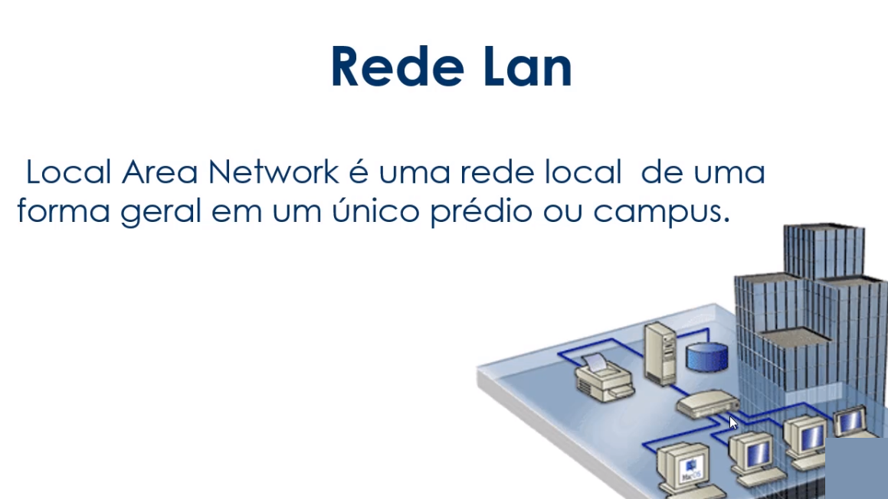

># LINUX FEDORA - ***CONHECENDO A COMAND-LINE*** 
( Curso base das anotacoões ) https://web.digitalinnovation.one/course/linux-a-introducao-ao-sistema-operacional/learning/e7f619cd-dda9-482a-bd09-88e9b1d26098/ 

># 1 TOPICO - Introdução ao Linux e configuração inicial

>**MANIPULANDO O TERMINAL**

***alt+space*** e digita _terminator_ = abre um terminal

***Ctrl+T*** = abre novas guias de terminal dentro de um terminal ja em execucao.

***Ctrl+Super*** (o super é a tecla com a logo do Windows) + Setas De Movimentacao Do Teclado < ou > = alternar entre as guias que estão abertas no terminal

***Ctrl+W*** = fecha a guia do terminal ,mas se caso houver varias guias abertas , esse comando fecha uma guia por vez. 

***Ctrl+Q*** = fecha todas as guias do terminal que estiverem abertas de uma única vez

***Ctrl+Shift+I*** = Abre um terminal com varias guias com varios ramos de desenvolvimento da liferay

***exit*** = fecha o terminal 

***clear ou crtl+ L*** = limpa o termnal

>**São duas formas de representar o mesmo caminho** 

    [Usuario administrador]
    [local/usuario]
    [home/me]
    [~]
---
    [~] = significa pasta pessoal (~ é o mesmo que >>> /home/me ) 

    [/] = onde se encontra o diretório raiz do sistema linux , para guarda as informacões de programas instalados no sistems e também pastas de funcionamento do próprio sistema linux.

***pwd*** = mostra qual o caminho que está atualmente 

***history*** = tras o histórico de todos os comandos utilizados em execucão do terminal.

***seta ^ para Cima Do Teclado*** = se apertamos na seta para cima do nosso teclado conseguimos navegar entre esse historico de comandos- ele vai alternando e mostrando no terminal.

***!!*** = vai repetir o último comando digitado no terminal

***'nome do comando' --help*** =  traz ajudas sobre determinado comando. 

***'nome do comando' --manual*** = traz o manual do comando com as opcões.

># 2 TOPICO - Conhecendo o terminal Linux e seus atalhos

>**ATALHOS PARA UTILIZAR DENTRO DO TERMINAL**

    Quando entramos em algum editor de texto pelo terminal por exemplo e queremos sair, qual tecla de atalho utilizar ? 
***Ctrl+C*** = cancela o comando atual em funcionamento 

***Ctrl+Z*** = pausa o comando atual, colocando ele em segundo plano

    fechando o terminal

***Ctrl+D*** = faz logout da sessao atual, sai do terminal

***exit***= sai do terminal assim com o Crtl+d

    escrevendo no terminal e manipulando O QUE FOI ESCRITO
***Ctrl+W*** = apaga uma palavra na linha atual

***Ctrl+U*** = apaga a linha inteira

***Ctrl+R*** = busca um comando recente

***!!*** = repete o ultimo comando

>**NAVEGANDO ENTRE DIRETORIOS(PASTAS)/ARQUIVOS**

***cd 'NomeDaPasta'*** =  Vai mover entre os diretörios(pastas) 

***cd ..*** = os dois pontos indica que queremos voltar uma pasta, retornar 

***cd*** ou ***[cd ~]*** = se for o comando apenas com cd + espaco em branco  ele vai retornar para o diretório /home/me

***cd /*** = vai retornar para o diretorio raiz do Linux 

    [man cd] ou  [cd --help] = manual do comando - vai listar todas as opcões

>**LISTANDO OS DIRETÓRIOS (PASTAS)/ARQUIVOS**

***ls*** = Lista as pastas de uma Diretório que estamos acessando

***ls -la ou la*** = lista os diretórios e os arquivos existentes na pasta, tanto as pastas/arquivos visiveis, quanto ocultos que inicia o nome com (.)

***ls -l*** = lista diretorios e arquivos com detalhes assim com o -la , so que nao mostra arquivos ocultos 

    outra opcão- pode ser usado junto com o nome da pasta que voce deseja listar
***ls 'NomeDiretorio'*** - nesse caso não vai entrar na pasta ele apenas vai listar a pasta que foi especificada e continua no local atual

    [man ls] ou  [ls --help] = manual do comando - vai listar todas as opcões.

>**CRIANDO DIRETÓRIOS(PASTAS) E EXCLUINDO**

***mkdir 'NomeDaPasta'*** =  cria pastas (diretórios) 

***rmdir*** = especifico para remover um diretório , se existir arquivos dentro da pasta ele não funciona, só funciona para pastas vazias.

***rm -r*** = remove diretórios com a opcão -r (recursiva)forca a remocão, nesse segundo caso conseguimos apagar a pasta com os arquivos dentro.

    [rm -r *]  apaga todos os arquivos de uma pasta.

>**RENOMEANDO E MOVENDO DIRETÓRIOS(PASTAS) E ARQUIVOS**

***mv 'NomeDaPastaOuArquivo'*** [mv NomeAtual novoNome]= Vai renomear uma pasta ou arquivo

***mv NomeDaPasta caminho*** [mv Nome/ caminho da pasta] - vai receber o arquivo vai mover um arquivo/diretorio(pasta)atual para o caminho que ficou determinado.

>**CRIANDO ARQUIVOS, COPIANDO, EDITANDO,VISUALIZANDO E REMOVENDO**

***touch 'Nome'*** = cria arquivos vazios

***echo "conteudo do arquivo" > NomedoArquivo*** = escreve um conteudo e coloca dentro do arquivo , se o arquivo já existe ele coloca o contéudo dentro, se o arquivo ainda não existia ele cria na hora.

***cat 'Nomedoarquivo' ou more 'Nomedoarquivo'*** = esses dois comando podem ser utilizados para mostrar no terminal o conteudo de um arquivo de texto

***rm 'NomedoArquivo'*** = remove um arquivo

***cp 'Nomedoarquivo' 'Diretorio' ou 'nome ao arquivo'*** = se colocar o diretorio para onde quer copiar ele vai com o nome do arquivo original , mas se usar no lugar de um diretorio o nome do arquivo , ele copia e nomeia com aquele nome que voce escolheu. [cp NomedoArquivo 'nome']

    >>> RESUMO DOS COMANDOS <<< 

># 3 TOPICO - Comandos para manipulação de arquivos e textos e redirecionamento

>**MANIPULANDO ARQUIVOS PELO TERMINAL**

**EDITORES**

NANO = ***nano***

VIM = ***vi***

SUBLIME = ***osub***

ViSUAL STUDIO CODE = ***code***

>**[COMANDOS DE MANIPULACAO]**

***cat 'nome do arquivo'*** =  mostra o conteudo do arquivo na tela do terminal 

***tac'nome do arquivo'*** = tambem mostra o conteudo na tela, mas esse comando inverte as linhas do texto

***head'nome do arquivo'*** = mostra as 10 primeiras linhas de um arquivo

***tail'nome do arquivo'*** = mostra as 10 ultimas linhas de um arquivo

>**[COMANDOS DE REDIRECIONAMENTO]** criando novos arquivos

***head 'nome do arquivo' > NomeDoArquivoNovoque VaiserCriado***

 ou 

***tail 'nome do arquivo' > NomeDoArquivoNovoque VaiserCriado*** = vai pegar as 10 linhas e colocar dentro desse arquivo , criando um novo arquivo com aquele conteudo que foi listado.

>**[REDIRECIONANDO INFORMACõES DE COMANDOS]**

***cal*** =  mostra o calendario 

e se quisermos criar um arquivo com isso que foi impresso no terminal, como faze ? com REDIRECIONAMENTO

***cal > 'NomeDoArquivo'*** = é criado um arquivo com a informacão que o comando mostra no terminal.

 nesse caso vai mostrar o calendario, mas pode ser utilizado por qualquer comando que traga informacoes na tela do terminal

>**[ADICIONANDO INFORMACOES A UM ARQUIVO EXISTENTE]**

***date*** = mostra a data

e se quisermoscolocar a inforacão que esse comando trouxe , dentro do arquivo que foi criado anteriormente com as informacoes do calendario? utilizamos o comando seguido de >> e o nome do arquivo

***date >> 'NomeDoArquivo'***  =  vai colocar as informacões de ***date*** dentro do arquivo que ja existia

>**[SUBSTITUINDO INFORMACOES DE UM ARQUIVO EXISTENTE]**

***cal 2021 > 'NomeDoArquivoExistente'*** vai substitui as informacões que ja existiam em um arquivo pelas informacoes novas do comando que foi utilizado para mostrar o conteudo no terminal.

QUANDO PEGAMOS UMA SAIDA , E EXIBIMOS O CONTEUDO  

    *SE QUISERMOS CRIAR UM ARQUIVO OU SUBSTITUIR UTILIZA O [>]

    *SE QUISERMOS ADICIONAR COISAS A UM ARQUIVO JA EXISTENTE[>>]

>**[OPERADORES DE REDIRECIONAMENTO - UTILIZANDO A BARRA '|' PARA FAZER O USO DE 2 COMANDOS]**

***grep 'nome do termo quer pesquisar' 'nomedoarquivo.txt'***

***cat 'NomeDoArquivo' | grep 'nome do termo quer pesquisar'*** =  o comando grep vai fazer uma busca por algum termo dentro do arquivo e vai exibir os termos encontrados.

    FOI UTILIZADO 2 COMANDOS , O *cat* PARA MOSTRAR O ARQUIVO , E O *grep* PARA BUSCAR UM TERMO DENTRO DO ARQUIVO e exibi-lo.

***cat 'NomeDoArquivo' | more*** = vai mostrar o conteudo paginado,e logo embaixo aparece uma informacão [mais]indicando que existe mais conteudo descendo.

    Voce vai descendo o texto com as setas do teclado, e o arquivo vai passando pelas paginas ate se findar e volta para o terminal.

***cat 'NomeDoArquivo' | less*** = tambem faz a paginacão,a diferenca é que ele nao mostra o [mais]indicando que existe mais conteudo descendo, fica mostrando : , e quando chega no final ele nao volta para o terminal.

    e para sair desse modo , tem que utilizar o ***Crtl + Z***vai parar a exibicão e  voltar ao terminal.

>**[OPERADORES DE REDIRECIONAMENTO - UTILIZANDO & && ]**

***cat 'NomeDoArquivo' & cat 'NomeDoArquivo'*** = separa por linha de terminal o resultado , quando digitarmos Enter ele finaliza.

***cat 'NomeDoArquivo' && cat 'NomeDoArquivo'*** = uma unica linha de de terminal exibindo os resultados.

***mkdir linux_ubuntu && cd linux_ubuntu*** = vai criar e ja vai entrar na pasta que acaou de ser criada.

>**[COMANDO FILE]**

***file 'NomedoArquivo ou pasta'*** = esse comando vai mostrar qual tipo de arquivo. vai trazer informacões sobre o tipo do arquivo.

    >>> RESUMO DOS COMANDOS <<< 

---

># 4 TOPICO - Diretórios do Linux e Comandos de Sistema

    **[DIRETORIOS DO LINUX]**
    COMO IR PARA ESSE DIRETORIO ? 
    COM O [cd /]

---

    **[COMANDOS DO SISTEMA LINUX]** comandos para buscar informacões do sistema

># 5 TOPICO - Fundamentos de Rede e Comandos de Rede

>**FUNDAMENTOS DE REDE**

**O que é rede ?**

    Conjunto de equipamentos interligados de maneira a trocarem informacões e compartilharem recursos, como arquivos de dados gravados, impressoras, modems , softwares e outros equipamentos.

Cada equipamento que existe dentro dessa rede ,é chamada de "nó" são os pontos de rede.

>**SÃO SEPARADAS EM GRANDES REDES**

    REDE WAN = É UMA REDE GEOGRAFICAMENTE DISTRIBUIDA - LIGA UM CONTINENTE A OUTRO CONTINENTE

    REDES MAN =  DENTRO DAS REDES WAN , NÓS TEMOS AS REDES MAN, QUE INTERLIGAM VÁRIAS REDES LOCAIS

    REDES LAN = DENTRO DAS REDES MAN , NÓS TEMOS AS REDES LAN. É UMA REDE LOCAL 

Para que essas redes se comuniquem , existem alguns tradutores que fazem a comunicacao. 

    OS PROTOCOLOS SÃO AS LINGUAGENS - CONCEITO ABAIXO 

    PROTOCOLOS - OS 3 PRINCIPAIS

