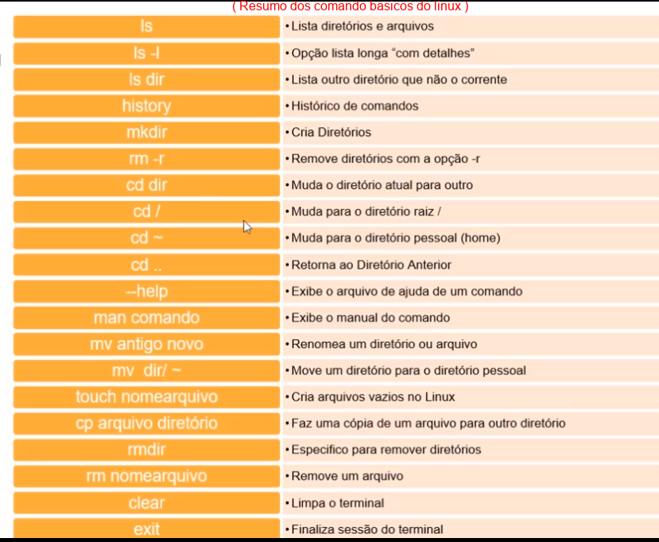
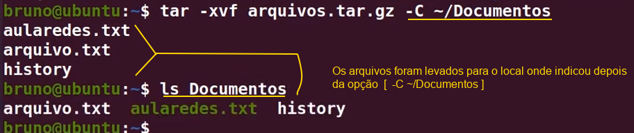

# LINUX FEDORA - CONHECENDO A COMAND-LINE (Linha de comandos)

># 1 Tópico - Introdução ao Linux e configuração inicial

>>**MANIPULANDO O TERMINAL**

***alt+space(TeclaDeEspaço)*** e digita 'terminator' = abre um terminal.

***Ctrl+T*** = abre novas guias de terminal dentro de um terminal já em execução.

***Ctrl+Super*** + 'Setas De Movimentação' < ou > = alterna entre as guias que estão abertas no terminal (a tecla super é a tecla com a logo do Windows).

***Ctrl+W*** = fecha a guia do terminal,mas se caso houver várias guias abertas , esse comando fecha uma guia por vez. 

***Ctrl+Q*** = fecha todas as guias do terminal que estiverem abertas de uma única vez (diferente do Ctrl+W que fecha uma por vez).

***Ctrl+Shift+I*** = Abre um terminal com várias guias contendo vários ramos de desenvolvimento da liferay.

***exit*** = fecha o terminal. 

***clear ou crtl+L*** = limpa o termnal.

>>**Duas formas de Representar /home/me** 

    [Usuario administrador]
    [local/usuario]

    [home/me]             "são os mesmos caminhos 
    [~]             representados de formas diferentes"

    [~] = significa pasta pessoal (~ é o mesmo que >>> /home/me) 

    [/] = onde se encontra o diretório raiz do sistema linux , para guarda as informacões de programas instalados no sistema e também pastas de funcionamento do próprio sistema linux.

***pwd*** = mostra qual o caminho/diretório que está atualmente. 

***history*** = traz o histórico de todos os comandos utilizados em execução do terminal.

***history -c*** = limpa o histórico dos comandos.

***seta ^ 'para Cima Do Teclado'*** = se apertarmos na seta para cima do nosso teclado conseguimos navegar entre esse histórico de comandos - ele vai alternando e mostrando no terminal.

***!!*** = vai repetir o último comando digitado no terminal

***'nome do comando' --help*** =  traz ajuda sobre determinado comando. 

***'nome do comando' --manual*** = traz o manual do comando com as opcões.

***alias 'NomeQueDesejaUsar'='NomeAtualdoComando' / com isso modificamos o comando*** = vai dar um nome ao comando ,podemos através desse comando mudar o comando e personalizá-lo.

># 2 Tópico - Conhecendo o terminal Linux e seus atalhos

>>**ATALHOS PARA UTILIZAR DENTRO DO TERMINAL**

    Quando entramos em algum editor de texto pelo terminal por exemplo e queremos sair, qual tecla de atalho utilizar ? 
***Ctrl+C*** = cancela o comando atual em funcionamento 

***Ctrl+Z*** = pausa o comando atual, colocando ele em segundo plano, fechando o terminal

***Ctrl+D*** = faz logout da sessao atual, sai do terminal

***exit***= sai do terminal assim como o Crtl+d

>>**Escrevendo no terminal e manipulando O QUE FOI ESCRITO**

***Ctrl+W*** = apaga uma palavra na linha atual

***Ctrl+U*** = apaga a linha inteira

***Ctrl+R*** = busca um comando recente

>>**NAVEGANDO ENTRE DIRETORIOS(PASTAS)/ARQUIVOS**

***cd 'NomeDaPasta'*** =  Vai mover entre os diretórios/pastas 

***cd ..*** = os dois pontos indica que queremos voltar uma pasta, (retornar). 

***cd*** ou ***[cd ~]*** = se for o comando apenas com cd + espaco em branco  ele vai retornar para o diretório /home/me

***cd /*** = vai para o diretorio raiz do Linux 

    [man cd] ou  [cd --help] = manual do comando - vai listar todas as opcões do comando 

>>**LISTANDO OS DIRETÓRIOS (PASTAS)/ARQUIVOS**

***ls*** = Lista as pastas de uma Diretório que estamos acessando

***ls -la ou la*** = lista os diretórios e os arquivos existentes na pasta, tanto as pastas/arquivos visiveis, quanto ocultos que inicia o nome com (.)

***ls -l*** = lista diretorios e arquivos com detalhes assim como o -la , só que não mostra arquivos ocultos 

    outra forma de usar- pode ser usado junto com o nome da pasta que voce deseja listar , exemplo abaixo 
***ls 'NomeDiretorio'*** - nesse caso não vai entrar na pasta ele apenas vai listar a pasta que foi especificada e continua no local atual

    [man ls] ou  [ls --help] = manual do comando - vai listar todas as opcões do comando.

>>**CRIANDO DIRETÓRIOS(PASTAS) E EXCLUINDO**

***mkdir 'NomeDaPasta'*** =  cria pastas (diretórios) 

***rmdir*** = especifico para remover um diretório , se existir arquivos dentro da pasta ele não funciona, só funciona para pastas vazias.

***rm -r*** = remove diretórios com a opcão -r (recursiva)vai forçar a remoção, nesse segundo caso conseguimos apagar a pasta com os arquivos dentro.

    [rm -r *]  apaga todos os arquivos de uma pasta.

>>**RENOMEANDO E MOVENDO DIRETÓRIOS(PASTAS) E ARQUIVOS**

***mv 'NomeDaPastaOuArquivo' 'novoNome'*** = Vai renomear uma pasta ou arquivo

***mv 'NomeDaPasta' 'caminho'***  = vai mover um arquivo/diretorio(pasta)atual para o caminho que foi determinado. vai com o mesmo nome do original

***mv 'NomeDaPasta' 'caminho'/'novo nome'do arquivo ou pasta'*** = vai mover um arquivo/diretorio(pasta)atual para o caminho que foi determinado. e vai modificar vai o nome.

>>**CRIANDO ARQUIVOS, COPIANDO, EDITANDO,VISUALIZANDO E REMOVENDO**

***touch 'Nome'*** = cria arquivos vazios

***echo "conteúdo do arquivo" > NomedoArquivo*** = escreve um conteúdo e coloca dentro do arquivo , se o arquivo já existe ele coloca o conteúdo dentro, se o arquivo ainda não existia ele cria um.

***cat 'NomeDoArquivo' ou more 'Nomedoarquivo'*** = esses dois comando podem ser utilizados para mostrar no terminal o conteudo de um arquivo de texto

***nl NomedoArquivo*** =  mostra o conteudo do arquivo assim como o [cat] , mas ele tras a numeracão das linhas.

    Outra forma de ver o número de linhas de um arquivo é com o comando [wc -l NomedoArquivo] , vai contar com as linhas em branco, diferente do nl que traz o número de linhas que tem algo escrito, sem contar as linhas em branco.

***wc -l NomedoArquivo*** = traz os números de linhas , contando com as linhas em branco. 

    mais informacoes em [wc --help]

***rm 'NomedoArquivo'*** = remove um arquivo

***cp 'Nomedoarquivo' 'Diretorio' ou 'nome ao arquivo'*** = se colocar o diretorio para onde quer copiar ele vai com o nome do arquivo original , mas se usar no lugar de um diretorio o nome do arquivo , ele copia e nomeia com aquele nome que voce escolheu. [cp NomedoArquivo 'nome']

***cp -r NomedaPasta' 'nome a pasta que sera copiada'*** = 

    >>> RESUMO DOS COMANDOS <<< 

># 3 Tópico - Comandos para manipulação de arquivos e textos e redirecionamento

>>**MANIPULANDO ARQUIVOS PELO TERMINAL**

**EDITORES**

NANO = ***nano***

VIM = ***vi***

SUBLIME = ***osub***

ViSUAL STUDIO CODE = ***code .***

>>**[COMANDOS DE MANIPULACAO]**

***cat 'nome do arquivo'*** =  mostra o conteúdo do arquivo na tela do terminal 

***tac'nome do arquivo'*** = também mostra o conteúdo na tela, mas esse comando inverte as linhas do texto.

***head'nome do arquivo'*** = mostra as 10 primeiras linhas de um arquivo

***tail'nome do arquivo'*** = mostra as 10 ultimas linhas de um arquivo

>>**[COMANDOS DE REDIRECIONAMENTO]** criando novos arquivos

***head 'nome do arquivo' > NomeDoArquivoNovoque VaiserCriado***

 ou 

***tail 'nome do arquivo' > NomeDoArquivoNovoque VaiserCriado*** = vai pegar as 10 linhas e colocar dentro desse arquivo novo, criando um novo arquivo com aquele contéudo que foi listado.

>>**[REDIRECIONANDO INFORMAÇÕES DE COMANDOS]**

***cal*** =  mostra o calendario 

e se quisermos criar um arquivo com isso que foi impresso no terminal, como fazer ? com REDIRECIONAMENTO ! :)

***cal > 'NomeDoArquivo'*** = é criado um arquivo com a informacão que o comando mostra no terminal.

 nesse caso vai mostrar o calendario, mas pode ser utilizado por qualquer comando que traga informacoes na tela do terminal

>>**[ADICIONANDO INFORMAÇÕES A UM ARQUIVO EXISTENTE]**

***date*** = mostra a data

e se quisermos colocar a informação que esse comando trouxe , dentro do arquivo que foi criado anteriormente com as informações do calendario ? utilizamos o comando seguido de >> e o nome do arquivo

***date >> 'NomeDoArquivo'***  =  vai colocar as informações de ***date*** dentro do arquivo que já existia

>>**[SUBSTITUINDO INFORMAçõES DE UM ARQUIVO EXISTENTE]**

***cal 2021 > 'NomeDoArquivoExistente'*** vai substitui as informacões que ja existiam em um arquivo pelas informacoes novas do comando que foi utilizado para mostrar o conteÚdo no terminal.

QUANDO PEGAMOS UMA SAIDA , E EXIBIMOS O CONTEUDO  

    *SE QUISERMOS CRIAR UM ARQUIVO OU SUBSTITUIR UTILIZA O [>]

    *SE QUISERMOS ADICIONAR COISAS A UM ARQUIVO JÁ EXISTENTE , SEM SUBSTITUIR O QUE JA ESTAVA NO ARQUIVO[>>]

>>**[OPERADORES DE REDIRECIONAMENTO - UTILIZANDO A BARRA '|' PARA FAZER O USO DE 2 COMANDOS]**

***grep 'nome do termo que quer pesquisar' 'nomedoarquivo.txt'***

***cat 'NomeDoArquivo' | grep 'nome do termo quer pesquisar'*** =  o comando grep vai fazer uma busca por algum termo dentro do arquivo e vai exibir os termos encontrados.

    FOI UTILIZADO 2 COMANDOS , O *cat* PARA MOSTRAR O ARQUIVO , E O *grep* PARA BUSCAR UM TERMO DENTRO DO ARQUIVO e exibi-lo.

***cat 'NomeDoArquivo' | more*** = vai mostrar o conteúdo paginado,e logo embaixo aparece uma informaÇão [mais] indicando que existe mais contéudo para ser rolado para baixo.

    Voce vai descendo o texto com as setas do teclado, e o arquivo vai passando pelas páginas até se findar e volta para o terminal.

***cat 'NomeDoArquivo' | less*** = também faz a paginacão,a diferença é que ele não mostra o [mais] indicando que existe mais conteudo descendo, fica mostrando [:] e quando chega no final ele não volta para o terminal.

    e para sair desse modo , tem que utilizar o ***Crtl + Z***vai parar a exibição e  voltar ao terminal.

>>**[OPERADORES DE REDIRECIONAMENTO - UTILIZANDO & / && ]**

***cat 'NomeDoArquivo' & cat 'NomeDoArquivo'*** = separa por linha de terminal o resultado , quando digitarmos Enter ele finaliza.

***cat 'NomeDoArquivo' && cat 'NomeDoArquivo'*** = uma unica linha de de terminal exibindo os resultados.

***mkdir linux_ubuntu && cd linux_ubuntu*** = vai criar e ja vai entrar na pasta que acabou de ser criada.

>>**[COMANDO FILE]**

***file 'NomedoArquivo ou pasta'*** = esse comando vai mostrar qual tipo de arquivo. vai trazer informações sobre o tipo do arquivo.

    >>> RESUMO DOS COMANDOS <<< 

---

># 4 Tópico - Diretórios do Linux e Comandos de Sistema

    **[DIRETORIOS DO LINUX]**
    COMO IR PARA ESSE DIRETORIO ? 
    COM O [cd /]

---

    **[COMANDOS DO SISTEMA LINUX]** comandos para buscar informacões do sistema

># 5 Tópico - Fundamentos de Rede e Comandos de Rede

>>**FUNDAMENTOS DE REDE**

**O que é rede ?**

    Conjunto de equipamentos interligados de maneira a trocarem informações e compartilharem recursos, como arquivos de dados gravados, impressoras, modems , softwares e outros equipamentos.

Cada equipamento que existe dentro dessa rede ,é chamada de "nó" são os pontos de rede.

>>**SÃO SEPARADAS EM GRANDES REDES**

    REDE WAN = É UMA REDE GEOGRAFICAMENTE DISTRIBUIDA - LIGA UM CONTINENTE A OUTRO CONTINENTE

    REDES MAN =  DENTRO DAS REDES WAN , NÓS TEMOS AS REDES MAN, QUE INTERLIGAM VÁRIAS REDES LOCAIS

    REDES LAN = DENTRO DAS REDES MAN , NÓS TEMOS AS REDES LAN. É UMA REDE LOCAL 

Para que essas redes se comuniquem , existem alguns tradutores que fazem a comunicação. 

    OS PROTOCOLOS SÃO AS LINGUAGENS - CONCEITO ABAIXO 

    PROTOCOLOS - OS 3 PRINCIPAIS

-------------------------
    Para que esses protocolos se comuniquem existem as interfaces. 

    para fazer a instalacão de pacotes(programas) em nosso computador, usamos o comando [sudo su] para entrar no usuario ROOT, ou podemos digitar [sudo dnf install "nome do programa"] que ele vai pedir a permissão com a senha do usuário.

***sudo su*** = entrar no super usuário,(ROOT)  e podemos passar o comando para instalacão [dnf install 'nome do programa']

***sudo dnf install 'nome do programa'*** =  ja vai tentar fazer o comando direto , e pede a senha para confirmar.

>>**COMANDOS DE REDE**

    Para que saibamos o ip da nossa máquina. passamos o comando [ipconfig]

***ipconfig ou nmcli*** = vai mostrar a inteface de rede e listar as informacões da rede , e podemos ver o IP de nossa máquina

***nmcli device wifi list*** = vai mostrar as redes wireless disponiveis.

***nmcli device wifi connect 'NomeDaRede' password 'SenhaDaRede'*** = vai se conectar a rede wifi 

***hostname*** = traz informações de nome do computador na rede.

***hostname -I*** = traz o endereco IPv4 na rede e o loopback 

***hostname -i*** = traz o endereco IPv6 o IPv4  na rede e o loopback

***who*** = traz informações de como estamos logado nesta rede

***whoami***=  traz o nome de usuário logado na rede

***whois*** =  traz informações mais detalhadas sobre o Domínio.

***ping "www.pagina que deseja fazer o ping*** =  faz parte do protocolo icmp , envia mensagens de controle para um determinado host, verificando se este host esta ativo ou inativo.

    para finalizar o ping - tecla de atalho [Ctrl+Z] ou [Ctrl+C]

    [ping --help]  veremos outras opcoes do comando

***dig*** = tras informacões sobre DNS , que são os caminhos de rede. é o serviço de nomes de domínios -DNS vai trazer o IP do site que queremos acessar.

    O DNS transforma esse nome que eu digitei (nome do site) em IP para buscar esse site no servidor.
    
      como se fosse o nome da pessoa e o IP é a identidade da pessoa. então quando digitamos o nome do site ele vai buscar a identidade daquele site , que no caso é o IP

***dig 'NomeDoSite' + short*** = vai mostrar somente o endereco IP do site.

***traceroute 'NomeDoSite'*** = traca a rota da nossa rede , mostra informações dos 'nó' que existem até o site ,o caminho que percorre em nossa rede ate chegar no site. 

***finger*** = traz informações do usuário que está logado no nosso host.

    RESUMO DOS COMANDOS

># 6 Tópico - Fuçando no Linux com comandos diversos

***last reboot*** = informacoes sobre reinicializacão do sistema

***route -n*** = mostra todas as tabelas  de roteamento do IP do kernel

***time [comando]*** = mostra o tempo do processo de um comando

***uptime*** = mostra o tempo que o sistema esta rodando

***cowsay*** ou ***xcowsay*** ou ***cmatrix***  = traz animações no terminal

***halt*** = pede uma autenticacao para desligar a maquina

***init 0*** ou ***poweroff*** ou ***telinit 0***= desliga a maquina

***seq '1 10'*** = imprime uma sequencia de números

    RESUMO DOS COMANDOS

># 7 Tópico - Controle de usuários, grupos e permissões

usuario ROOT é o que tem mais privilegios dentro do sistema

>>**ADICIONANDO USUÁRIO E MODIFICANDO SENHAS**

***sudo adduser*** = vai adicionar um usuario novo no sistema

***su 'NomedoUsuario'*** = alterna entre o usuario

***passwd 'NomeUsuario'*** = muda a senha do usuario

>>**COMO EXIBIR INFORMAÇÕES DE LOGIN E REMOVER UM USUÁRIO**

***lastlog*** = traz informaçÕes de login dos Usuários existentes no sistema, quando foi logado, quais foram os usuários que se logaram. 

***last*** = traz todos os registros de usuário quando foi inicializado o sistema e quando foi finalizado.informações do usuario que esta logado na máquina. 

    diferente do outro comando 'lastlog' que traz informaçÕes de todos os usuários existentes.

***logname*** =  exibe o nome do Usuário atual logado no sistema.

***id*** = exibe todos os identificadores do usuário,mostra os grupos há que este usuário pertence.

***cat/etc/passwd*** = exibe todos os usuários do sistema

***userdel -r 'NomeDoUsuário'*** =  remove um usuário e a pasta pessoal do mesmo 

>>**COMO CRIAR UM GRUPO E GERENCIAR OS USUÁRIOS**

    OS GRUPOS PERMITEM ORGANIZAR OS USUÁRIOS E DEFINIR AS PERMISSÕES DE ACESSO A ARQUIVOS E DIRETÓRIOS DE FORMA MAIS FÁCIL

***cat/etc/group*** = exibe todos os grupos do sistema.

***groups*** = exibe os grupos que o usuário pertence.

***addgroup 'nome'*** = cria um grupo.

***adduser 'usuario''grupo' ou //  gpasswd -a 'usuario' 'grupo'*** = adiciona um usuário a um grupo.

***gpasswd -d 'usuario' 'grupo'*** =  remove um usuário de um grupo.

***groupdel 'nome'*** = remove um grupo

>>**COMO GERENCIAR PERMISSÕES EM DIRETÓRIOS - MODO OCTAL**

>>**CONTROLE DE PERMISSÕES**

***ls -lh*** = verificar permissões em um diretório

>> **MODO OCTAL**

---

***chmod + 'oNumeroOctal'*** = mudar a permissão de um arquivo ou diretório.

    RESUMO DOS COMANDOS

># 8 Tópico -Compactação, descompactação e arquivamento

    COMPACTADORES SÃO PROGRAMAS QUE DIMINUEM O TAMANHO DE UM ARQUVIO OU DIRETÓRIO, com a finalidade de envia-lo com mais rapidez quando for compartilhar na rede , ou apenas para dinimuir o tamanho e ocupar menos espaço na máquina

>> **COMANDOS GZIP , ZIP E BZIP2**

* GZIP

***gzip 'NomedoArquivo'*** = para compactar arquivos.

***gunzip 'NomedoArquivo'*** = para descompactar o arquivo

***gzip -9 'NomedoArquivo'*** = usa a compactação Máxima

* ZIP 

***zip 'nomeDoArquivoqueSereGerado' 'NomedoArquivoQuevaiCompactar'*** = vai compactar o arquivo

***unzip 'nomeDoArquivo'*** = vai descompactar o arquivo

* BZIP2

***bzip2 'NomedoArquivo'*** = vai compactar o arquivo

***bzip2 -d 'NomedoArquivo'***

>> **ARQUIVADORES**

***tar -cf 'NomedoArquivoGerado' 'NomedoarquivoParaArquivar*** = vai arquivar os arquivos em uma pasta

    compactando o arquivo que acabou de ser arquivado com .tar

    como Descompactar esse arquivo que agora esta como [.tar.gz] ? com o proprio comando "tar -xvf" 

***tar -xvf 'NomedoArquivoGerado.tar.gz'*** = vai descompactar os arquivos

    foi descompactado, os arquivos foram listados e extraidos da pasta [.tar.gz]

    se eu quiser indicar o local onde os arquivos devem ser colocados apos ser extraido utiliza-se a opção[ -C 'o local onde vai os arquivos'] 

    A sintaxe fica assim [tar -xvf 'NomedoArquivoGerado.tar.gz' -C 'o local onde vai os arquivos']

    RESUMO DOS COMANDOS

># 9 Tópico - Gerenciamento de pacotes

>>**INSTALAÇÃO ,ATUALIZAÇÃO REMOÇÃO DE PACOTES**

* PACOTES

são programas colocados dentro de um arquivo identificados por sua extensão, e incluem arquivos necessários para a instalação de programas.

Extensão [.deb] [.rpm]

* GERENCIADORES

são sistemas que possuem resolução automática de dependencias entre pacotes, método fácil de instalação de pacotes.

Exemplos de Gerenciadores [dpgk] [apt] [yum] [dnf]

    Comandos dos gerenciadores para instalar os pacotes

***sudo apt install 'NomePacote'*** = faz a instalação do pacote

***sudo apt upgrade 'NomePacote'*** = faz a atualização do pacote

***sudo apt remove 'NomePacote'*** = remove o pacote (desinstalação do programa)

>**ATUALIZAÇÃO DE SISTEMA E O COMANDO DPKG**

>**UBUNTU -Gerenciadores** [.deb]

***sudo apt update && apt upgrade*** = atualiza o sistema e em seguida os pacotes instalados.

* Sites de Pacotes

pkgs.org

rpm.pbone.net

    Para instalar pacotes do tipo .deb , temos o comando [dpkg]

***sudo dpkg -i 'NomeDoPacote.deb'*** = para instalação do pacote [esse comando tem que ser feito na pasta onde foi baixado o arquivo]

***sudo dpkg -I 'NomeDoPacote.deb'*** = traz informações do pacote.

***sudo dpkg -r 'NomeDoPacote' - não usa a extensao .deb'*** = remove o pacote [desinstalação do programa]

>**FEDORA -Gerenciadores** [.rpm]

* Comandos Rpm e Yum

Para instalar pacotes do tipo .rpm , temos o comando [rpm -ivh 'nome do pacote']

***sudo rpm -ivh 'NomeDoPacote.rpm'*** = para instalação do pacote [esse comando tem que ser feito na pasta onde foi baixado o arquivo] 

    se caso der algum erro de Dependencias usar o comando com a opção [--nodeps]

***sudo rpm -ivh --nodeps 'NomeDoPacote.rpm'*** = vai resolver o erro de dependencias

***sudo rpm -U 'NomedoPacote.rpm'*** =  vai trazer as atualizações do pacote 

***sudo rpm -e 'NomedoPacote.rpm'*** = vai fazer a remoção do pacote [desinstalação do programa]

    PODE SER UTILIZADO TANTO O COMANDO [YUM] OU [DNF]

***sudo yum install 'NomedoPacote'*** = instalacao do pacote [instalação do programa]

***sudo yum update 'NomedoPacote'*** = atualização do pacote

***sudo yum remove 'NomedoPacote'***

    RESUMO DOS COMANDOS

># 10 Tópico - Baixando arquivos

***curl 'URL'*** = imprime o conteúdo da URL , não baixar arquivo nenhum , apenas visualiza.

***curl 'URL' --output 'NomeDoArquivo'*** = vai colocar dentro do arquivo o conteúdo que está na URL.

***wget 'URL'*** = vai baixar um arquivo com o conteudo da URL

># 11 Tópico - Sincronizando diretórios e arquivos

***rsync -av ~/test1 ~/test2*** = nesse caso a pasta test1 foi copiada para dentro de teste 2 , a pasta juntos com os arquivos que ela contem 

***rsync -av ~/test1/ ~/test2*** = nesse caso a pasta test1 contem arquivos que foram levados para a pasta test2 , dessa vez apenas os arquivos foram copiados a pasta nao foi copiada.

    A DIFERENÇA É QUE:
    
    O CASO         >>   ~/test - LEVA A PASTA COM OS ARQUIVOS 
    E O OUTRO CASO >>   ~/test/ - LEVA APENAS OS ARQUIVOS QUE ESTAVAM NA PASTA

># 12 Tópico - Comandos Mais Úteis Para Otimizar o Trabalho

***1. Comando pwd***
Use o comando pwd para encontrar o caminho para o diretório atual (da pasta) em que você está. O comando vai retornar um caminho completo (cheio), que é basicamente um caminho que começa com uma barra inclinada (/). Um exemplo de um caminho completo é /home/username.

***2. Comando cd***
Para navegar pelo filesystem do Linux, use o comando cd. Ele requer ou um caminho completo ou o nome de um diretório, dependendo do diretório atual em que você estiver.

Vamos dizer que você esteja em /home/username/Documents e quer ir para Photos, um subdiretório de Documents. Para fazer isso, simplesmente digite cd Photos.

Outro cenário em que você quer mudar completamente de diretório, digamos, para /home/username/Movies. Nesse caso, você tem que digitar cd seguido pelo caminho absoluto do diretório.   

Existem alguns atalhos que você pode usar para navegar mais rapidamente.:

Use cd.. (com dois pontos seguidos) para mover um diretório acima
Use cd para ir diretamente para a pasta home
Use cd– (com um hífen) para mover para os diretórios anteriores.
Uma nota de aviso: o shell do Linux é sensível a tipos de caracteres. Por isso, você precisa digitar o nome do diretório exatamente como ele é escrito (usando letras minúsculas ou maiúsculas).  

***3. Comando ls***
O comando ls é usado para visualizar conteúdos em um diretório. Por padrão, esse comando vai mostrar os conteúdos apenas do diretório atual em que você estiver.

Se você quiser ver o conteúdo de outros diretórios, digite ls e, então, o caminho do diretório. Por exemplo, digite ls /home/username/Documents para ver os conteúdos de Documents.

Existem variações que você pode usar com o comando Is:

ls -R vai listar todos os arquivos nos subdiretórios
ls -a vai mostrar todos os arquivos ocultos
ls -al vai listar todos os arquivos e diretórios com informações detalhadas como permissões, tamanho, proprietário, etc.

***4. Comando cat***
O cat (abreviação para concatenar) é um dos comandos Linux mais usados. Ele é usado para visualizar o conteúdo de um arquivo na saída padrão (sdout). Para executar esse comando, digite cat seguido pelo nome do arquivo e sua extensão. Por exemplo: cat file.text.

Aqui estão outras maneiras de usar o comando cat:

cat > filename cria um novo arquivo
cat filename1 filename2>filename3 junta dois arquivos (1 e 2) e armazena a saída deles num novo arquivo (3)
para converter um arquivo para usos de maiúscula ou minúscula, use cat filename | tr a-z A-Z >output.txt

***5. Comando cp***
Use o comando cp para copiar arquivo do diretório atual em que você estiver. Por exemplo, o comando cp scenery.jpg /home/username/Picturesvai criar uma cópia de scenery.jpg para o diretório Pictures.  

***6. Comando mv***
O usuário habitual do comando mv é mover arquivos, ainda que ele possa também ser usado para renomear arquivos.

Os argumentos neste comando é similar ao comando cp. Você precisa digitar mv, o nome do arquivo e o diretório de destino. Por exemplo: mv file.txt /home/username/Documents.  

Já para renomear arquivos, a sintaxe é mv nomeantigo.ext nomenovo.ext. 

***7. Comando mkdir***
Use o comando mkdir para criar um novo diretório – como mkdir Music, que vai criar um novo diretório chamado Music.

Também existem comandos mkdir extras:

Para gerar um novo diretório dentro de outro diretório, use este comando básico do Linux mkdir Music/Newfile
use a opção p (parents) para criar um diretório entre dois diretórios existentes. Por exemplo, mkdir -p Music/2020/Newfile vai criar o novo arquivo “2020”.

***8. Comando rmdir***
Se você precisa apagar (deletar) um diretório, use o comando rmdir. Porém, o rdmir só permite que você apague diretórios vazios (sem conteúdos).

***9. Comando rm***
O comando rm é usado para apagar um diretório e todos os conteúdos que estiverem lá dentro. Se você só quer deletar o diretório – como uma alternativa ao rdmir – use rm -r.

Nota: Tenha muito cuidado com este comando e sempre verifique duas vezes em qual diretório você está. Isso irá deletar tudo e não há opção para desfazer.

***10. Comando touch***
O comando touch permite criar novos arquivos em branco através de uma linha de comando. Como exemplo, digite touch /home/username/Documents/Web.html para criar um arquivo HTML chamado Web dentro do diretório Documents.

***11. Comando locate***
Você pode o comando locate para localizar um arquivo, assim como você faz para procurar um arquivo no Windows. Além disso, usando o argumento -i junto com esse comando faz com que ele se torne insensível a caracteres, permitindo que você pesquise por um arquivo não sabendo exatamente o nome dele.

Para procurar um arquivo que contém duas ou mais palavras, use um asterisco (*). Por exemplo, use o comando locate -i school*note para encontrar qualquer arquivo que tenha as palavras “school” e “note”, não importando se existem letras maiúsculas ou minúsculas.

***12. Comando find***
Similar ao comando locate, o comando find ajuda você a procurar por arquivos. A diferença é que você usa o find para localizar arquivos dentro de um diretório específico.

Como exemplo, digite find /home/ -name notes.txt para procurar por um arquivo chamado notes.txt dentro do diretório home e seus subdiretórios.

Outras variações na hora de usar o find são:

Para encontrar arquivos no diretório atual, use find . -name notes.txt
Para procurar por diretórios, use / -type d -name notes. txt

***13. Comando grep***
Outro dos principais comandos Linux e que são frequentemente usados pela sua utilidade. O comando grep permite que você procure através de todo texto dentro de um arquivo específico.

Para ilustrar, use grep blue notepad.txt para procurar pela palavra blue no arquivo notepad. Linhas que contêm a palavra pesquisadas serão mostradas por completo.

***14. Comando sudo***
Correspondente a SuperUser Do, o comando sudo permite que que você execute tarefas que exigem permissões root ou administrativas. Porém, não é muito aconselhável usá-lo diariamente porque pode ser que um erro aconteça se você fizer algo de errado.  

***15. Comando df***
Use o comando df para obter uma resposta da quantidade de espaço de disco usado no seu sistema. Esse valor será mostrado em KBs. Se você ver os resultados em MBs, digite df -m.

***16. Comando du***
Se você quer verificar o quanto de espaço um arquivo ou um diretório ocupa, o comando du é a resposta. Entretanto, o resumo do uso de disco vai mostrar números, ao invés do tamanho do formato atual. Se você quer esse valor em bytes, KBs ou MBs, use o argumento -h na linha de comando.   

***17. Comando head***
O comando head é usado para ver as primeiras linhas de um arquivo de texto. Por padrão, ele vai mostrar as primeiras 10 linhas, mas você pode mudar essa quantidade para qualquer outra. Por exemplo, se você quer ver apenas as 5 primeiras linhas, digite head -n 5 nomedoarquivo.txt.

***18. Comando tail***
O comando tail tem função similar ao comando head. Mas ele mostra nas últimas 10 linhas de um arquivo de texto. Por exemplo, tail -n nomedoarquivo.txt.

***19. Comando diff***
O comando diff (diferença) compara o conteúdo de dois arquivos linha por linha. Depois de analisar esses arquivos, ele vai mostrar as linhas que não são comuns entre eles. Os programadores frequentemente usam este comando quando precisam fazer pequenas alterações em programas. Assim, eles não precisam reescrever o código inteiro.

A forma mais simples deste comando é diff arquivo1.ext arquivo2.ext.  

***20. Comando tar***
O comando tar é o comando mais usado para arquivar múltiplos arquivos em um tarball – um formato de arquivo Linux que é similar ao formato zip, mas a compressão é opcional.

Este comando é um tanto complexo. E tem uma longa lista de funções, como adicionar novos arquivos em um arquivo já existente, listar conteúdos em um arquivo, extrair conteúdos de um arquivo e muitos outros. Veja estes exemplos práticos para saber as outras funções dele.

***21. Comando chmod***
O comando chmod é outro comando essencial. Ele é usado para ler, escrever e executar permissões de arquivos e diretórios. Como esse comando é relativamente complicado, você pode ler o tutorial completo para saber como executá-lo corretamente.

***22. Comando chown***
No Linux, todos os arquivos são de propriedade de um usuário específico. O comando chown permite que você mude ou transfira a propriedade de um arquivo para um nome de usuário específico. Por exemplo, o comando chown linuxuser2 file.ext vai fazer com que o linuxuser2 seja o proprietário do file.ext.

***23. Comando jobs***
O comando jobs vai mostrar todos os trabalhos junto com os seus status de desenvolvimento. Um job é basicamente um processo que é iniciado pelo shell.

***24. Comando kill***
Se você tem um programa que não está respondendo bem, você pode finalizá-lo manualmente pelo comando kill. Ele vai mandar um certo sinal ao aplicativo com mau funcionamento e instruir que ele seja encerrado sozinho logo na sequência.

Existe um total de 64 avisos que você pode usar, mas, geralmente, as pessoas usam apenas 2 deles:

SIGTERM (15) – pede que um programa pare de rodar e dá algum tempo para salvar todo o seu progresso. Se você não especificar o aviso quando executar o comando kill, é este aviso que será usado.
SIGKILL (9) – força um programa a parar imediatamente, em que todo o progresso não salvo será perdido.
Além de saber os avisos (sinais, notificações), você também precisa conhecer o número de identificação do processo (PID) do programa que você quer matar (kill). Se você não souber o PID, apenas execute o comando ps ux.  

Depois de saber qual aviso você quer usar e o PID do programa, use a sintaxe abaixo:

kill [signal option] PID.

***25. Comando ping***
Use o comando ping para verificar o status da conexão do seu servidor. Por exemplo, digitando ping google.com, o comando vai checar se você está ou não conectado ao Google e também medir o tempo de resposta.

***26. Comando wget***
A linha de comandos do Linux é muito útil: você até mesmo pode baixar arquivos da internet com a ajuda do comando wget. Para fazer isso, simplesmente digite wget seguido pelo link de download do arquivo.

***27. Comando uname***
O comando uname, que significa Unix Name, vai mostrar informações detalhadas sobre seu sistema Linux. Isso inclui o nome da máquina, do sistema operacional, do kernel e assim por diante.

***28. Comando top***
Equivalente ao gerenciador de Tarefas do Windows, o comando top vai mostrar uma lista de processos que estão em execução e o quanto de CPU cada processo usa. É muito útil para monitorar o uso de espaço no sistema, especialmente para saber qual processo deve ser encerrado porque ele consome muitos recursos.  

***29. Comando history***
Quando você já estiver familiarizado com o Linux, vai perceber que você pode executar centenas de comandos todos os dias. Por exemplo, o comando history (histórico) é particularmente útil se você quer rever quais comandos já usou antes.

***30. Comando man***
Está confuso com as funções de cada comando mostrado? Sem problema. Você pode aprender como usar o comando certo usando o comando man. Por exemplo, digitar man tail vai mostrar um manual de instruções do comando tail.

***31. Comando echo***
Este comando é usado para mover alguns dados para um arquivo. Por exemplo, se você quiser adicionar o texto “Olá, meu nome é John” em um arquivo chamado name.txt, digite echo Olá, meu nome é John >> name.txt

***32. Comando zip, unzip***
Use o comando zip para compactar seus arquivos em um arquivo zip e use o comando unzip para extrair arquivos descompactados de um arquivo zip. 

***33. Comando hostname***
Se você quiser saber o nome do seu host/network (da sua rede), basta digitar hostname. E se adicionar -I ao final, exibirá o endereço IP da sua rede.

***34. Comando useradd, userdel***
Como o Linux é um sistema multiusuário, isso significa que mais de uma pessoa pode interagir com o mesmo sistema ao mesmo tempo. useradd é usado para criar um novo usuário, enquanto passwd adiciona uma nova senha à conta deste usuário. Para criar um novo usuário chamado João, adicionar user e adicione seu tipo de senha, passwd 12345678.

Remover um usuário é muito semelhante a adicionar um novo usuário. Para excluir o tipo de conta de usuário, userdel username.

># 13 Tópico - Dicas e truques de Bônus

Use o comando ***clear***  ou ***Ctrl + L***, para limpar o terminal se estiver cheio de muitos comandos usados anteriormente. 

Experimente o botão ***TAB*** para preencher automaticamente o que você está digitando. Por exemplo, se você precisa digitar Documentos, comece a digitar o comando (vamos usar o cd Docu, então aperte a tecla TAB) e o terminal preencherá o restante, mostrando o cd Documents.

***Ctrl + C*** e ***Ctrl + Z*** =  são usados para qualquer comando que esteja funcionando no momento. Ctrl + C interromperá o comando com segurança, e o Ctrl + Z forçara a parada.

Se você congelar seu terminal acidentalmente com o ***Ctrl + S***, simplesmente desfaça o congelamento com ***Ctrl + Z***

***Ctrl+D*** = faz logout da sessao atual, sai do terminal

***exit***= sai do terminal assim como o Crtl+d

***Ctrl+W*** = apaga uma palavra na linha atual

***Ctrl+U*** = apaga a linha inteira

***Ctrl + A***=  move você para o início da linha 

***Ctrl + E*** =  move você para o fim

***Ctrl+R*** = busca um comando recente

># 14 Tópico - Comandos Linux de ( A a Z ) Guia Linux
![] (https://guialinux.uniriotec.br/)

># 15 Tópico - Links extras (Bibliografia)

![] (https://docs.fedoraproject.org/en-US/docs/)

![] (https://devcontent.com.br/artigos/linux/principais-comandos-terminal)

![] (https://help.ubuntu.com/kubuntu/desktopguide/pt_BR/terminals.html)

![] (https://pt.wikihow.com/Obter-Acesso-Root-no-Linux)

![] (https://diolinux.com.br/tutoriais/como-usar-o-thunar-como-gerenciador-de-arquivos-padrao-no-ubuntu.html)

![] (https://www.ti-enxame.com/pt/thunar/)

![] (https://livreeaberto.com/baixar-arquivos-do-terminal-linux)

![] (https://sempreupdate.com.br/como-baixar-arquivos-via-linha-de-comando-usando-wget/)

![] (https://e-tinet.com/linux/wget/)

![] (https://www.vivaolinux.com.br/topico/Iniciantes-no-Linux/Como-fazer-download-de-arquivos)

![] (https://www.hostinger.com.br/tutoriais/wget-o-que-e-como-instalar-comandos-wget)

![] (https://br.atsit.in/archives/31773)

![] (https://www.hostinger.com.br/tutoriais/comando-rsync-linux)

![] (https://e-tinet.com/linux/sincronizacao-de-arquivos-no-linux-rsync/)

![] (http://www.bosontreinamentos.com.br/linux/10-exemplos-do-comando-rsync-para-backup-e-sincronismo-de-arquivos-no-linux/)

![] (https://e-tinet.com/linux/usuario-root/)

![] (https://www.edivaldobrito.com.br/desativar-a-conta-root-no-linux/)

![] (https://help.ubuntu.com/kubuntu/desktopguide/pt_BR/root-and-sudo.html)

![] (https://www.dicas-l.com.br/arquivo/root_direitos_privilegios_e_seguranca.php)

![] (https://elias.praciano.com/2014/07/monitore-o-seu-sistema-com-as-ferramentas-do-sysstat/)

![] (https://www.youtube.com/watch?v=mxeOAjdQ_rk&list=RDCMUCzOGJclZQvPVgYZIwERsf5g&start_radio=1&t=39s)

![] (https://pt.wikibooks.org/wiki/Guia_do_Linux/Iniciante%2BIntermedi%C3%A1rio/Execu%C3%A7%C3%A3o_de_programas/path)

![] (https://www.infowester.com/linuxpermissoes.php)

![] (https://www.filemagic.com/pt-br/uncommon-files/ant-file-extension/ant-files-what-it-is-and-how-to-open-it/)

![] (https://www.vivaolinux.com.br/artigo/O-que-e-PATH-como-funciona-e-como-trabalhar-com-ele)

![] (https://ant.apache.org/)

![] (https://guialinux.uniriotec.br/chmod/)

![] (https://e-tinet.com/linux/chmod/)

![] (https://www.linuxforce.com.br/comandos-linux/comandos-linux-comando-chmod/)

![] (https://devcontent.com.br/artigos/linux/como-executar-scripts-no-terminal)

![] (https://canaltech.com.br/linux/Introducao-ao-Shell-Script/)

![] (https://canaltech.com.br/linux/entendendo-a-estrutura-de-diretorios-do-linux/)

![] (https://www.linuxando.com/tutorial.php?t=A%20estrutura%20de%20diret%C3%B3rios%20Linux_6)
