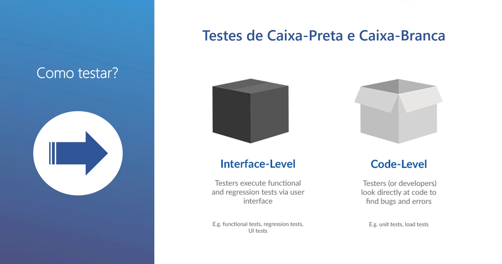
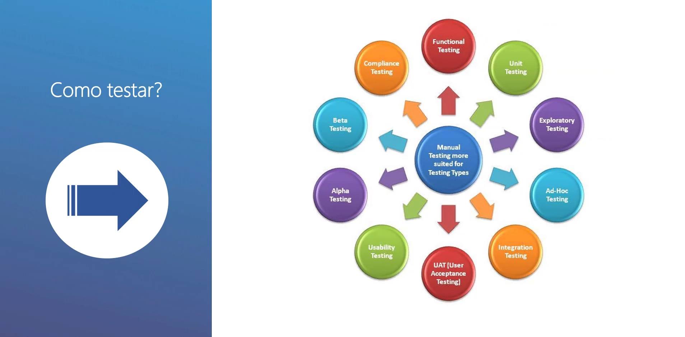
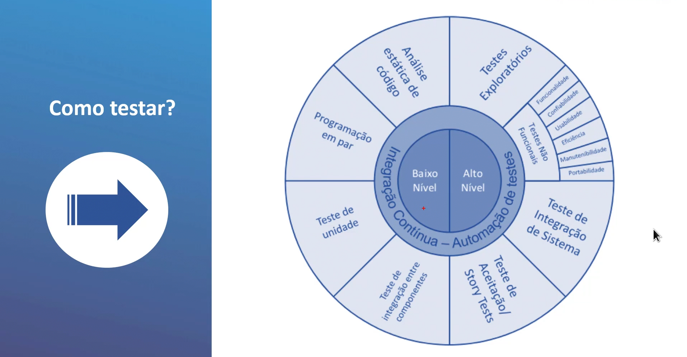
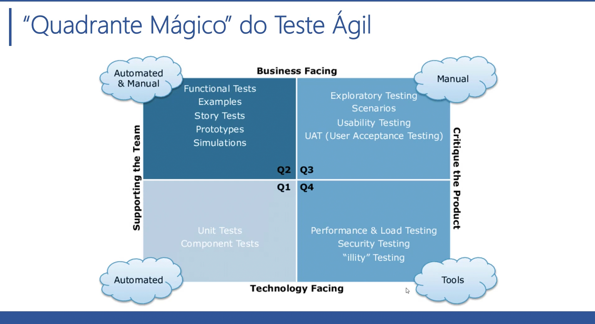
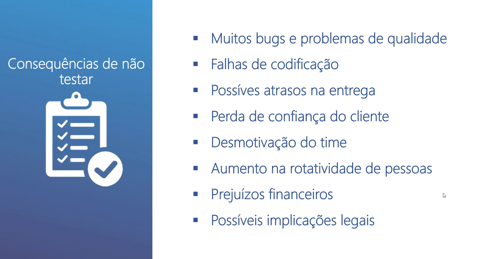
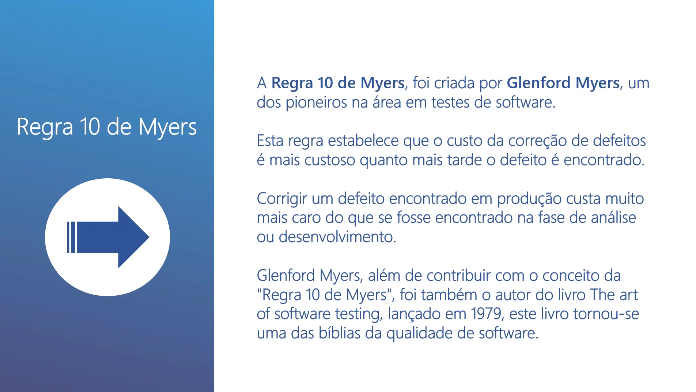
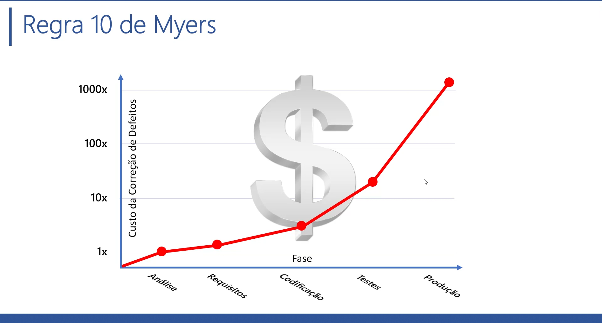

# Dominando os Testes de Software

># 1- A importância de testar 

>>**Por que testar ?**

Testar é o processo de executar um programa ou sistema com a intenção de encontrar defeitos (test Negativo).

Testar é qualquer atividade que , a partir da avaliação de um atributo ou capacidade, permita determnar se o programa ou sistema obtém resultados desejados. 

- Questão da Qualidade (tudo que existe ao nosso redor passa por testes de qualidade)

Tudo é constantemente testado ! POR QUE COM SOFTWARE SERIA DIFERENTE ?

```
O software está envolvido em tudo em nosso redor, 
por isso que é necessário o controle de qualidade 
no desenvolvimento dos softwares.
``` 

- Como garantir a qualidade ?

Quem desenvolve software acaba sendo o próprio responsável pela garantia da qualidade, diferente de outras areas da indutria que existem os orgãos de certificação.

é nesse cenário que entra o  papel fundamental dos testes - Quality Assurance (Controle de Qualidade).

>>**Como testar?**

- Testes de Caixa-preta e Caixa-branca

O QUE É TESTE DE CAIXA-PRETA ?

São feitos na interface do usuário , testes baseados na Usabilidade.

O QUE É TESTE DE CAIXA-BRANCA ?

São testes feitos no codigo-fonte (debug) buscar defeitos na codificação.




- Tipos de testes para Aplicar no controle de qualidade das Aplicações.



- Testes de Baixo Nivel e Alto Nivel

BAIXO NIVEL - vai explorar o Codigo-Fonte (DEBUG) - caixa-Branca. 

ALTO NIVEL - vai focar na Interface de Usuário (USABILIDADE) caixa-preta.



- Conceito de Agilidade - Desenvolvimento Ágil SCRUM (quadrante Mágico do teste ágil)



- Consequencias de não implementar os testes de Softwares nas Aplicações.



>>**Regra 10 de Myers**

Esta regra trata a respeito do custo da correção de Defeitos no Processo de desenvolvimento de um Software



Quanto mais próximo da Produção, mais caro o custo das Correções.



>>**Mitos sobre os testes de software**

- Está errado pensar que não se tem tempo para testar -
- Testar é escrever o Dobro de código - mas é necessário para o desenvolvimento 
- Se fizer o código certinho não precisa de teste - errar tudo bem. o Problema é não testar
- Testar é papel do testador - também é papel do desenvolvedor
- Que adianta eu testar se o resto da equipe não testa - testando voce consegue melhores resultados , e ao seu codigo vai falhar menos
- Os testes garantem 100% de software livre de erros - náo basta ter teste , tem que saber escrever testes
- se passou no teste é por que não tem bug - é necessario testar o cenário que dar certo e tambem ver o cenario que dar erro para ver realmente dando erro
- Eu ja terminei só falta testar - só termina o projeto quanto os testes são implementados junto com o desenvolvimento
- Testes de unidade só funcionam se for com TDD - testes feitos antes do código
- Testar manualmente é mais produtivo - as vezes é necessario uma equipe de teste maior para testar de ponta a ponta a aplicação
- Não consigo convencer meu gerente - Mostrar a regra de 10 de Myers e explica o quanto que a empresa pode ter problema se deixar para corrigir os erros em produção.

>>**Tipos de testes mais comuns**