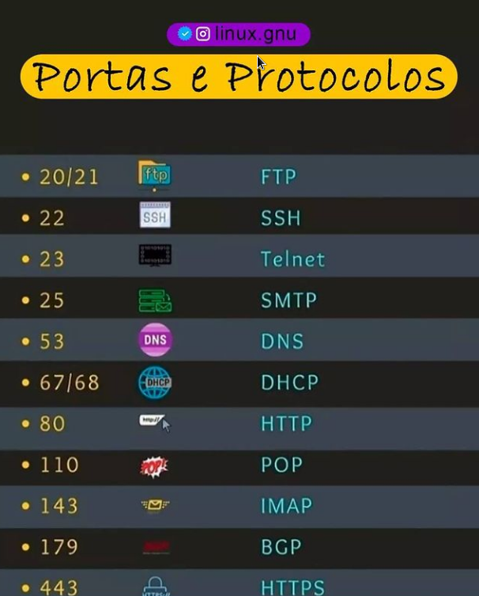

># 1 TÓPICO - Nmcli

        Descrição sobre nmcli
nmcli é uma ferramenta de linha de comando para gerenciar e controlar o NetworkManager.

Além de gerenciar ele também exibe(reporta) status  da rede. Quais as placas ou interfaces de rede usadas? Elas estão ativas(on) ou não ativas(off)? qual ip dessas interfaces?

Como gerenciador de rede a ferramenta nmcli pode criar, deletar, editar, ativar, desativar conexões de rede.

***nmcli ou ifconfig*** = podemos identificar as informações de rede , ip de nossa maquina na rede e outras informações.

***nmcli deive wifi list*** = lista as redes wifi disponiveis 

***nmcli device wifi connect 'NomeRedeWifi' password 'SenhaDoWifi*** = para se conectar com a rede wifi 

***nmcli radio wifi*** = para saber se o wifi esta habilitado ou não 

***nmcli radio on*** = liga o wifi

***nmcli radio off*** = desliga o wifi 

***nmcli device status*** = Liste os dispositivos disponíveis e seus status
![Mais informações] (https://fedoraproject.org/wiki/Networking/CLI)

![] (https://access.redhat.com/documentation/pt-br/red_hat_enterprise_linux/8/html/configuring_and_managing_networking/getting-started-with-nmcli_configuring-and-managing-networking)

![] (https://access.redhat.com/documentation/pt-br/red_hat_enterprise_linux/8/html/configuring_and_managing_networking/ref-frequent-nmcli-commands_getting-started-with-nmcli)

![] (https://gnulinuxbrasil.com.br/2021/07/24/gerenciando-rede-com-mncli-no-linux/)

![] (https://www.youtube.com/watch?v=XtyrKtBciEE)

># 2 TÓPICO - Ping

        O QUE FAZ O PING ? 
podemos ter o acesso ao tempo de envio e recebimento de resposta de uma rede. Ele funciona enviando uma série de mensagens ICMP (Internet Control Message Protocol) ao host de destino e aguarda por uma resposta echo do host ou dispositivo. Assim, somos informados sobre o funcionamento da rede.

***ping 'IP da Máquina' ou 'endereço da página*** = vai mostrar a latencia da rede , indica se esta boa a conexão com a rede , verificando conectividade.

>**Resumo**
O Ping é uma ferramenta comum para identificar problemas de conexão entre dispositivos e redes. Ele ajuda a entender o porquê de um site não estar funcionando.

É preciso entender o que está causando o problema. Pode ser desde problemas de conexão com a internet, perda de dados ou o site não está mais disponível. O comando ping nos ajuda a identificar a melhor maneira de resolver o problema.

![Mais informações] (https://www.hostinger.com.br/tutoriais/comando-ping-linux?ppc_campaign=google_performance_max&gclid=Cj0KCQjwsZKJBhC0ARIsAJ96n3UQT3RgY2VYhtbDqU2Y4FIUzCDzGTtACQbrkUL8DltSmdZCvQq3nyQaAnfwEALw_wcB)

![] (https://linux.die.net/man/8/ping)

![] (https://www.hostinger.com.br/tutoriais/comando-ping-linux?ppc_campaign=google_performance_max&gclid=Cj0KCQjwsZKJBhC0ARIsAJ96n3UQT3RgY2VYhtbDqU2Y4FIUzCDzGTtACQbrkUL8DltSmdZCvQq3nyQaAnfwEALw_wcB)

![] (https://www.hostgator.com.br/blog/comando-linux-ping/)

![] (https://kb.vmware.com/s/article/2018931?lang=pt_PT)

![] (https://guialinux.uniriotec.br/ping/)

![] (https://pt.wikihow.com/Executar-o-PING-no-Linux)

![] (https://www.elitevisual.com.br/sites/guia-basico-como-usar-o-comando-ping-no-linux/)

![] (https://www.vivaolinux.com.br/dica/O-comando-ping)

![] (https://www.linuxforce.com.br/comandos-linux/comandos-linux-comando-ping/)

![] (https://www.youtube.com/watch?v=72H1Egwomsg)

># 3 TÓPICO - SSH

        o que é o SSH?
SSH é o protocolo para o acesso remoto. Ele nos permite fazer uma conexão segura entre as nossas máquinas, acessando um secure shell.

***sudo systemctl start sshd.service*** = iniciar o daemon SSH para que outras pessoas possam usar o SSH em seu computador. Conecte-se via SSH a um computador remoto.

***ssh 'IP da maquina que vai se conectar'*** = vai fazer a conexão remota com a maquina identificada pelo IP

***ssh-keygen -t rsa -C "email"*** =  gera as duas chaves ssh , uma privada e outra publica.

***chmod 700 ~ /.ssh*** =  para alterar a permissão desse diretório para um valor de 700. 

        Digite la ~ / .ssh. Já existe um arquivo chamado authorized_keys que normalmente não existiria em uma nova instalação, mas foi instalado em seu computador anteriormente

***more ~/.ssh/authorized_keys*** =  arquivo onde vai ser colocado a chave ssh Pública para que possa se conectar com o par de chaves ssh, sem a necessidade de senha do usuário do pc.

***chmod 640 ~/.ssh/authorized_key*** = Volte para a guia onde você está logado no computador do vizinho e digite chmod 640 ~ / .ssh / authorized_keys para garantir as permissões corretas. 

        *DEPOIS DE COMANDO*
Abra uma nova guia Terminator e SSH no computador do seu vizinho. Observe que você não precisa mais digitar um nome de usuário ou senha. 

ESTA UTILIZANDO AGORA AS CHAVES QUE FORAM SINCRONIZADAS. chave publica no Autorized_keys do Vizinho e a chave privada no computador pessoal.

        Ao adicionar uma chave pública em ~ / .ssh / authorized_keys, você está dizendo ao SSH que qualquer pessoa com a chave privada correspondente pode acessar seu computador.

![mais informações] (https://www.alura.com.br/artigos/como-acessar-servidores-remotamente-com-ssh?gclid=CjwKCAjw1JeJBhB9EiwAV612y_Dsv4OFrldIsbYHz0xvnRR9ZPPWDI3EEp03rCw0m4vPptKGMywrRBoCWhMQAvD_BwE)(https://www.alura.com.br/artigos/entendendo-as-diferencas-entre-telnet-e-ssh)

># 3 TÓPICO - SFTP

        O que é SFTP ?
SFTP, ou SSH File Transfer Protocol, é uma maneira muito mais segura de mover arquivos. Usando o protocolo SSH, ela suporta criptografia e outros métodos de segurança usados para melhor proteger transferências de arquivos.

É o único protocolo de transferência de arquivos que protege contra ataques em qualquer ponto do processo de transferência de dados, sendo então o protocolo preferido.

***sftp 'IP'*** = vai se conectar a outra máquina pelo protocolo SFTP

***put 'NomeDoArquivo'*** = para enviar um de seus arquivos para a outra maquina pelo SFTP

***get 'NomeDoArquivo'*** = para baixar um dos arquivos do seu vizinho. 

         Digitando exit se desconecta do SFTP

![mais informações] (https://www.digitalocean.com/community/tutorials/como-utilizar-o-sftp-para-transferir-arquivos-com-seguranca-com-um-servidor-remoto-pt)(https://www.hostinger.com.br/tutoriais/como-usar-sftp-ssh-file-transfer-protocol)

![] (https://www.digitalocean.com/community/tutorials/como-utilizar-o-sftp-para-transferir-arquivos-com-seguranca-com-um-servidor-remoto-pt)

![] (https://www.hostinger.com.br/tutoriais/como-usar-sftp-ssh-file-transfer-protocol)

![] (https://linux.die.net/man/1/sftp
)
># 4 TÓPICO - Rsync

        O que é o Rsync?
O Rsync é uma ferramenta de sincronização habilitada em rede muito. Devido à sua onipresença em sistemas Linux e do tipo Unix, além da sua popularidade como uma ferramenta para scripts de sistema, ela é incluída na maioria das distribuições Linux por padrão.

***rsync -av /home/me/'NomeDoArquivoOuPasta' me@192.168.xxx.xxx:/home/me*** = do meu pc para o computador do vizinho.

***rsync -av me@192.168.xxx.xxx:/home/me/'NomeDoArquivoOuPasta' /home/me*** = do meu pc do vizinho para a minha maquina.

![mais informações] (https://www.digitalocean.com/community/tutorials/how-to-use-rsync-to-sync-local-and-remote-directories-pt)

># 5 TÓPICO - Ports

        Portas de comunicação são:
as entradas e saídas de dados que temos em nossa máquina, mas antes é bom saber que podemos falar das portas físicas (USB, Serial e etc) e as Lógicas como a TCP e UDP, etc.

Seu computador possui um IP e escuta em muitas portas. As portas são números entre 0 e 65535. Dois programas na mesma máquina não podem escutar na mesma porta.

![mais informações] (https://king.host/wiki/artigo/portas-de-comunicacao/#:~:text=As%20portas%20de%20comunica%C3%A7%C3%A3o%20s%C3%A3o,padr%C3%A3o%20para%20envio%20de%20emails.&text=Como%20analogia%2C%20podemos%20dizer%20que,o%20n%C3%BAmero%20do%20seu%20apartamento.)

![] (https://www.hostinger.com.br/tutoriais/o-que-e-localhost)

![] (https://www.linuxforce.com.br/comandos-linux/comandos-linux-comando-telnet/)

![] (https://pt.stackoverflow.com/questions/107682/como-saber-se-uma-porta-est%C3%A1-aberta-ou-n%C3%A3o-no-linux)

![] (https://linux.die.net/man/1/telnet)

># 6 TÓPICO - Systemctl

        Introdução
Systemd é um sistema init e gerenciador de sistema que se tornou o novo padrão para distribuições Linux. Devido à sua forte adoção, familiarizar-se com o systemd vale muito a pena, pois irá tornar a administração de servidores consideravelmente mais fácil. Aprender sobre as ferramentas e daemons que compõem o systemd e como usá-los irá ajudar a entender melhor o poder, flexibilidade e capacidades que ele oferece ou, pelo menos, facilitará o seu trabalho.

        O objetivo fundamental de um sistema init é inicializar os componentes que devem ser iniciados após o kernel do Linux ser inicializado (tradicionalmente conhecido como componentes “userland”). O sistema init também é usado para gerenciar serviços e daemons para o servidor em qualquer momento enquanto o sistema está em execução. 

***systemctl status sshd.service.*** =  para ver se esta ativado ou desativado o serviço de comunicação.

***sudo systemctl stop sshd.service*** =  faz parar o Daemon 

***sudo systemctl start sshd.service.*** = faz iniciar , habilitar novamente

***sudo systemctl enable sshd.service.*** = Para iniciar um serviço na inicialização, use o comando enable

![mais informações] (https://www.digitalocean.com/community/tutorials/how-to-use-systemctl-to-manage-systemd-services-and-units-pt)

![Protocolos de Rede: O Que São, Como Funcionam e Tipos de Protocolos de Internet] (https://www.weblink.com.br/blog/tecnologia/conheca-os-principais-protocolos-de-internet/)

![] (https://access.redhat.com/documentation/pt-br/red_hat_enterprise_linux/8/html/configuring_and_managing_networking/index)

