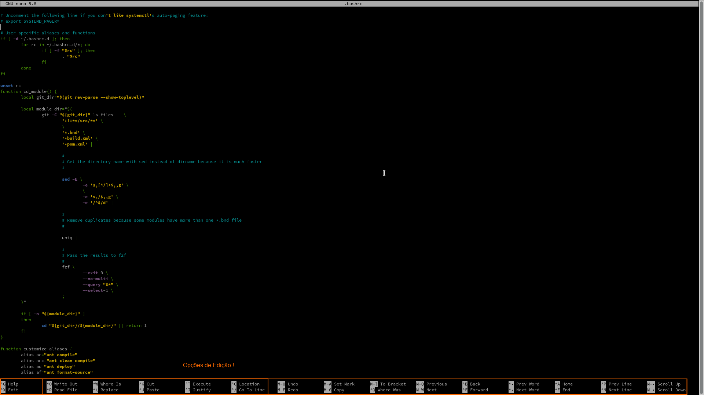
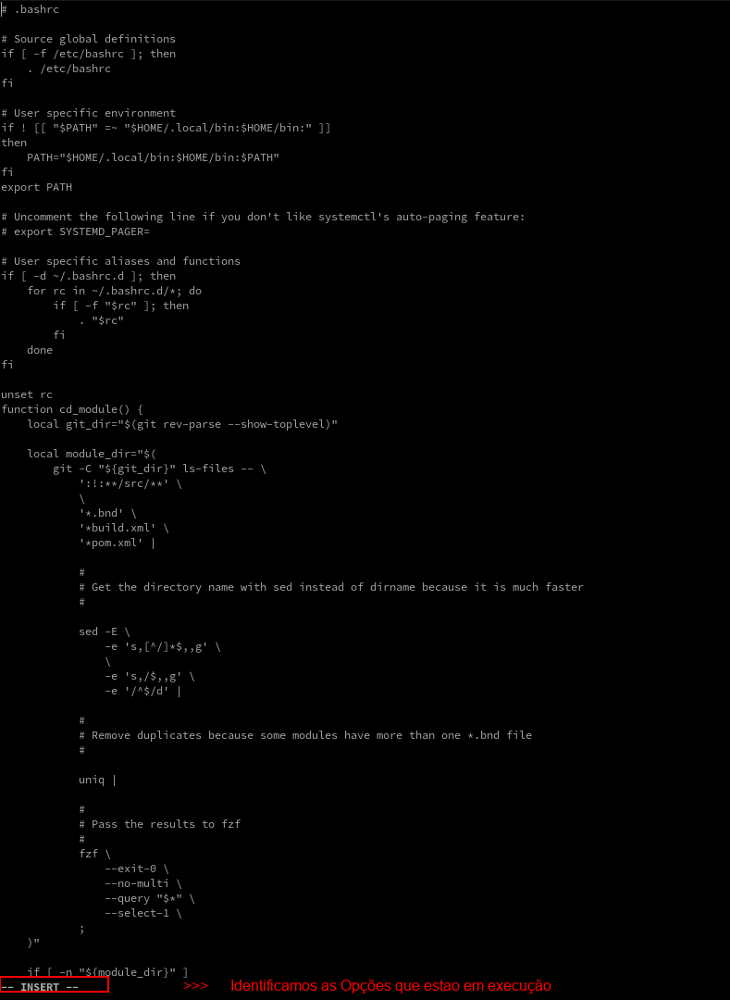
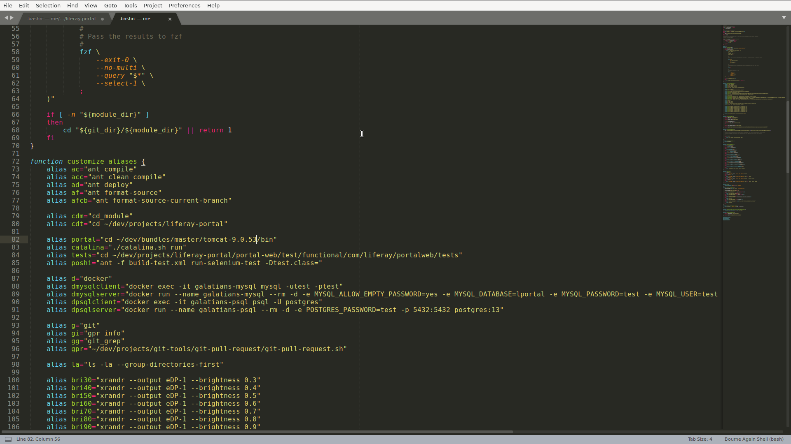
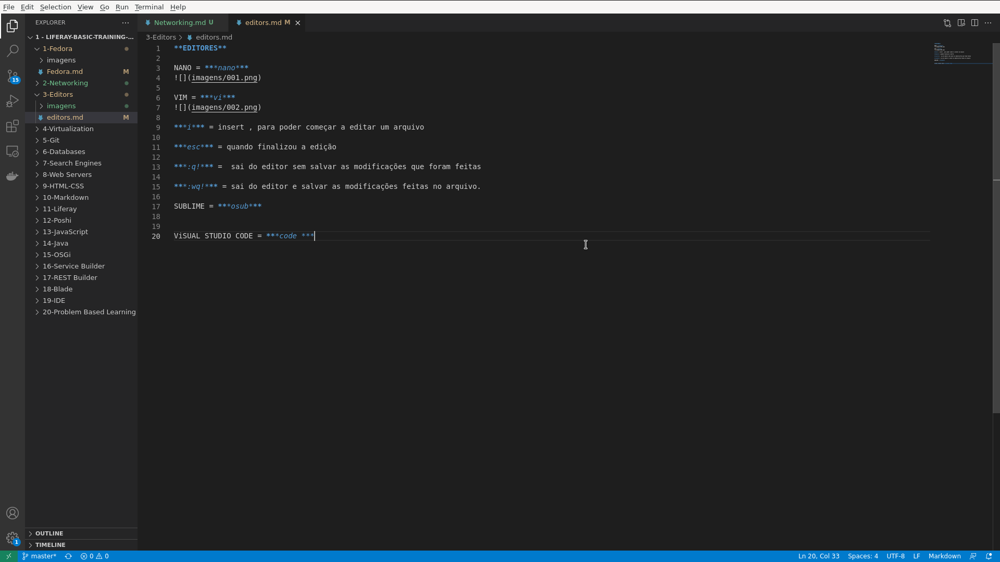

# EDITORES

># NANO = ***nano***

># VIM = ***vi***

***i*** = insert , para poder começar a editar um arquivo

***esc*** = quando finalizou a edição

***:q!*** =  sai do editor sem salvar as modificações que foram feitas

***:wq!*** = sai do editor e salvar as modificações feitas no arquivo.

># SUBLIME = ***osub***

mais adequado para manipular codigos

># ViSUAL STUDIO CODE = ***code ***

mais completo para desenvolver codigos 