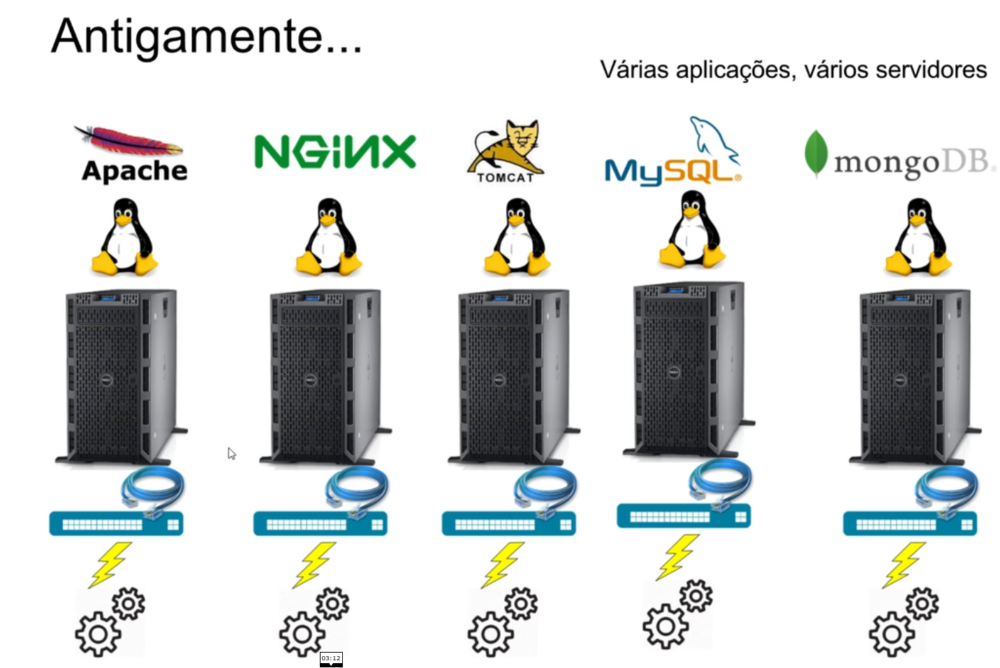
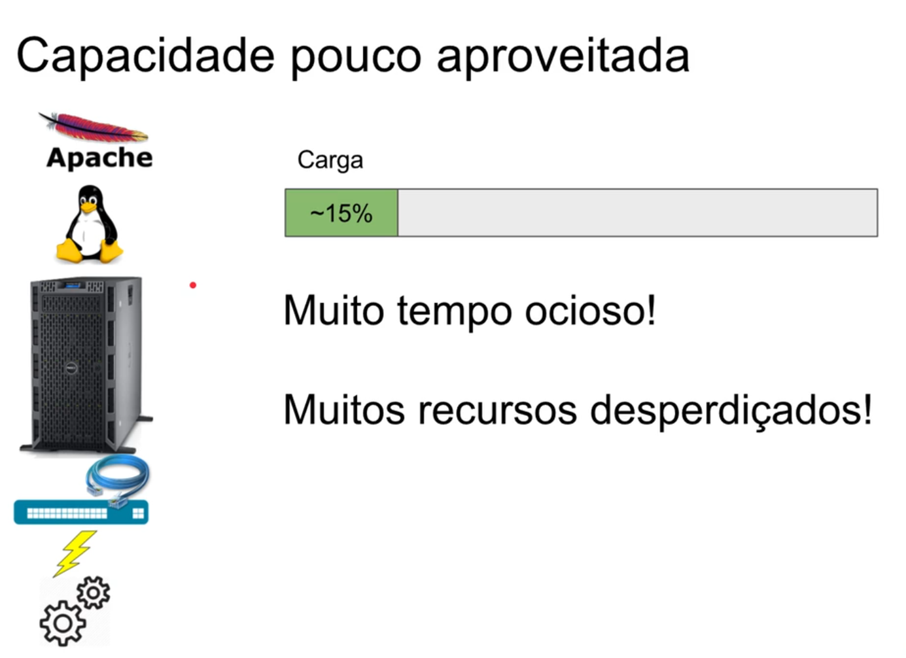
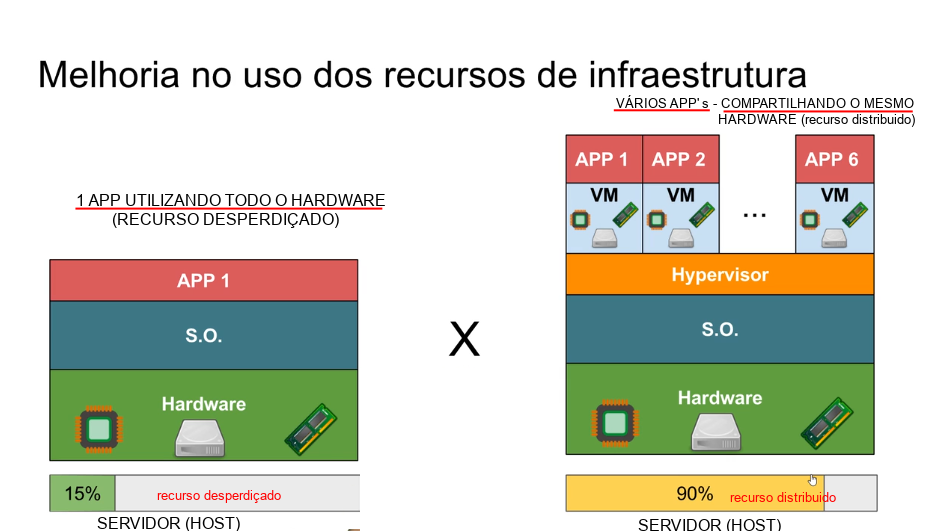
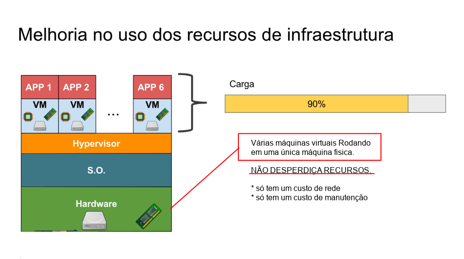
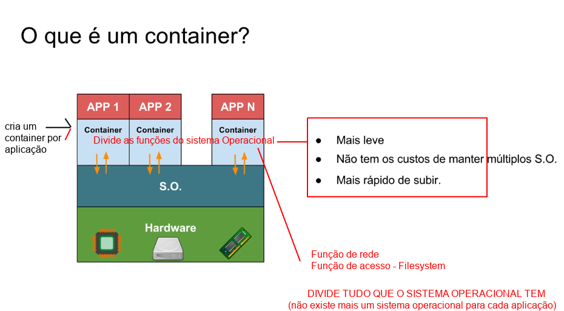
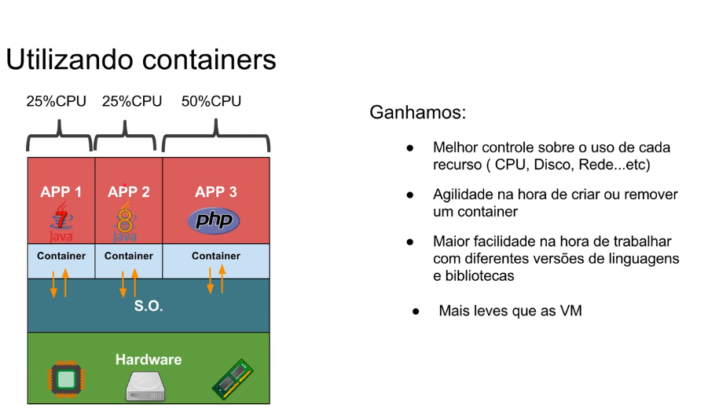
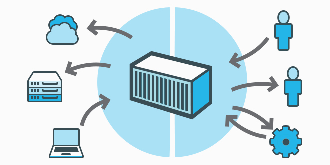

># Introdução ao tema Conceitos iniciais

`O Porque de Utilizar o Docker - um Pouco Sobre a História dessa Tecnologia` 
*  A evolução do host de aplicações (host=hospedagem, serviço que armazena os arquivos no servidor)  

* Host significa "Hospedeiro" quem hospeda ou mantém uma Estrutura de tecnologia. (na Nuvem)  >> hospedagem de aplicações, serviços (SERVIDOR)

```
* web sites 
* sistema completo
* aplicação
* Estrutura inteira de DataCenter
```

* Host pode também significar ,qualquer computador ou máquina conectado a uma rede , que armazena qualquer tipo de informação.

```
QUALQUER COMPUTADOR QUE ESTÁ LIGADO A OUTRAS MÁQUINAS ATRAVÉS DE CONEXÃO.
```


`Entendendo a Evolução do host de Aplicações e a causa do Surgimento do Docker (tecnologia de Container)`

* Como era antigamente >>> várias Aplicações , vários servidores rodando com cada aplicação. 

* Cada aplicação em um servidor fisico.

* Cada servidor um sistema Operacional para instalar a aplicação



```
e como um projeto tem todas essa aplicações cada uma cuidando de uma parte do meu sistema inteiro, então para que elas se comunicassem era necessário a conexão entre elas , e isso era feito atraves de cabos de rede que permitem a comunicação na rede .( Uma rede para cada aplicação)
```

`Toda essa estrutura gera um custo`

1. um servidor por aplicação 
2. um sistema operacional por servidor
3. uma rede para cada servidor se comunicar

``` 
(cabos de rede) 
(energia para muitas máquinas) 
(configuraçÕes e atualizações)
```

`Para manter toda essa estrutura funcionando , era necessario:`

* manutenção tanto da parte fisica Hardware (Hd -Memória - Processador)

* como da parte lógica software (Atualizações de sistemas e programas)

* Essa era a estrutura para manter uma aplicação/sistema completo Rodando na internet.

por causa de todo esse processo o DePLOY de uma aplicação era muito lento (compra de um novo servidor e todo o processo de configuração)

```
O que é DePLOY ? quando vamos disponibilizar o sistema em um ambiente de desenvolvimento para testes ou em produção. ou quando colocamos na nuvem(servidor).
```

`Outros problemas com esse tipo de arquitetura `

```
capacidade da máquina (servidor) - pouco aproveitada
```   


* Uma aplicação rodando só, em uma máquina com muitos recursos , a aplicação roda consumindo uma capacidade baixa dos recursos que a máquina tem.

* Todo o recurso que era investido na máquina(servidor) como : Muita memória ram , Muito Hd disco rigido, Muito processador.

* Tudo isso ficava a maior parte do tempo Ocioso(sem usar) porque a aplicação consumia pouco... então por que tanto recurso investido ?

```
Para que o servidor continuasse funcionando quando tivesse muitos acessos simultaneos.

Não era todo dia que isso acontecia , então ficava muuito tempo Ocioso, muitos Recursos desperdiçados.
```

* Melhorando a situação de um servido Ocioso , custo demorado e desperdicio de Recursos >>> SURGIU A VIRTUALIZAÇÃO.

`Melhorando a Situação : VIRTUALIZAÇÃO`

Várias maquinas virtuais ( criar um computador dentro de outro de forma lógica , virtualizando o Sistema Operacional )

´


```
A virtualização resolveu a questão de ter vários servidores, um para cada aplicação, desperdiçando recursos.
```
* com a virtualização temos uma máquina com um hardware potente ( e podemos criar várias maquinas virtuais para rodar em uma única máquina fisica)

```
Assim não desperdiça recursos 
* só tem um custo de rede 
* só tem um custo de manutenção
```


Diminuindo assim o custo de infraEstrutura

```
* Melhoria no uso dos recursos 
* Divide o hardware que estava ocioso
```

Pequenas máquinas virtuais cada uma consumindo uma parte do hardware

* Melhor aproveitamento do hardware fisico



```
Agiliza também a questão de querer subir uma nova aplicação , sendo necessário apenas a criação de uma nova maquina virtual para colocar essa nova aplicação.
```
Atualmente as máquinas virtuais estão sendo substituídas por containers (DOCKER)
```
Entendendo os problemas das maquinas virtuais ,e o por que de ter surgido os containers >> DOCKER
```


```
CADA APLICAÇÃO VAI PEDIR UM SISTEMA OPERACIONAL >>> E TODO SISTEMA OPERACIONAL TEM UM CUSTO.
```
* ENTAO SURGIU OS CONTAINERS PARA MELHORAR A SITUAÇÃO DAS VIRTUAL MACHINE (V.M)

`A Era dos Containers (DOCKER)`


`O que é um Container`

É o que vai conter a minha aplicação (container= contém)
```
A aplicação vai ser executada dentro desse container( isolando a aplicão)
e ele vai funcionar junto com o sistema Operacional
```


Cria um container por aplicação  - esses vários container vão dividir as funções do sistema Operacional

* Vão dividir tudo que o sistema operacional tem
* Não existe mais um sistema operacional para cada aplicação
* As aplicações estão dividindo o mesmo sistema Operacional que esta em cima do hardware.

```
Com isso reduzindo todo aquele custo: 
*   Manter um sistema;
*   Atualizar;
*   Custo de disco(HD);
*   Memória RAM;
*   Custo de Processador;
```


Por que precisamos dos container's Fazendo essa separação para que cada aplicação funcione dentro, possa dividir as funções do Sistema Operacional? 

```
Por que não instalar todas as aplicações direto na máquina , Já que estamos usando o mesmo sistema Operacional
```
`VAMOS ENTENDER`

O sistema operacional que usamos funciona da seguinte forma:

* Todos os aplicativos são instalados direto na máquina , sem a necessidade dessa separação das aplicações por container's

* Mas quando se trata de uma Estrutura Empresarial, existem alguns problemas que podem ocorrer, e estando todas as aplicações instaladas direto na máquina (sem a divisão dos container's) pode causar muitos Problemas.

```
Os Problemas dessa Abordagem
```
* Dois app's utilizando a mesma a porta de rede ? 

**Apache x Nginix >>> os dois querendo utilizar a porta 8080**

O sistema Operacional não vai permitir utilizar a mesma (vai dar problema se não tiver alguém para separar uma da outra).

```
O container serve para isso , para isolar uma aplicação da outra
```
* Se um aplicativo começar a consumir muito de uma recurso ( tipo CPU)

O aplicativo vai começar a travar o computador >> tomando todo o processamento da máquina, e existe outro aplicativo na máquina que ficou muito lento ( isso acontece com muita frequencia se nós não limitarmos o App)


`O container serve para evitar esse tipo de situação`

```
Onde uma aplicação pega todo o processamento da máquina para ela, travando o funcionamento dos demais aplicativos instalados.
```

* O container isola cada aplicação e limita quanto que cada aplicação vai poder consumir do Processador. Evitando o travamento do sistema e parar os outros aplicativos que estão na máquina.

E se cada App precisar de uma versão especifica de uma linguagem ?
```
Os container vão permitir fazer essas diferentes versões funcionarem, por que elas vão está rodando de forma isolada (dentro de um CONTAINER)

```

`Evitando a incompatibilidade e sendo possivel rodar várias versões de um tecnologia na mesma máquina, sem interferencias.`

    O que muitas vezes seria impossivel de conseguir instalar direto na máquina (sem o isolamento dos Container's) Muitas vezes o sistema Operacional não permite ter várias versões de um mesmo programa , ele vai sempre tentar fazer uma atualização e acaba retirando a versão anterior.

* A instalação de várias versões seria impossivel de rodar sem haver conflitos 

```
Mas o container resolvem esse problema , isolando uma aplicação da outra.
```


`O funcionamento dos container's Esquematizado`

* Define o que vai ser utilizado em cada Aplicação ISOLADAMENTE
* Limita o uso da CPU por App.( se chegar no limite não vai derrubar/travar os outros)

```
O QUE GANHAMOS COM OS CONTAINER'S
```
* Mais leves que as Máquinas virtuais
* Melhor controle sobre o uso d e cada recurso(Cpu - DiscoRigido - MemóriaRam)
*Agilidade na hora de criar ou remover um container e subir novamente uma aplicação.
* Maior facilidade na hora de trabalhar com diferentes versões de um mesmo Programa.

```
CONTAINER SÃO:

* LEVES;
* CONFIGURÁVEIS;
* CONSEGUIMOS ISOLAR UMA APLICAÇÃO;
* COMPARTILHA O MESMO SISTEMA OPERACIONAL;
* EVITA TER QUE CUIDAR DE DIVERSOS SISTEMAS 
OPEREACIONAIS, COMO FUNCIONA NAS VM'S
```
`O QUE O DOCKER FAZ?`

* Nos deixar trabalhar com container's, que é a melhor forma de se trabalhar com InfraEstrutura.

`O QUE é O DOCKER ?`

* De forma bem resumida, podemos dizer que o Docker é uma plataforma aberta, criada com o objetivo de facilitar o desenvolvimento, a implantação e a execução de aplicações em ambientes isolados. Foi desenhada especialmente para disponibilizar uma aplicação da forma mais rápida possível.



Usando o Docker, você pode facilmente gerenciar a infraestrutura da aplicação, isso agilizará o processo de criação, manutenção e modificação do seu serviço.

Todo processo é realizado sem necessidade de qualquer acesso privilegiado à infraestrutura corporativa. Assim, a equipe responsável pela aplicação pode participar da especificação do ambiente junto com a equipe responsável pelos servidores.

O Docker viabilizou uma "linguagem" comum entre desenvolvedores e administradores de servidores. Essa nova "linguagem" é utilizada para construir arquivos com as definições da infraestrutura necessária e como a aplicação será disposta nesse ambiente, em qual porta fornecerá seu serviço, quais dados de volumes externos serão requisitados e outras possíveis necessidades.

O Docker também disponibiliza uma nuvem pública para compartilhamento de ambientes prontos, que podem ser utilizados para viabilizar customizações para ambientes específicos. É possível obter uma imagem pronta do apache e configurar os módulos específicos necessários para a aplicação e, assim, criar seu próprio ambiente customizado. Tudo com poucas linhas de descrição.

    O Docker utiliza o modelo de container para “empacotar” a aplicação que, após ser transformada em imagem Docker, pode ser reproduzida em plataforma de qualquer porte; ou seja, caso a aplicação funcione sem falhas em seu notebook, funcionará também no servidor ou no mainframe. Construa uma vez, execute onde quiser.

Os containers são isolados a nível de disco, memória, processamento e rede. Essa separação permite grande flexibilidade, onde ambientes distintos podem coexistir no mesmo host, sem causar qualquer problema. Vale salientar que o overhead nesse processo é o mínimo necessário, pois cada container normalmente carrega apenas um processo, que é aquele responsável pela entrega do serviço desejado. Em todo caso, esse container também carrega todos os arquivos necessários (configuração, biblioteca e afins) para execução completamente isolada.

    Outro ponto interessante no Docker é a velocidade para viabilizar o ambiente desejado; como é basicamente o início de um processo e não um sistema operacional inteiro, o tempo de disponibilização é, normalmente, medido em segundos.

`Virtualização a nível do sistema operacional`

O modelo de isolamento utilizado no Docker é a virtualização a nível do sistema operacional, um método de virtualização onde o kernel do sistema operacional permite que múltiplos processos sejam executados isoladamente no mesmo host. Esses processos isolados em execução são denominados no Docker de container.


Para criar o isolamento necessário do processo, o Docker usa a funcionalidade do kernel, denominada de namespaces, que cria ambientes isolados entre containers: os processos de uma aplicação em execução não terão acesso aos recursos de outra. A menos que seja expressamente liberado na configuração de cada ambiente.

    Para evitar a exaustão dos recursos da máquina por apenas um ambiente isolado, o Docker usa a funcionalidade cgroups do kernel, responsável por criar limites de uso do hardware a disposição. Com isso é possível coexistir no mesmo host diferentes containers sem que um afete diretamente o outro por uso exagerado dos recursos compartilhados.

># Comandos básicos e Sua Utilidade

- `docker attach`  – Acessar dentro do container e trabalhar a partir dele.

- `docker build `  – A partir de instruções de um arquivo Dockerfile eu possa criar uma imagem.

- `docker commit`  – Cria uma imagem a partir de um container.

- `docker cp`     – Copia arquivos ou diretórios do container para o host.

- `docker create`  – Cria um novo container.

- `docker diff`    – Exibe as alterações feitas no filesystem do container.

- `docker events`  – Exibe os eventos do container em tempo real.

- `docker exec`    – Executa uma instrução dentro do container que está rodando sem precisar atachar nele.

- `docker export`  – Exporta um container para um arquivo .tar.

- `docker history `– Exibe o histórico de comandos que foram executados dentro do container.

- `docker images ` – Lista as imagens disponíveis no host.

- `docker import ` – Importa uma imagem .tar para o host.

- `docker info`    – Exibe as informações sobre o host.

- `docker inspect` – Exibe r o json com todas as configurações do container.

- `docker kill`    – Da Poweroff no container.

- `docker load `   – Carrega a imagem de um arquivo .tar.

- `docker login `  – Registra ou faz o login em um servidor de registry.

- `docker logout ` – Faz o logout de um servidor de registry.

- `docker logs `   – Exibe os logs de um container.

- `docker port`    – Abre uma porta do host e do container.

- `docker network `– Gerenciamento das redes do Docker.

- `docker node`    – Gerenciamento dos nodes do Docker Swarm.

- `docker pause`   – Pausa o container.

- `docker port `   – Lista as portas mapeadas de um container.

- `docker ps `     – Lista todos os containers.

- `docker pull`    – Faz o pull de uma imagem a partir de um servidor de registry.

- `docker push `   – Faz o push de uma imagem a partir de um servidor de registry.

- `docker rename`  – Renomeia um container existente.

- `docker restart `– Restarta um container que está rodando ou parado.

- `docker rm `     – Remove um ou mais containeres.

- `docker rmi `    – Remove uma ou mais imagens.

- `docker run`     – Executa um comando em um novo container.

- `docker save `   – Salva a imagem em um arquivo .tar.

- `docker search ` – Procura por uma imagem no Docker Hub.

- `docker service `– Gernciamento dos serviços do Docker.

- `docker start`   – Inicia um container que esteja parado.

- `docker stats `  – Exibe informações de uso de CPU, memória e rede.

- `docker stop `   – Para um container que esteja rodando.

- `docker swarm `  – Clusterização das aplicações em uma orquestração de várias containers, aplicações junto.

- `docker tag `    – Coloca tag em uma imagem para o repositorio.

- `docker top `    – Exibe os processos rodando em um container.

- `docker unpause `– Inicia um container que está em pause.

- `docker update`  – Atualiza a configuração de um ou mais containers.

- `docker version `– Exibe as versões de API, Client e Server do host.

- `docker volume`  – Gerenciamento dos volumes no Docker.

- `docker wait`    – Aguarda o retorno da execução de um container para iniciar esse container.

- `docker --help`  - Ver todos os comandos que o Docker possui

># Parametros mais utilizados na Execução dos containers

Para utilização do Docker é necessário conhecer alguns comandos e entender de forma clara e direta para que servem, assim como alguns exemplos de uso.

**Executando um container**

Para iniciar um container é necessário saber a partir de qual imagem será executado. Para listar as imagens que seu Docker host tem localmente, execute o comando abaixo:

    docker image list

As imagens retornadas estão presentes no seu Docker host e não demandam qualquer download da nuvem pública do Docker, a menos que deseje atualizá-la. Para atualizar a imagem basta executar o comando abaixo:

    docker image pull python

Usamos a imagem chamada python como exemplo, mas caso deseje atualizar qualquer outra imagem, basta colocar seu nome no lugar de python.

Caso deseje inspecionar a imagem que acabou de atualizar, basta usar o comando abaixo:

    docker image inspect python

O comando inspect é responsável por informar todos os dados referentes à imagem.

Agora que temos a imagem atualizada e inspecionada, podemos iniciar o container. Mas antes de simplesmente copiar e colar o comando, vamos entender como ele realmente funciona.

    docker container run <parâmetros> <imagem> <CMD> <argumentos>

**Os parâmetros mais utilizados na execução do container são:**

`Parâmetro`	--->> Explicação

`-d`	--->> Execução do container em background

`-i`	--->> Modo interativo. Mantém o STDIN aberto mesmo sem console anexado

`-t`	--->> Aloca uma pseudo TTY

`--rm`	--->> Automaticamente remove o container após finalização (Não funciona com -d)

`--name`	--->> Nomear o container

`-v`	--->> Mapeamento de volume

`-p`	--->> Mapeamento de porta

`-m`	--->> Limitar o uso de memória RAM

`-c`	--->> Balancear o uso de CPU

Segue um exemplo simples no seguinte comando:

    docker container run -it --rm --name meu_python python bash

De acordo com o comando acima, será iniciado um container com o nome meu_python, criado a partir da imagem python e o processo executado nesse container será o bash.

Vale lembrar que, caso o CMD não seja especificado no comando docker container run, é utilizado o valor padrão definido no Dockerfile da imagem utilizada. No nosso caso é python e seu comando padrão executa o binário python, ou seja, se não fosse especificado o bash, no final do comando de exemplo acima, ao invés de um shell bash do GNU/Linux, seria exibido um shell do python.

**Mapeamento de volumes**

Para realizar mapeamento de volume basta especificar qual origem do dado no host e onde deve ser montado dentro do container.

    docker container run -it --rm -v "<host>:<container>" python

O uso de armazenamento é melhor explicado em capítulos futuros, por isso não detalharemos o uso desse parâmetro.

**Mapeamento de portas**

Para realizar o mapeamento de portas basta saber qual porta será mapeada no host e qual deve receber essa conexão dentro do container.

    docker container run -it --rm -p "<host>:<container>" python

Um exemplo com a porta 80 do host para uma porta 8080 dentro do container tem o seguinte comando:

    docker container run -it --rm -p 80:8080 python

Com o comando acima temos a porta 80 acessível no Docker host que repassa todas as conexões para a porta 8080 dentro do container. Ou seja, não é possível acessar a porta 8080 no endereço IP do Docker host, pois essa porta está acessível apenas dentro do container que é isolada a nível de rede, como já dito anteriormente.

**Gerenciamento dos recursos**

Na inicialização dos containers é possível especificar alguns limites de utilização dos recursos. Trataremos aqui apenas de memória RAM e CPU, os mais utilizados.

Para limitar o uso de memória RAM que pode ser utilizada por esse container, basta executar o comando abaixo:

    docker container run -it --rm -m 512M python

Com o comando acima estamos limitando esse container a utilizar somente 512 MB de RAM.

Para balancear o uso da CPU pelos containers, utilizamos especificação de pesos para cada container, quanto menor o peso, menor sua prioridade no uso. Os pesos podem oscilar de 1 a 1024.

Caso não seja especificado o peso do container, ele usará o maior peso possível, nesse caso 1024.

Usaremos como exemplo o peso 512:

    docker container run -it --rm -c 512 python

Para entendimento, vamos imaginar que três containers foram colocados em execução. Um deles tem o peso padrão 1024 e dois têm o peso 512. Caso os três processos demandem toda CPU o tempo de uso deles será dividido da seguinte maneira:

O processo com peso 1024 usará 50% do tempo de processamento
Os dois processos com peso 512 usarão 25% do tempo de processamento, cada.

**Verificando a lista de containers**

Para visualizar a lista de containers de um determinado Docker host utilizamos o comando docker ps.

Esse comando é responsável por mostrar todos os containers, mesmo aqueles não mais em execução.

    docker container list <parâmetros>

Os parâmetros mais utilizados na execução do container são:

`Parâmetro`	--->> Explicação
`-a`	--->>Lista todos os containers, inclusive os desligados
`-l`	--->>Lista os últimos containers, inclusive os desligados
`-n`	--->>Lista os últimos N containers, inclusive os desligados
`-q`	--->>Lista apenas os ids dos containers, ótimo para utilização em scripts

**Gerenciamento de containers**

Uma vez iniciado o container a partir de uma imagem é possível gerenciar a utilização com novos comandos.

Caso deseje desligar o container basta utilizar o comando docker stop. Ele recebe como argumento o ID ou nome do container. Ambos os dados podem ser obtidos com o docker ps, explicado no tópico anterior.

Um exemplo de uso:

    docker container stop meu_python

No comando acima, caso houvesse um container chamado meu_python em execução, ele receberia um sinal SIGTERM e, caso não fosse desligado, receberia um SIGKILL depois de 10 segundos.

Caso deseje reiniciar o container que foi desligado e não iniciar um novo, basta executar o comando docker start:

    docker container start meu_python

    A ideia dos containers é a de serem descartáveis. Caso você use o mesmo container por muito tempo sem descartá-lo, provavelmente está usando o Docker incorretamente. O Docker não é uma máquina, é um processo em execução. E, como todo processo, deve ser descartado para que outro possa tomar seu lugar na reinicialização do mesmo.

># Links Extras Para Mais Informações 
---

![] (https://stack.desenvolvedor.expert/appendix/docker/introducao.html)

![] (https://docker-curriculum.com/)

![] (https://blog.hostone.com.br/host/)

![] (https://www.youtube.com/watch?v=0cDj7citEjE)

![] (https://www.hostinger.com.br/tutoriais/remover-imagem-docker)

![] (https://www.hostinger.com.br/tutoriais/remover-imagens-docker)

![] (https://www.hostinger.com.br/tutoriais/?s=docker)

![] (https://www.youtube.com/watch?v=mfX0y9zvRMk)

![] (https://www.youtube.com/watch?v=a0ts9vhaY0w)

![] (https://labs.play-with-docker.com/)

![] (https://aws.amazon.com/pt/)

![] (https://aws.amazon.com/pt/ec2/?ec2-whats-new.sort-by=item.additionalFields.postDateTime&ec2-whats-new.sort-order=desc)

![] (https://aws.amazon.com/pt/elasticbeanstalk/)

![] (https://aws.amazon.com/pt/ecs/?whats-new-cards.sort-by=item.additionalFields.postDateTime&whats-new-cards.sort-order=desc&ecs-blogs.sort-by=item.additionalFields.createdDate&ecs-blogs.sort-order=desc)

![] (https://docs.docker.com/desktop/mac/install/)

![] (https://docs.docker.com/engine/install/ubuntu/)

![] (https://docs.docker.com/desktop/windows/install/)

![] (https://blog.geekhunter.com.br/o-que-e-deploy/)

![] (https://www.redhat.com/pt-br/topics/virtualization/what-is-a-hypervisor)


