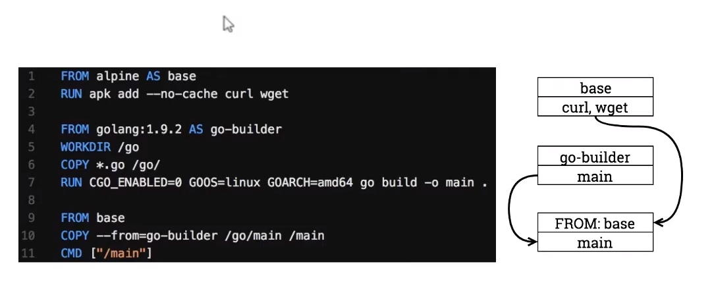
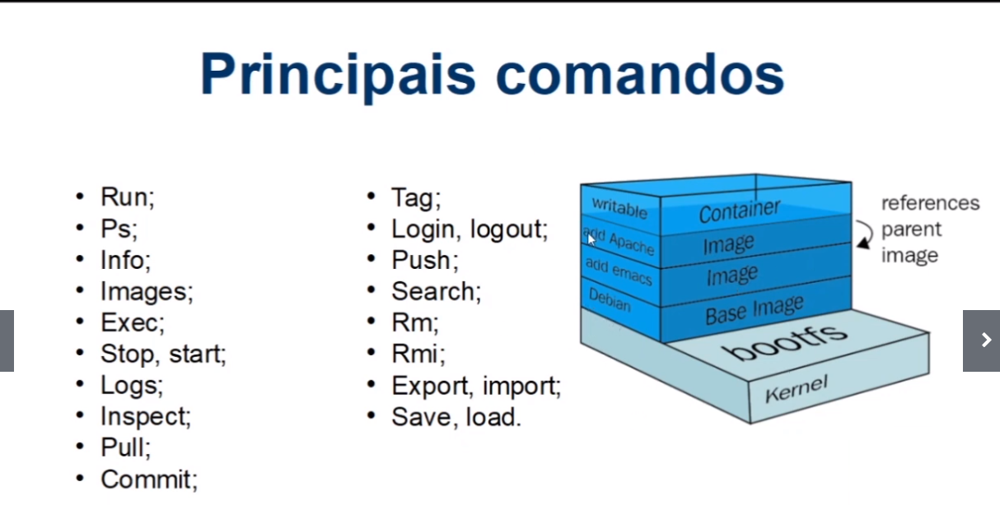

>**Arquitetura do Docker**

**CONTAINER-IMAGE**
    pacote com todas as dependencias que criam o nosso container

**DOCKER-FILE**
    arquivo de texto que contem todas as instrucoes para fazer o build da nossa imagem 

**BUILD**
    acao que cria uma imagem apartir do dockerfile , gera uma imagem aparti das instrucoes que foram passadas pelo dockerfile

**CONTAINER**
    e uma instancia na nossa imagem que representa uma execucao de uma aplicacao ou um processo ou um servico

**VOLUMES**
    permite que o nosso container armazene arquivos, dados em disco. se o container morrer as informacoes salvas no volume nao sao perdidas(persiste as informacoes no disco)

**TAG** ajuda no versionamento das nossas imagens

**MULTI-STAGE-BUILD**

    multi estagios de build , podemos usar no momento do build uma imagem para compilar uma aplicacão e chama uma outra imagem que faz o running na nossa aplicacao 

**REPOSITORY**
    colecao de imagens (uma caixa com varias imagens)

**REGISTRY**
    servico que prover o acesso do nosso docker ao repositorio 

**DOCKER-HUB**
    repositorio publico para guardar as imagens(tanto publicas quanto privadas) produtos containeizados estao disponiveis no repositorio

**DOCKER-COMPOSE**
    e uma ferramenta para crias multiplos container com um simples comando.
    ![como tudo funciona] (imagens/01.png)

># 2 Tópico - Primeiros passos com o Docker

># Bibliografia - Links Extras

![] (https://docker-curriculum.com/)

![] (https://blog.hostone.com.br/host/)

![] (https://www.youtube.com/watch?v=0cDj7citEjE)

![] (https://www.hostinger.com.br/tutoriais/remover-imagem-docker)

![] (https://www.hostinger.com.br/tutoriais/remover-imagens-docker)

![] (https://www.hostinger.com.br/tutoriais/?s=docker)

![] (https://www.youtube.com/watch?v=mfX0y9zvRMk)

![] (https://www.youtube.com/watch?v=a0ts9vhaY0w)

![] (https://labs.play-with-docker.com/)

![] (https://aws.amazon.com/pt/)

![] (https://aws.amazon.com/pt/ec2/?ec2-whats-new.sort-by=item.additionalFields.postDateTime&ec2-whats-new.sort-order=desc)

![] (https://aws.amazon.com/pt/elasticbeanstalk/)

![] (https://aws.amazon.com/pt/ecs/?whats-new-cards.sort-by=item.additionalFields.postDateTime&whats-new-cards.sort-order=desc&ecs-blogs.sort-by=item.additionalFields.createdDate&ecs-blogs.sort-order=desc)

![] (https://docs.docker.com/desktop/mac/install/)

![] (https://docs.docker.com/engine/install/ubuntu/)

![] (https://docs.docker.com/desktop/windows/install/)

![] (https://blog.geekhunter.com.br/o-que-e-deploy/)

![] (https://www.redhat.com/pt-br/topics/virtualization/what-is-a-hypervisor)
