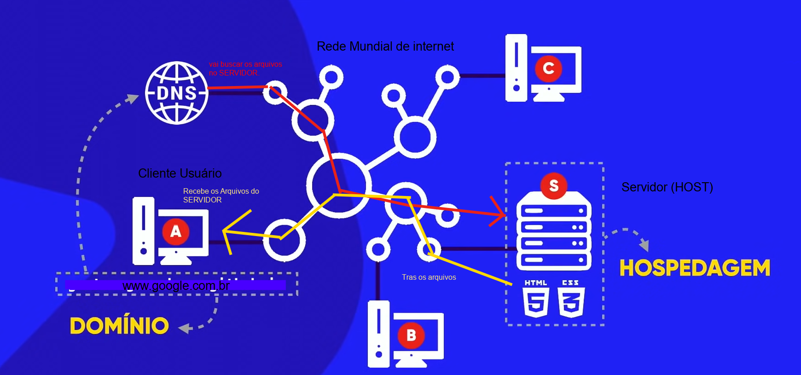
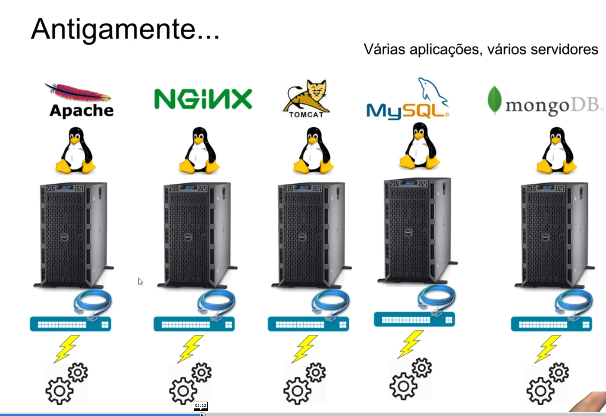
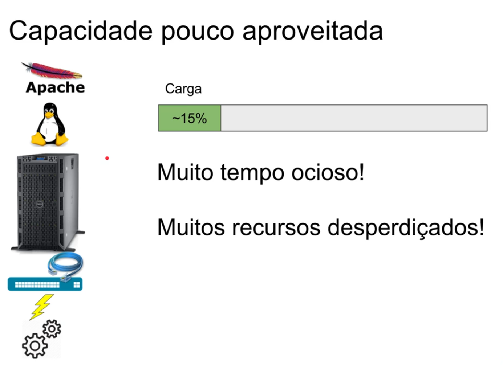
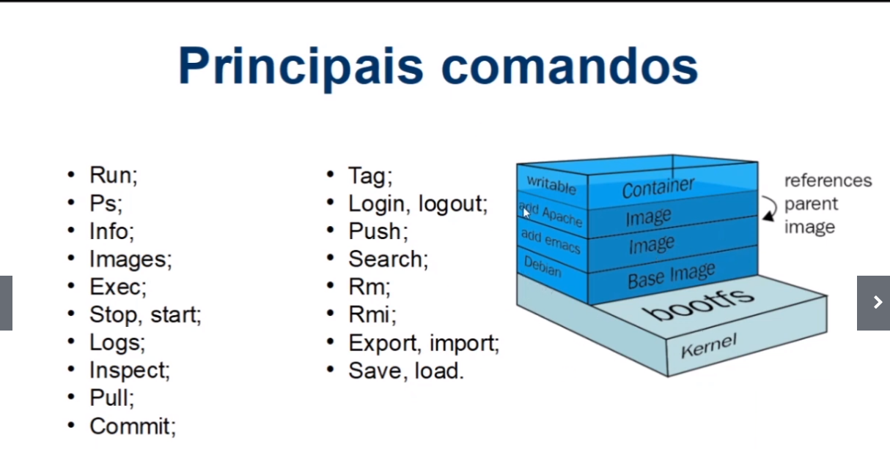

># DOCKER - VIRTUALIZAÇÃO E CONTAINERS

(Curso base das anotacoões)  https://web.digitalinnovation.one/course/introducao-a-orquestracao-de-conteineres-com-docker/learning/c85d8e63-3431-4769-8d8d-39b019ad979f/

># 1 Tópico - Introdução ao tema Conceitos iniciais

>**O Porque de Utilizar o Docker - um Pouco Sobre a Historia dessa Tecnologia** 
*  A evolução do host de aplicações (host=hospedagem, serviço que armazena os arquivos no servidor)  

* Host significa "Hoespedeiro"quem hospeda ou mantém uma Estrutura de tecnologia. (na NUvem)  >> hospedagem de aplicaçÕes, serviços // SERVIDOR \\\

    * web sites 
    * sistema completo
    * aplicação
    * Estrutura inteira de DataCenter
    ---

* Host pode também significar ,qualquer computador ou máquina conectadoa uma rede , que armazena qualquer tipo de informação.

    QUALQUER COMPUTADOR QUE ESTA CONECTADO A OUTRAS MÁQUINAS ATRAVÉS DE CONEXÃO

* Entendendo a Evolução do host de Aplicações e a causa do Surgimento do Docker(tecnologia de Container)

~ Como era antigamente >>> várias Aplicações , vários servidores rodando com cada aplicação. 

~ Cada aplicação em um servidor fisico.

~ Cada servidor um sistema Operacional para instalar a aplicação

e como um projeto tem todas essa aplicações cada uma cuidando de uma parte do meu sistema inteiro, então para que elas se comunicassem era necessário a conexão entre elas , e isso era feito atraves de cabos de rede que permitem a comunicação na rede .( Uma rede para cada aplicação)

* Toda essa estrutura gera um custo

1. um servidor por aplicação 
2. um sistema operacional por servidor
3. uma rede para cada servidor se comunicar
 
    (cabos de rede) 
    (energia para muitas máquinas) 
    (configuraçÕes e atualizações)

Para manter toda essa estrutura funcionando , era necessario:

*** manutenção tanto da parte fisica Hardware (Hd -Memória - Processador)

***    como da parte lógica software (Atualizações de sistemas e programas)

* Essa era a estrutura para manter uma aplicação/sistema completo Rodando na internet.

por causa de todo esse processo o DePLOY de uma aplicação era muito lento (compra de um novo servidor e todo o processo de configuração)

O que é DePLOY ? quando vamos disponibilizar o sistema em um ambiente de desenvolvimento para testes ou em produção. ou quando colocamos na nuvem(servidor).

* Outros problemas com esse tipo de arquitetura : 

    capacidade da máquina (servidor) - pouco aproveitada
    

* Uma aplicação rodando só, em uma máquina com muitos recursos , a aplicação roda consumindo uma capacidade baixa dos recursos que a máquina tem.

Todo o recurso que era investido na máquina(servidor) como : Muita memória ram , Muito Hd disco rigido, Muito processador.

tudo isso ficava a maior parte do tempo Ocioso(sem usar) porque a aplicação consumia pouco... então por que tanto recurso investido ?

    Para que o servidor continuasse funcionando quando tivesse muitos acessos simultaneos.

Não era todo dia que isso acontecia , então ficava muuito tempo Ocioso, muitos Recursos desperdiçados.

* melhorando a situação de um servido Ocioso , curso demorado e desperdicio de Recursos >>> SURGIU A VIRTUALIZAÇÃO  - 

  

>**Arquitetura do Docker**

**CONTAINER-IMAGE**
    pacote com todas as dependencias que criam o nosso container

**DOCKER-FILE**
    arquivo de texto que contem todas as instrucoes para fazer o build da nossa imagem 

**BUILD**
    acao que cria uma imagem apartir do dockerfile , gera uma imagem aparti das instrucoes que foram passadas pelo dockerfile

**CONTAINER**
    e uma instancia na nossa imagem que representa uma execucao de uma aplicacao ou um processo ou um servico

**VOLUMES**
    permite que o nosso container armazene arquivos, dados em disco. se o container morrer as informacoes salvas no volume nao sao perdidas(persiste as informacoes no disco)

**TAG** ajuda no versionamento das nossas imagens

**MULTI-STAGE-BUILD**

    multi estagios de build , podemos usar no momento do build uma imagem para compilar uma aplicacão e chama uma outra imagem que faz o running na nossa aplicacao 

**REPOSITORY**
    colecao de imagens (uma caixa com varias imagens)

**REGISTRY**
    servico que prover o acesso do nosso docker ao repositorio 

**DOCKER-HUB**
    repositorio publico para guardar as imagens(tanto publicas quanto privadas) produtos containeizados estao disponiveis no repositorio

**DOCKER-COMPOSE**
    e uma ferramenta para crias multiplos container com um simples comando.
    ![como tudo funciona] (imagens/01.png)

># 1 Tópico - Primeiros passos com o Docker

># Bibliografia - Links Extras

![] (https://docker-curriculum.com/)

![] (https://blog.hostone.com.br/host/)

![] (https://www.youtube.com/watch?v=0cDj7citEjE)

![] (https://www.hostinger.com.br/tutoriais/remover-imagem-docker)

![] (https://www.hostinger.com.br/tutoriais/remover-imagens-docker)

![] (https://www.hostinger.com.br/tutoriais/?s=docker)

![] (https://www.youtube.com/watch?v=mfX0y9zvRMk)

![] (https://www.youtube.com/watch?v=a0ts9vhaY0w)

![] (https://labs.play-with-docker.com/)

![] (https://aws.amazon.com/pt/)

![] (https://aws.amazon.com/pt/ec2/?ec2-whats-new.sort-by=item.additionalFields.postDateTime&ec2-whats-new.sort-order=desc)

![] (https://aws.amazon.com/pt/elasticbeanstalk/)

![] (https://aws.amazon.com/pt/ecs/?whats-new-cards.sort-by=item.additionalFields.postDateTime&whats-new-cards.sort-order=desc&ecs-blogs.sort-by=item.additionalFields.createdDate&ecs-blogs.sort-order=desc)

![] (https://docs.docker.com/desktop/mac/install/)

![] (https://docs.docker.com/engine/install/ubuntu/)

![] (https://docs.docker.com/desktop/windows/install/)

![] (https://blog.geekhunter.com.br/o-que-e-deploy/)

![] (https://www.redhat.com/pt-br/topics/virtualization/what-is-a-hypervisor)
