># DOCKER - VIRTUALIZAÇÃO E CONTAINERS

># 1 Tópico - Introdução ao tema Conceitos iniciais

>**O Porque de Utilizar o Docker - um Pouco Sobre a História dessa Tecnologia** 
*  A evolução do host de aplicações (host=hospedagem, serviço que armazena os arquivos no servidor)  

* Host significa "Hospedeiro" quem hospeda ou mantém uma Estrutura de tecnologia. (na Nuvem)  >> hospedagem de aplicações, serviços (SERVIDOR)

```
* web sites 
* sistema completo
* aplicação
* Estrutura inteira de DataCenter
```

* Host pode também significar ,qualquer computador ou máquina conectado a uma rede , que armazena qualquer tipo de informação.

```
QUALQUER COMPUTADOR QUE ESTÁ LIGADO A OUTRAS MÁQUINAS ATRAVÉS DE CONEXÃO.
```

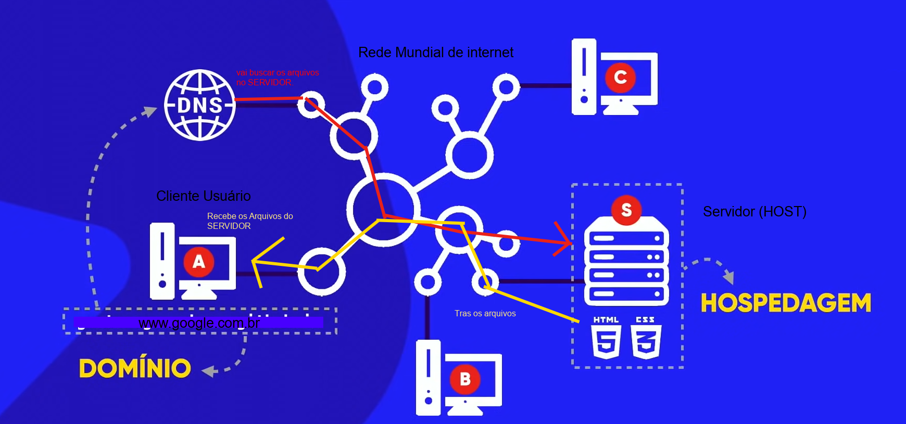

>**Entendendo a Evolução do host de Aplicações e a causa do Surgimento do Docker (tecnologia de Container)**

* Como era antigamente >>> várias Aplicações , vários servidores rodando com cada aplicação. 

* Cada aplicação em um servidor fisico.

* Cada servidor um sistema Operacional para instalar a aplicação

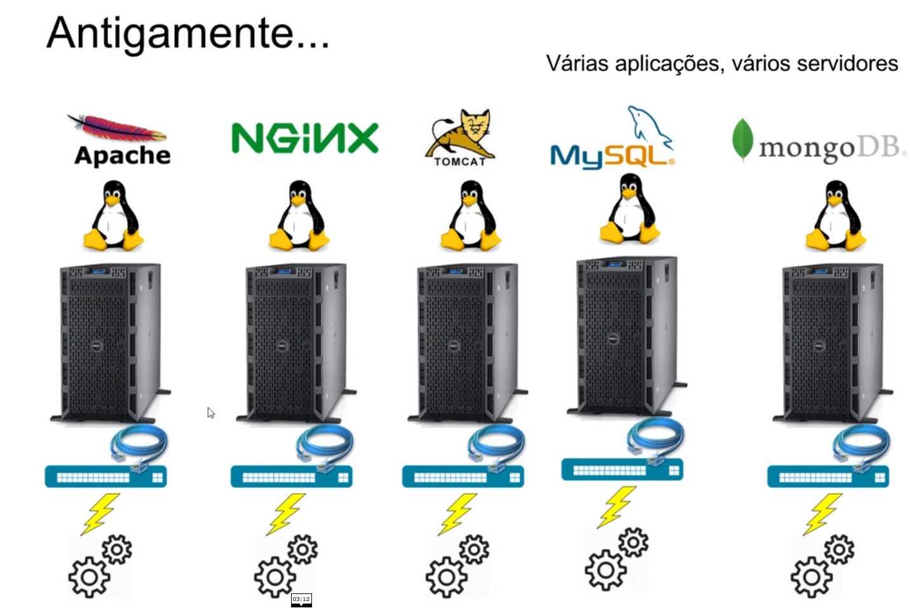

```
e como um projeto tem todas essa aplicações cada uma cuidando de uma parte do meu sistema inteiro, então para que elas se comunicassem era necessário a conexão entre elas , e isso era feito atraves de cabos de rede que permitem a comunicação na rede .( Uma rede para cada aplicação)
```

Toda essa estrutura gera um custo

1. um servidor por aplicação 
2. um sistema operacional por servidor
3. uma rede para cada servidor se comunicar

``` 
(cabos de rede) 
(energia para muitas máquinas) 
(configuraçÕes e atualizações)
```

Para manter toda essa estrutura funcionando , era necessario:

* manutenção tanto da parte fisica Hardware (Hd -Memória - Processador)

* como da parte lógica software (Atualizações de sistemas e programas)

* Essa era a estrutura para manter uma aplicação/sistema completo Rodando na internet.

por causa de todo esse processo o DePLOY de uma aplicação era muito lento (compra de um novo servidor e todo o processo de configuração)

```
O que é DePLOY ? quando vamos disponibilizar o sistema em um ambiente de desenvolvimento para testes ou em produção. ou quando colocamos na nuvem(servidor).
```

Outros problemas com esse tipo de arquitetura : 

```
capacidade da máquina (servidor) - pouco aproveitada
```   
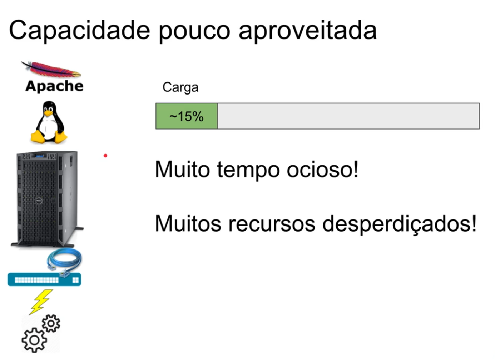

* Uma aplicação rodando só, em uma máquina com muitos recursos , a aplicação roda consumindo uma capacidade baixa dos recursos que a máquina tem.

* Todo o recurso que era investido na máquina(servidor) como : Muita memória ram , Muito Hd disco rigido, Muito processador.

* Tudo isso ficava a maior parte do tempo Ocioso(sem usar) porque a aplicação consumia pouco... então por que tanto recurso investido ?

```
Para que o servidor continuasse funcionando quando tivesse muitos acessos simultaneos.

Não era todo dia que isso acontecia , então ficava muuito tempo Ocioso, muitos Recursos desperdiçados.
```

* melhorando a situação de um servido Ocioso , custo demorado e desperdicio de Recursos >>> SURGIU A VIRTUALIZAÇÃO.


>**Melhorando a Situação : VIRTUALIZAÇÃO**

Várias maquinas virtuais ( criar um computador dentro de outro de forma lógica , virtualizando o Sistema Operacional )
´
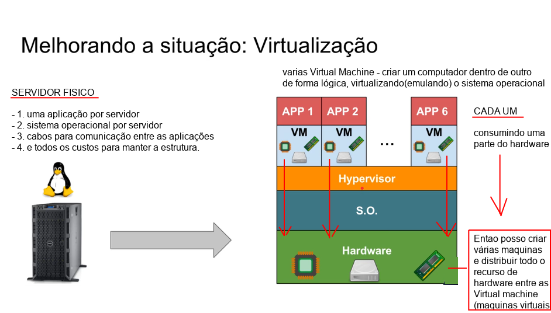

```
A virtualização resolveu a questão de ter vários servidores, um para cada aplicação, desperdiçando recursos.
```
* com a virtualização temos uma máquina com um hardware potente ( e podemos criar várias maquinas virtuais para rodar em uma única máquina fisica)

```
Assim não desperdiça recursos 
* só tem um custo de rede 
* só tem um custo de manutenção
```
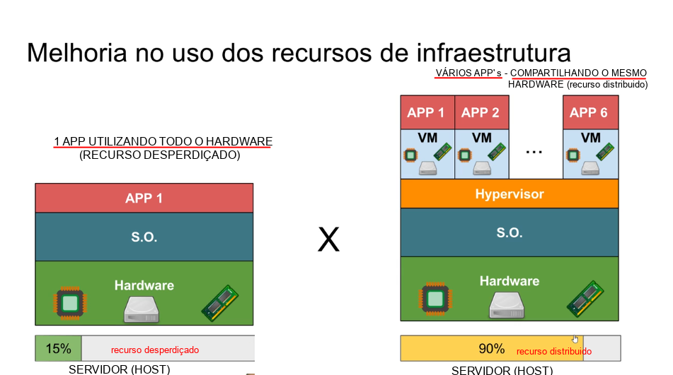

Diminuindo assim o custo de infraEstrutura

```
* Melhoria no uso dos recursos 
* Divide o hardware que estava ocioso
```

Pequenas máquinas virtuais cada uma consumindo uma parte do hardware

* Melhor aproveitamento do hardware fisico


```
Agiliza também a questão de querer subir uma nova aplicação , sendo necessário apenas a criação de uma nova maquina virtual para colocar essa nova aplicação.
```
Atualmente as máquinas virtuais estão sendo substituídas por containers (DOCKER)
```
Entendendo os problemas das maquinas virtuais ,e o por que de ter surgido os containers >> DOCKER
```
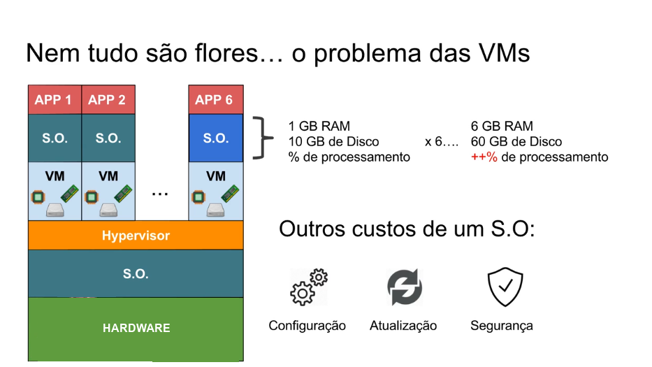

```
CADA APLICAÇÃO VAI PEDIR UM SISTEMA OPERACIONAL >>> E TODO SISTEMA OPERACIONAL TEM UM CUSTO.
```
* ENTAO SURGIU OS CONTAINERS PARA MELHORAR A SITUAÇÃO DAS VIRTUAL MACHINE (V.M)

>**A Era dos Containers (DOCKER)**

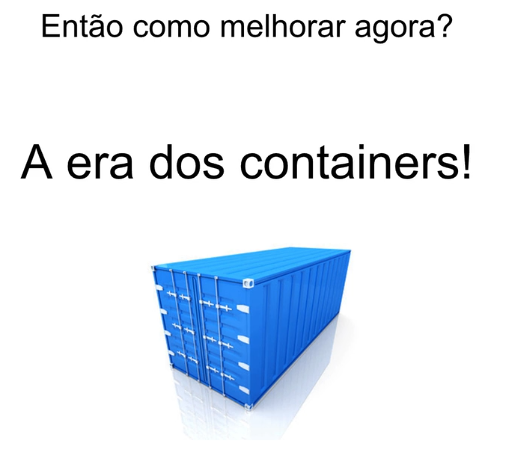

>**O que é um Container ?**

É o que vai conter a minha aplicação (container= contém)
```
A aplicação vai ser executada dentro desse container( isolando a aplicão)
e ele vai funcionar junto com o sistema Operacional
```
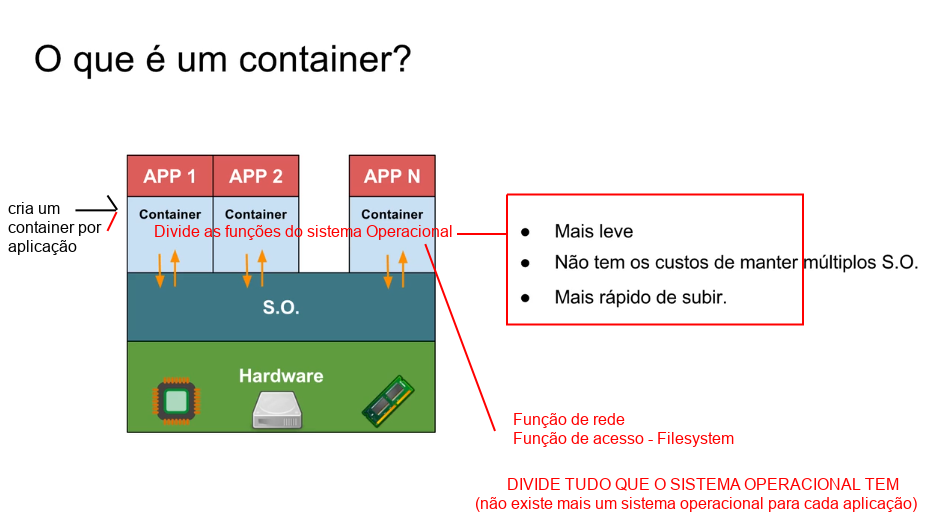

Cria um container por aplicação  - esses vários container vão dividir as funções do sistema Operacional

* Vão dividir tudo que o sistema operacional tem
* Não existe mais um sistema operacional para cada aplicação
* As aplicações estão dividindo o mesmo sistema Operacional que esta em cima do hardware.

```
Com isso reduzindo todo aquele custo: 
*   Manter um sistema;
*   Atualizar;
*   Custo de disco(HD);
*   Memória RAM;
*   Custo de Processador;
```
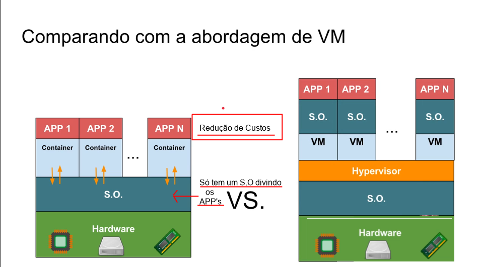

Por que precisamos dos container's Fazendo essa separação para que cada aplicação funcione dentro, possa dividir as funções do Sistema Operacional? 

```
Por que não instalar todas as aplicações direto na máquina , Já que estamos usando o mesmo sistema Operacional
```
**VAMOS ENTENDER**

O sistema operacional que usamos funciona da seguinte forma:

* Todos os aplicativos são instalados direto na máquina , sem a necessidade dessa separação das aplicações por container's

* Mas quando se trata de uma Estrutura Empresarial, existem alguns problemas que podem ocorrer, e estando todas as aplicações instaladas direto na máquina (sem a divisão dos container's) pode causar muitos Problemas.

```
Os Problemas dessa Abordagem
```
* Dois app's utilizando a mesma a porta de rede ? 

***Apache x Nginix >>> os dois querendo utilizar a porta 8080***

O sistema Operacional não vai permitir utilizar a mesma (vai dar problema se não tiver alguém para separar uma da outra).

```
O container serve para isso , para isolar uma aplicação da outra
```
* Se um aplicativo começar a consumir muito de uma recurso ( tipo CPU)

O aplicativo vai começar a travar o computador >> tomando todo o processamento da máquina, e existe outro aplicativo na máquina que ficou muito lento ( isso acontece com muita frequencia se nós não limitarmos o App)

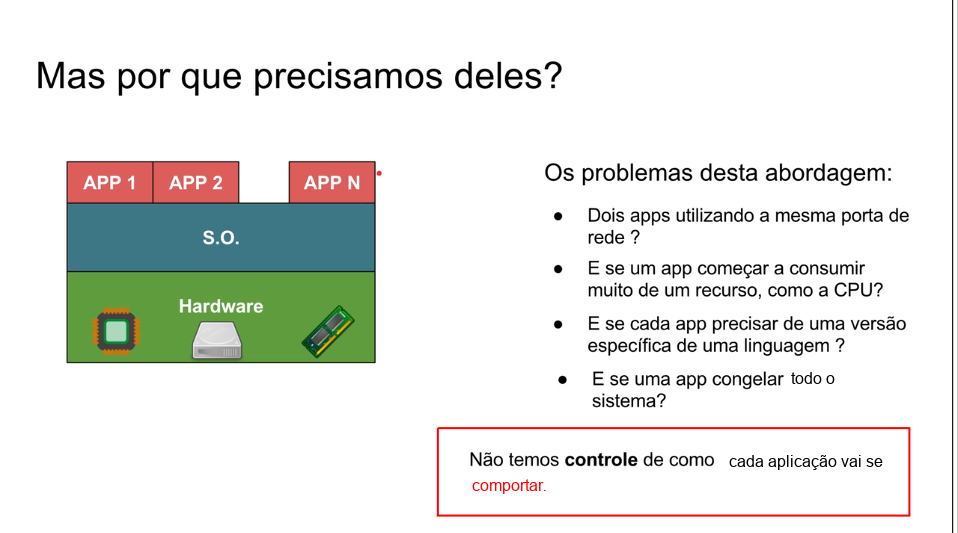

O container serve para evitar esse tipo de situação 

```
Onde uma aplicação pega todo o processamento da máquina para ela, travando o funcionamento dos demais aplicativos instalados.
```

* O container isola cada aplicação e limita quanto que cada aplicação vai poder consumir do Processador. Evitando o travamento do sistema e parar os outros aplicativos que estão na máquina.

E se cada App precisar de uma versão especifica de uma linguagem ?
```
Os container vão permitir fazer essas diferentes versões funcionarem, por que elas vão está rodando de forma isolada (dentro de um CONTAINER)

```

Evitando a incompatibilidade e sendo possivel rodar várias versões de um tecnologia na mesma máquina, sem interferencias.

o que muitas vezes seria impossivel de conseguir instalar direto na máquina (sem o isolamento dos Container's) Muitas vezes o sistema Operacional não permite ter várias versões de um mesmo programa , ele vai sempre tentar fazer uma atualização e acaba retirando a versão anterior.

* A instalação de várias versões seria impossivel de rodar sem haver conflitos 

```
Mas o container resolvem esse problema , isolando uma aplicação da outra.
```
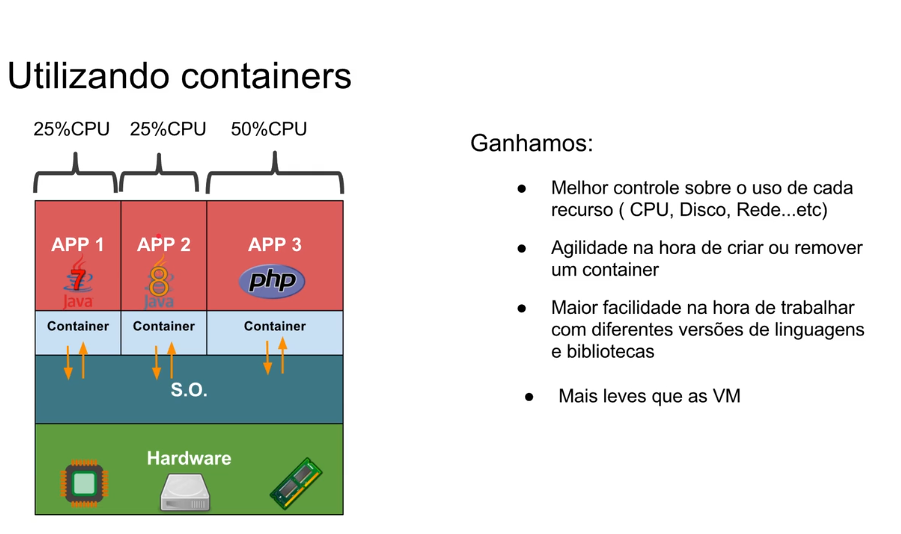

>**O funcionamento dos container's Esquematizado**

* Define o que vai ser utilizado em cada Aplicação ISOLADAMENTE
* Limita o uso da CPU por App.( se chegar no limite não vai derrubar/travar os outros)

```
O QUE GANHAMOS COM OS CONTAINER'S
```
* Mais leves que as Máquinas virtuais
* Melhor controle sobre o uso d e cada recurso(Cpu - DiscoRigido - MemóriaRam)
*Agilidade na hora de criar ou remover um container e subir novamente uma aplicação.
* Maior facilidade na hora de trabalhar com diferentes versões de um mesmo Programa.

```
CONTAINER SÃO:

* LEVES;
* CONFIGURÁVEIS;
* CONSEGUIMOS ISOLAR UMA APLICAÇÃO;
* COMPARTILHA O MESMO SISTEMA OPERACIONAL;
* EVITA TER QUE CUIDAR DE DIVERSOS SISTEMAS 
OPEREACIONAIS, COMO FUNCIONA NAS VM'S
```
**O QUE O DOCKER FAZ?**

* Nos deixar trabalhar com container's, que é a melhor forma de se trabalhar com InfraEstrutura.

**O QUE é O DOCKER ?**

Docker inc.( Empresa ) antes se chamava DotCloud

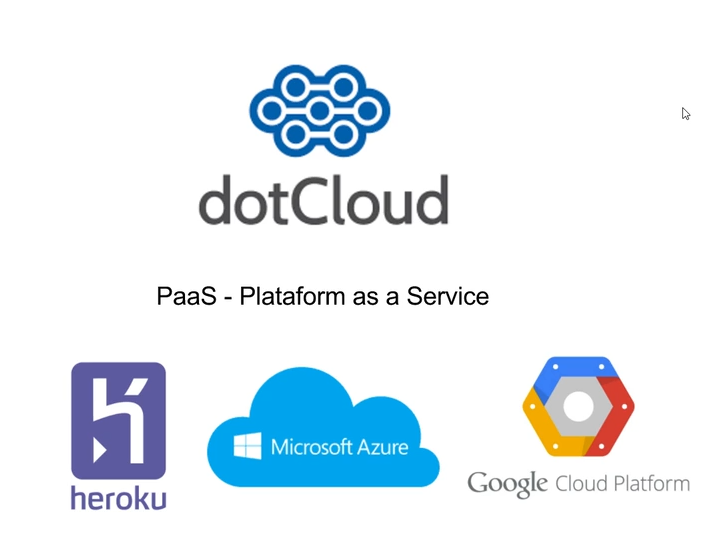


>**Arquitetura do Docker**

**CONTAINER-IMAGE**
    pacote com todas as dependencias que criam o nosso container

**DOCKER-FILE**
    arquivo de texto que contem todas as instrucoes para fazer o build da nossa imagem 

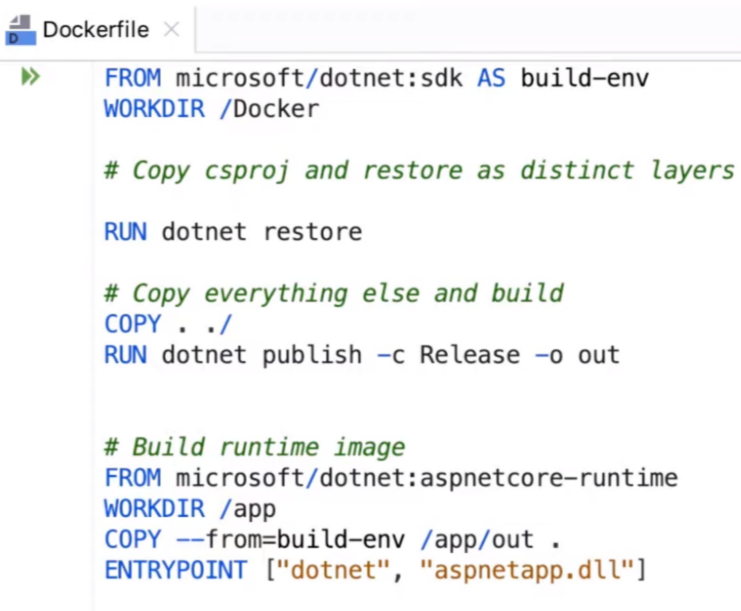

**BUILD**
    acao que cria uma imagem apartir do dockerfile , gera uma imagem aparti das instrucoes que foram passadas pelo dockerfile

**CONTAINER**
    e uma instancia na nossa imagem que representa uma execucao de uma aplicacao ou um processo ou um servico

**VOLUMES**
    permite que o nosso container armazene arquivos, dados em disco. se o container morrer as informacoes salvas no volume nao sao perdidas(persiste as informacoes no disco)

**TAG** ajuda no versionamento das nossas imagens

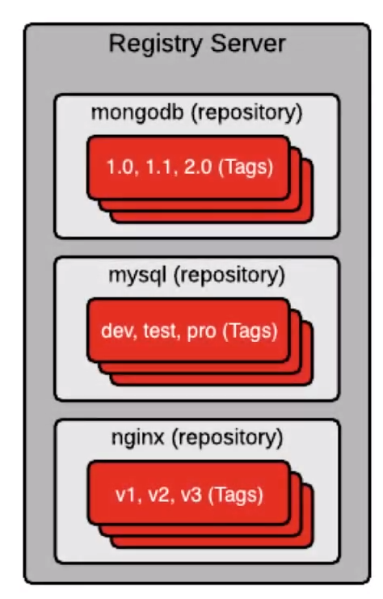

**MULTI-STAGE-BUILD**

    multi estagios de build , podemos usar no momento do build uma imagem para compilar uma aplicacão e chama uma outra imagem que faz o running na nossa aplicacao 
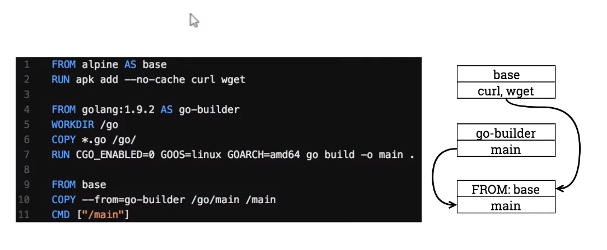

**REPOSITORY**
    colecao de imagens (uma caixa com varias imagens)

**REGISTRY**
    servico que prover o acesso do nosso docker ao repositorio 

**DOCKER-HUB**
    repositorio publico para guardar as imagens(tanto publicas quanto privadas) produtos containeizados estao disponiveis no repositorio

**DOCKER-COMPOSE**
    e uma ferramenta para crias multiplos container com um simples comando.
    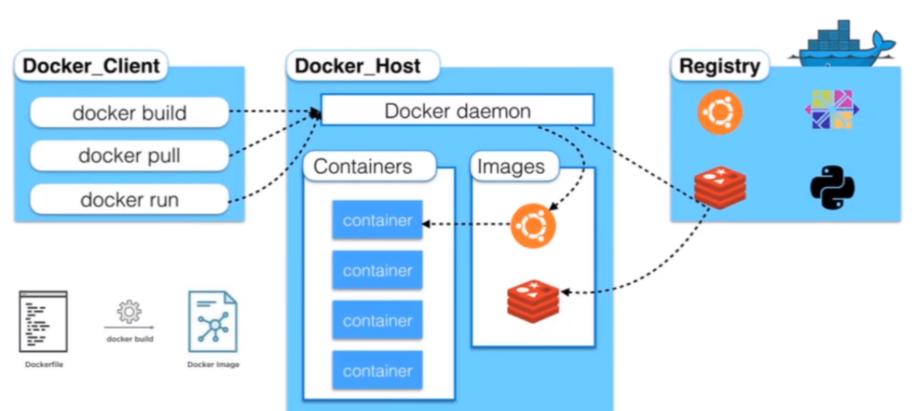

># Bibliografia - Links Extras

![] (https://docker-curriculum.com/)

![] (https://blog.hostone.com.br/host/)

![] (https://www.youtube.com/watch?v=0cDj7citEjE)

![] (https://www.hostinger.com.br/tutoriais/remover-imagem-docker)

![] (https://www.hostinger.com.br/tutoriais/remover-imagens-docker)

![] (https://www.hostinger.com.br/tutoriais/?s=docker)

![] (https://www.youtube.com/watch?v=mfX0y9zvRMk)

![] (https://www.youtube.com/watch?v=a0ts9vhaY0w)

![] (https://labs.play-with-docker.com/)

![] (https://aws.amazon.com/pt/)

![] (https://aws.amazon.com/pt/ec2/?ec2-whats-new.sort-by=item.additionalFields.postDateTime&ec2-whats-new.sort-order=desc)

![] (https://aws.amazon.com/pt/elasticbeanstalk/)

![] (https://aws.amazon.com/pt/ecs/?whats-new-cards.sort-by=item.additionalFields.postDateTime&whats-new-cards.sort-order=desc&ecs-blogs.sort-by=item.additionalFields.createdDate&ecs-blogs.sort-order=desc)

![] (https://docs.docker.com/desktop/mac/install/)

![] (https://docs.docker.com/engine/install/ubuntu/)

![] (https://docs.docker.com/desktop/windows/install/)

![] (https://blog.geekhunter.com.br/o-que-e-deploy/)

![] (https://www.redhat.com/pt-br/topics/virtualization/what-is-a-hypervisor)


