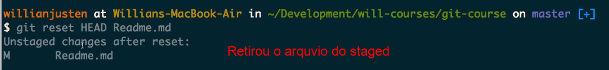
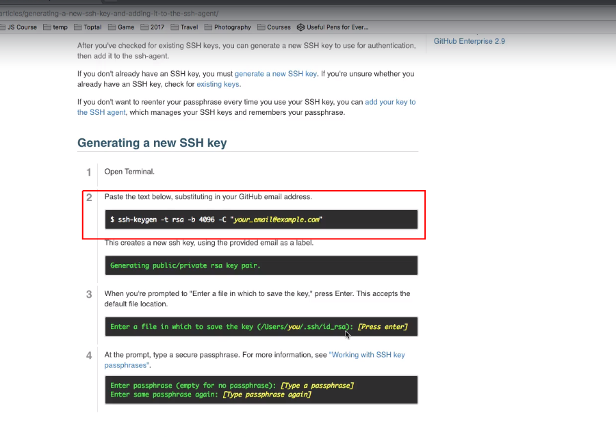

# CONTROLE DE VERSÃO - GIT E GITHUB
>>> ( Curso base das anotacoões ) (https://www.udemy.com/course/git-e-github-para-iniciantes/learn/lecture/5120486#overview)

># CONCEITO git - Repositorio local

    Controla varias versões de um arquivo versionando e tirando fotos(snapshots), guardando os estados dos arquivos(os arquivos que não foram modificados são levados juntos.

    (snapshots) Levam assim todos os arquivos juntos mesmo se eles não tiverem sido alterados, (ele faz um link simbólico mostrando que os arquivos estão indo ,mas que não foram modificados o sistema tira uma foto e manda junto com os arquivos que foram modificados) dessa forma nenhuma informacão se perde. 
    

>>## 2 pontos importantes do sistema git***             

    > 1- responsavel por versionar os arquivos do projeto, sem a necessidade de criar varios arquivos ,e varias versoes manualmente

    > 2- o git trabalha com os estados dos arquivos, diferente dos outros sistemas de versionamento que trabalham com as diferencas dos arquivos 

># CONCEITO github - Repositorio Remoto

    Servico de web onde podemos colocar os nossos projetos do git 
    é o repositório remoto. 

># CONFIGURACÕES INICIAS DO GIT 

***git config --global user.name "Seu nome"***  = salvar o nome do autor

***git config  --global user.email "seu Email"*** = salvar o email do autor

***git config  --global core.editor comando do editor que deseja abrir*** = vai selecionar o editor para ser utilizado pelo git para poder  fazer as modificacões de email e nome do autor - se voce nao selecionar o editor o linux abre por padrao o vim.

    ***git config --global user.name*** = vai mostrar o nome que esta configurado 
    ***git config --global user.email*** = vai mostrar o Email que esta configurado 
    ***git config --list*** = vai mostrar varias informacòes do git

># CRIANDO PASTAS -INICIANDO O VERSIONAMENTO com o repositorio local do git

   ***mkdir*** = cria uma pasta

    e dentro da pasta que foi criada dar o cOmando ***git init*** = inicia um repositório local, onde vamos trabalhar com as modificacões - é criado uma pasta.git onde vai esta guardado todas as modificacões
    

># UTILIZANDO EDITORES NO TERMINAL - editor vim

***vi "nome do arquivo"***
 
    Para inicia a edicão do arquivo pressiona a letra ***i*** = insert
    Quando finalizar pressiona a tecla ***esc*** =termina a secão
    E em seguida ***:wq*** = salvar e sair

># CICLO DE VIDA - STATUS DOS ARQUIVOS 

**UNTRACKED** = não marcado
    Momento que o arquivo foi adicionado dentro da pasta , mas o git não o reconhece por que nao foi feito nenhum versão.(nao  existe para o git)

**UNMODIFIED** = nao foi modificado 
    Quando adicionamos um arquivo com o ***git add*** mas nao foi feito nenhuma modificacão no arquivo, apenas foi adicionado ao git. (existe para o git)

**MODIFIED** = Modificado
    quando modificamos um arquivo que ja foi adicionado podemos jogar ele para uma area onde vai ser criada a versão
    
***AREA DE STAGED*** 
**STAGED** ESTADO
    Momento em que o arquivo é modificado
    onde vai ser criada uma versao, e no momento que o arquivo estiver pronto podemos dar o ***git commit***

    e quando finalizamos com o commit esses arquivos voltam para o UNTRACKTED com uma nova cara versao 2 ,por que ele ja crio uma versao 
    e entao volta para o inicio UNMODIFIED como versao 2 
    podemos fazer novas modificaoes e seguir todo o processo ate que seja criado uma nova versao, isso e o controle de versoes.

# CRIANDO ARQUIVOS DENTRO DO REPOSITORIO GIT -passo a passo de como acontece o versionamento.( CICLO DE VIDA DOS ARQUIVOS )

***mkdir*** = cria uma pasta

***git init*** = inicia um repositorio local do git 
dentro da pasta que foi criada , vai criar a pasta oculta .git, tornando  a nossa pasta um repositorio local do git , onde podemos fazer as modificacões.

se dermos o comando ***git status*** = vai mostrar que nao existe nada ainda para ser commitado 

 

não existe nenhum arquivo ainda no repositorio local.

***touch "nome do arquivo"*** = criar um arquivo vazio 
o arquivo foi criado dentro da pasta e vamos ver o git status

***git status*** = vai mostrar o ESTADO que o arquivo se encontra

    como apenas criamos um arquivo , mas nao modificamos nada nele vai mostrar que o arquivo estar em UNTRACKED** = não marcado

    se modificarmos o arquivo , tipo escrever algo dentro do arquivo que foi criado , e em seguida dar outro ***git status*** vai mostrar outro ESTADO

***git add*** = adiciona o arquivo ao staged

se digitar o ***git status*** agora o arquivo vai aparecer no staged (new file)foi adicionado ao git e esta preparado para commitar

    Se nesse momemto for feito uma modificacão no arquivo que acabou de ser adicionado o git vai rastrear essa modificacão
se digitar ***git status*** novamente, ele agora vai aparecer com a mensagem (modified : nome do arquivo) 

Esta preste a ser commitado , mas houve a alteracão, então ele mostra a modificacão >>> nesse caso é necessário fazer outro ***git add*** e entao o arquivo estara pronto para commmit

***git commit -m "mensagem sobre o commit"*** = o git vai criar uma imagem do arquivo (snapshot) uma versão.

    ***-m " "***
    usar sempre o campo de comentário para deixar registrado que tipo de modificacão você fez no arquivo. isso ajuda a identificar o historico dos commits e acompanhar o que esta sendo feito no projeto.

apos o commmit é gerado algumas informacões para acompanhar e fazer possiveis modificacões nos commits futuramente.

    1-Registra a mensagem que escrevemos 

    2-Gera um codigo de identificacão com varios numeros e letras - esse codigo é chamado de HASH

    3-Mostra a Branch onde esta o commit

    4-mostra quantos arquivos foram commitados 

    5-e se houve alguma insercão/modificacões nesse arquivo depois que ele foi adicionado pelo __ git add __ vai aparecer quantas vezes o arquivo foi modificado.

e depois de fazer o commit ,se dermos um ***git status*** vamos ver que nao existe mais arquivos para trabalhar, vai informar que area de trabalho do diretorio está limpa.

>> NAO HÁ NADA PARA SER FEITO, POR QUE? as mudancas que foram feitas já foram salvas , então acontece o retorno do arquivo para o inicio do processo como um arquivo tipo versao 2 (com todas as modificacões que eu fiz) Nova versão [versionamento o proposito do git]

Se eu fizer novas modificacoes ele vai seguir o mesmo processo  

    teremos que adicionar com o ***git add*** e depois fazer o commit com o ***git commit*** para que essas novas alteracões sejam salvas numa nova versao do arquivo, tipo atualizacão de aplicativos que sempre voltam com novas funcionalidades. nesse caso o arquvio vai ser salvo com tudo que eu tiver feito de novo dentro dele . >>> esse é o CICLO do git.
    

    Se tentarmos fazer um commit dessa nova modificacão logo em seguida que foi feito a modificacao sem antes dar o ***git add*** ele vai dar erro.

Pede para que faca o ***git add*** desse arquivo novamente ,pois houve alteracoes e o git não vai poder commitar sem antes ter adicionado o arquivo a STAGED, que é o estado onde o arquivo fica, esperando para ser commitado.

>>É PRECISO ADICIONAR O ARQUIVO QUE FOI MODIFICADO.

RESUMO DOS 4 CICLO

    *antes de dar o comando ***git add***

1 [UNTRACKED] = ainda não foi visto pelo git  

     *depois de dar o comando ***git add*** onde o git conhece o arquivo e vai acompanhar as modificacões.

2 [UNMODIFIED] = não teve nenhuma modificacão. 

3 [MODIFIED] = o arquivo foi editado mais ainda nao foi levado para ser salvo. 

4 [STAGED] = estou pronto para ser commitado, para ser salvo.

># VISUALIZANDO LOGS - DOS ARQUIVOS E SUAS MODiFICACÕES

***git log*** = vai mostrar o historico dos arquivos e suas modificacões

 

    e tras algumas informacoes sobre o autor do commit , data , existe tambem um ID que é usado para identificar o commit

## Opcões que podem ser utilizadas no comando ***git log***

***git log --decorate*** = mostra mais informacoes relacionado aos commits

 

***git log --author="nome"*** = vai buscar os commits com o nome daquele autor que foi digitado

***git shortlog*** = mostra em ordem alfabetica quais foram os autores, quantos commits fizeram e mostra quais foram os commits atraves das mensagens que sao registradas no momemto do commit ***git commit -m " "***. 

***git shortlog -sn*** = quantidade de commits e nome da pessoa 

***git log --graph*** = mostra de forma grafica o que esta acontecendo com os commits 

    dentro do git log existe um ID de cada commit , é chamado de HASH (número que identifica o commit , cada commit tem um ID único)

copiando essa HASH podemos usar o 

***git show "HASH DO COMMIT"*** = vai rastrear as modificacões daquele commit ,trazendo detalhes sobre o que foi modificado, adicionado, removido, alterado. 

    conseguimos ver muitas informacões com o comando ***git log***

    o que foi adicionado 
    o que foi removido 
    o que foi alterado 
    o que foi modificado 
    quem comitou 
    quais foram os commits  
    quando foram feitos  
    qual o ID HASH do commit

é apartir do ***git log*** que vamos conseguir voltar ou avancar e não vai ter o risco de perder informacões dos nossos arquivos.

># VISUALIZANDO DIFERENCA ENTRE VERSÕES 

COMANDO QUE PODEMOS VER AS MUDANCAS ANTES MESMO DE FAZER O COMMIT

***git diff*** = vai mostrar as modificacões que foram feitas no arquivo

    cada mudanca que fizermos , conseguimos olhar com o ***git diff*** antes de fazer o commit. MUITO IMPORTANTE !!! utilizar sempre o git diff antes de fazer um commit

    assim conseguindo dar uma última olhada no que foi feito antes de fazer o commit.
    é uma forma de dar uma revisada antes do commit para evitar de mandar um commit com algum erro 

## Opcões que podem ser utilizadas no comando ***git diff***

***git diff --name-only*** = vai mostrar somente o nome do arquivo que foi modificado 

    Muito util quando existe uma quantidade enorme de commit , por que ele nao vai trazer informacões detalhadas de cada commit ,um grande log com todas as diferencas, apenas vai trazer a lista com o nome dos arquivos.

># DESFAZENDO COISAS COM O RESET

    Editando um arquivo e vendo que a mudanca que foi feita esta errada , como desfazer o que foi editado ?

***git checkout "nome do arquivo"*** = vai trazer o estado do arquivo antes da edicão.(vai resetar as mudancas)

e digitando o comando ***git diff*** novamente , não vai mostrar as alteracões , por que o git checkout desfez a edicão(deu um reset no arquivo).

editando e em seguida adicionando com ***git add*** , colocando o arquivo na area de Staged 

    diferente do processo anterior que apenas editamos o arquivo e desfazemos as mudancas sem ter adicionado ao 'git add'

Como foi feito o passo do ***git add*** o git diff não ver o que foi modificado por que o arquivo ja foi adicionado ao Staged e so falta commitar , so que eu nao quero fazer o commit por que houve erros no arquivo editado , como resolver isso ?. com o comando ***git reset***

***git reset HEAD "nome do arquivo*** = faz com que o arquivo volte do Staged , sai da fila de espera do commit ... e HEAD diz para qual local vai ser restaurado

    mostra que o arquivo foi retirado do Staged , e se for digitado git diff agora ele vai mostrar as modificacoes que foram feitas no arquivo.

    se digitar agora o ***git checkout*** ele vai retirar todas as mudancas 

Editando o arquivo e commitando direto . esse git commit -***a***m "mensagem" esse (-a ) antes do m , indica todos.

    esta la nos log´s Registrado esse commit , so que eu nao quero que fique la , por que houve alguma informacão que foi errada.

    COMO RESOLVER ISSO ? com o mesmo comando de git reset , e para esse caso existem 3 tipos 

***git reset --soft*** =
vai pegar as minhas modificacões e vai voltar os commits(matar o commit), mas o arquivo ja vai esta em Staged com a modificacao pronta para ser commitada dinovo

----

    se for commitado novamente , e formos ver la no git log , o commit que esta constando , é esse ultimo que foi adicionado , so observarmos a mensagem qe foi passada que conseguimos notar que mudou o commit , o anterior foi resetado , nao consta no historico de commit's

----

    Aquele outro commit anterior sumiu e foi substituido por esse ultimo que fizemos novamente , o reset --soft faz isso (reseta o commit ) retira o commit do historico e o arquivo retorna em Staged ( que significa que não vamos precisar passar o comando git add novamente para aquele arquivo , por que ele continuar adicionado , o reset --soft simplesmente so mexeu no historico do commit , removendo ele do commit , mas as modificacões que foram feitas no arquivo ainda estão la )

    Com o *git diff* podemos ver que realmente o arquivo ainda esta la com as modificacões que fiz , apenas voltou o commit , que não mais aparece no historico dos commits 

***git reset --mixed*** =
vai pegar as minhas modificacões e vai voltar os commits, mas so que vai voltar os arquivo para antes do Staged , é necessario adicionar o arquivo no Staged com o ***git add*** as modificacões que foram feitas no arquivo estao la , mas o arquvio nao está  adicionado  

     A diferenca do --soft para --mixed é que :
    
    --Soft = vai voltar o arquivo , mas ele fica no Staged , ja adicionado com o 'git add'

    --Mixed = vai voltar o arquivo para antes do Staged , é preciso adicionalo aos Staged com o 'git add' 

***git commit --hard*** =
Vai simplesmente ignorar a existencia daquele commit , vai matar tudo daquele commit e as modificacoes

    o arquivo foi commitado e agora vamos reseta-lo com --hard e ver o resultado

---

--- 

    Apos fazer o 'git Reset --hard' , o commit sai do Histórico e se dermos um 'git status' nao existe mais o arquivo nem no Staged adicionado ,e nem Antes do Staged para ser adicionado , as modificacões tambem foram desconsideradas, é necessario fazer as modificacões novamente para que o git rastreie as mudancas que fizermos.

    diferente das outras 2 formas , o git hard , vai desfazer tanto o commit , como retirar o arquivo do rastreamento do git , desfazendo as modificacoes. 

    muito importante , vai facillitar agente poder voltar em alguns historicos que houve erros , evitando subir coisas erradas no arquivo.

>>TER CUIDADO !! O git reset alterado o Historico do commit.
se voce ja tinha feito um push daquele commit( empurrado) . e for feito o reset com hard 

matou o commit e quer subir novamente o git vai identificar que existe uma diferenca entre o que voce esta tentando mandar e o que eu tenho, e vai pedir para atualizar >>> e so vai conseguir atualizar com force.

># TRABALHANDO COM GITHUB - REPOSITORIO REMOTO

CONCEITO - é um repositório remoto onde podemos guardar os nossos codigos versionados no git.

> # CRIANDO UM REPOSITORIO REMOTO

---

---

> # CONFIGURACÕES INICIAIS 

>> CRIANDO E ADICIONANDO UMA CHAVE SSH

