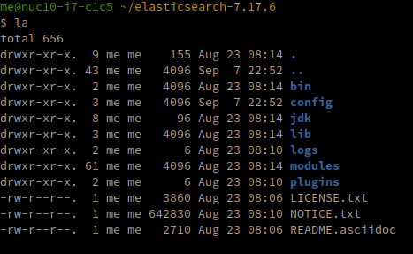
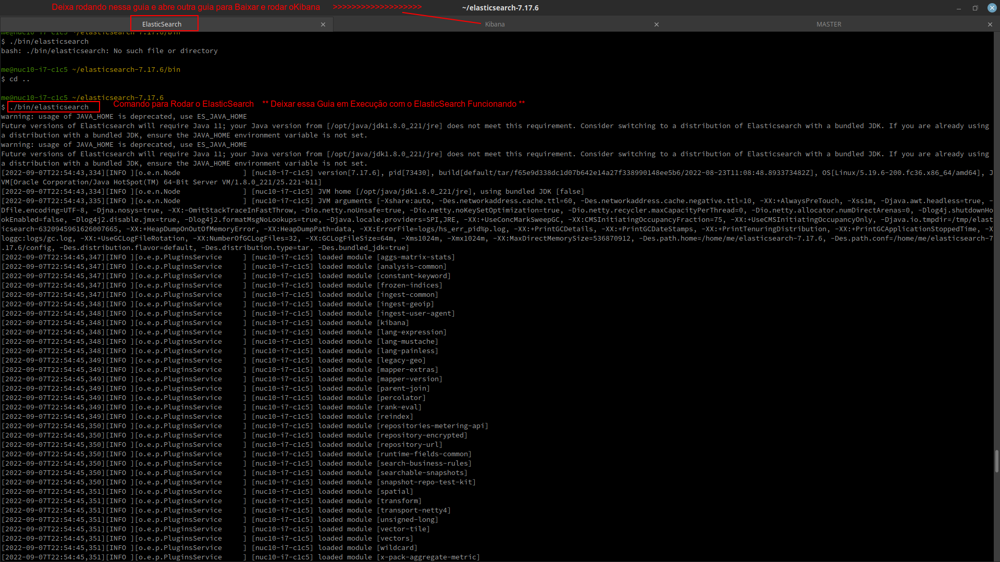
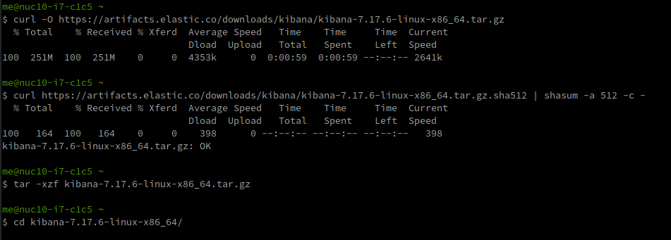
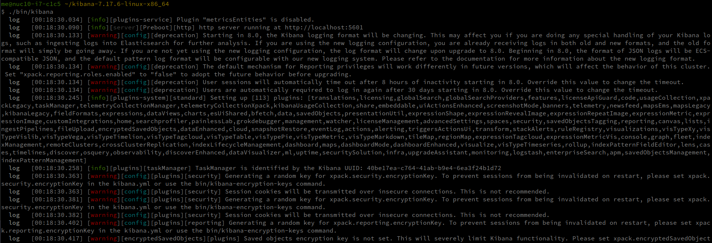
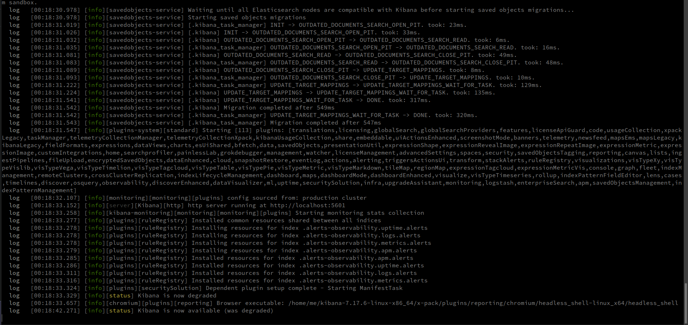

# O Que é Elasticsearch como Funciona e para que serve


Quando as pessoas perguntam, “o que é Elasticsearch?”, Alguns podem responder que é “um índice”, “um motor de busca”, um “banco de dados analítico”, “uma solução de big data”, que “é rápido e escalável”, ou que “É meio parecido com o Google”. Dependendo do seu nível de familiaridade com essa tecnologia, essas respostas podem ajudar ou confundir ainda mais. Mas a verdade é que todas essas respostas estão corretas e isso é parte do que é mesmo o Elasticsearch. Ao longo dos anos, o Elasticsearch e o ecossistema de componentes e serviços que cresceu em torno dele, chamado de “Elastic Stack”, foram usados ​​para um número crescente de casos de uso, desde uma pesquisa simples em um site ou documento, coleta e análise de dados de registro, até inteligência de negócios ferramenta para análise e visualização de dados.

**O que é Elasticsearch?**

De maneira simples, você pode pensar no Elasticsearch como um servidor que pode processar solicitações JSON e devolver dados JSON.

Elasticsearch é um mecanismo de pesquisa e análise de código aberto distribuído, construído no Apache Lucene e desenvolvido em Java. Começou como uma versão escalável da estrutura de pesquisa de código aberto Lucene e, em seguida, adicionou a capacidade de escalar horizontalmente os índices Lucene. O Elasticsearch permite que você armazene, pesquise e analise grandes volumes de dados com rapidez e quase em tempo real e forneça respostas em milissegundos. É capaz de obter respostas de pesquisa rápidas porque, em vez de pesquisar o texto diretamente, ele pesquisa um índice. Ele usa uma estrutura baseada em documentos em vez de tabelas e esquemas e vem com APIs REST abrangentes para armazenar e pesquisar os dados. Basicamente, você pode pensar no Elasticsearch como um servidor que pode processar solicitações JSON e devolver dados JSON.

**Como funciona o Elasticsearch?**

Para entender melhor como o Elasticsearch funciona, vamos cobrir alguns conceitos básicos de como ele organiza os dados e seus componentes de back-end.

**Conceitos Lógicos**

`Documentos`

Documentos são a unidade básica de informação que pode ser indexada no Elasticsearch expressa em JSON, que é o formato global de intercâmbio de dados da Internet. Você pode pensar em um documento como uma linha em um banco de dados relacional, representando uma determinada entidade – aquilo que você está procurando. No Elasticsearch, um documento pode ser mais do que apenas texto, pode ser qualquer dado estruturado codificado em JSON. Esses dados podem ser números, strings e datas. Cada documento possui um ID único e um determinado tipo de dados, que descreve o tipo de entidade do documento. Por exemplo, um documento pode representar um artigo de enciclopédia ou entradas de log de um servidor da web.   

`Índices`

Um índice é uma coleção de documentos com características semelhantes. Um índice é a entidade de nível mais alto que você pode consultar no Elasticsearch. Você pode pensar no índice como sendo semelhante a um banco de dados em um esquema de banco de dados relacional. Quaisquer documentos em um índice são geralmente relacionados logicamente. No contexto de um site de comércio eletrônico, por exemplo, você pode ter um índice para Clientes, um para Produtos, um para Pedidos e assim por diante. Um índice é identificado por um nome que é usado para se referir ao índice ao executar operações de indexação, pesquisa, atualização e exclusão nos documentos nele.

`Índice Invertido`

Um índice no Elasticsearch é, na verdade, o que chamamos de índice invertido, que é o mecanismo pelo qual todos os mecanismos de pesquisa funcionam. É uma estrutura de dados que armazena um mapeamento de conteúdo, como palavras ou números, até suas localizações em um documento ou conjunto de documentos. Basicamente, é uma estrutura de dados semelhante a um hashmap que o direciona de uma palavra para um documento. Um índice invertido não armazena strings diretamente e, em vez disso, divide cada documento em termos de pesquisa individuais (ou seja, cada palavra) e mapeia cada termo de pesquisa para os documentos nos quais esses termos de pesquisa ocorrem. Por exemplo, na imagem abaixo, o termo “melhor” ocorre no documento 2, portanto, está mapeado para esse documento. Isso serve como uma pesquisa rápida de onde encontrar os termos de pesquisa em um determinado documento. Usando índices invertidos distribuídos.


**Componentes de back-end**

`Conjunto`

Um cluster Elasticsearch é um grupo de uma ou mais instâncias de nó que estão conectadas. O poder de um cluster Elasticsearch está na distribuição de tarefas, pesquisa e indexação em todos os nós do cluster.

`Node (Nó)`

Um nó é um único servidor que faz parte de um cluster. Um nó armazena dados e participa dos recursos de indexação e pesquisa do cluster. Um nó Elasticsearch pode ser configurado de diferentes maneiras:

*Node Master (nó mestre)* – controla o cluster Elasticsearch e é responsável por todas as operações de todo o cluster, como criar / excluir um índice e adicionar / remover nós.

*Data Node (nó de dados)* – armazena dados e executa operações relacionadas a dados, como pesquisa e agregação.

*Client Node (nó cliente)* – encaminha solicitações de cluster para o nó mestre e solicitações relacionadas a dados para nós de dados.

`Shards (Fragmentos)`

Elasticsearch fornece a capacidade de subdividir o índice em várias partes chamadas shards. Cada fragmento é em si um “índice” totalmente funcional e independente que pode ser hospedado em qualquer nó de um cluster. Distribuindo os documentos em um índice em vários fragmentos e distribuindo esses fragmentos em vários nós, o Elasticsearch pode garantir redundância, o que protege contra falhas de hardware e aumenta a capacidade de consulta conforme os nós são adicionados a um cluster.

`Réplicas`

Elasticsearch permite que você faça uma ou mais cópias dos fragmentos de seu índice, que são chamados de “fragmentos de réplica” ou apenas “réplicas”. Basicamente, um shard de réplica é uma cópia de um shard primário. Cada documento em um índice pertence a um fragmento primário. As réplicas fornecem cópias redundantes de seus dados para proteger contra falhas de hardware e aumentar a capacidade de atender a solicitações de leitura, como pesquisa ou recuperação de um documento.

## The Elastic Stack (ELK)

Elasticsearch é o componente central do Elastic Stack, um conjunto de ferramentas de código aberto para ingestão, enriquecimento, armazenamento, análise e visualização de dados. É comumente referido como a pilha “ELK” após seus componentes Elasticsearch, Logstash e Kibana e agora também inclui Beats. Embora seja um mecanismo de pesquisa em seu núcleo, os usuários começaram a usar o Elasticsearch para dados de registro e queriam uma maneira de inserir e visualizar facilmente esses dados.

Kibana

Kibana é uma ferramenta de visualização e gerenciamento de dados para Elasticsearch que fornece histogramas, gráficos de linha, gráficos de pizza e mapas em tempo real. Ele permite que você visualize seus dados do Elasticsearch e navegue no Elastic Stack. Você pode selecionar a forma como dá forma aos seus dados começando com uma pergunta para descobrir aonde a visualização interativa o levará. Por exemplo, como Kibana é frequentemente usado para análise de log, ele permite que você responda a perguntas sobre a origem de seus acessos na web, seus URLs de distribuição e assim por diante. Se você não está construindo seu próprio aplicativo em cima do Elasticsearch, Kibana é uma ótima maneira de pesquisar e visualizar seu índice com uma interface do usuário poderosa e flexível. No entanto, uma grande desvantagem é que cada visualização só pode funcionar em um único índice / padrão de índice. Então, se você tiver índices com dados estritamente diferentes, você terá que criar visualizações separadas para cada um. 

Logstash

Logstash é usado para agregar e processar dados e enviá-los ao Elasticsearch. É um pipeline de processamento de dados do lado do servidor de código aberto que ingere dados de uma infinidade de fontes simultaneamente, os transforma e os envia para coleta. Ele também transforma e prepara os dados independentemente do formato, identificando campos nomeados para construir a estrutura e os transforma para convergir em um formato comum. Por exemplo, uma vez que os dados costumam ser espalhados por diferentes sistemas em vários formatos, o Logstash permite que você vincule diferentes sistemas, como servidores da web, bancos de dados, serviços da Amazon AWS, etc. e publique dados para qualquer lugar que seja necessário em um fluxo contínuo.

Beats

O Beats é uma coleção de agentes de envio de dados leves e de propósito único usados ​​para enviar dados de centenas ou milhares de máquinas e sistemas para Logstash ou Elasticsearch. Os Beats são ótimos para coletar dados, pois podem ficar em seus servidores, com seus contêineres ou implantar como funções e, em seguida, centralizar dados no Elasticsearch. Por exemplo, o Filebeat pode ficar em seu servidor, monitorar arquivos de log conforme eles chegam, analisá-los e importar para o Elasticsearch quase em tempo real.

## Para que é usado o Elasticsearch?

Agora que temos uma compreensão geral do que é Elasticsearch, os conceitos lógicos por trás dele e sua arquitetura, temos uma noção melhor de por que e como ele pode ser usado para uma variedade de casos de uso. A seguir, examinaremos alguns dos principais casos de uso do Elasticsearch e forneceremos exemplos de como as empresas o estão usando hoje.

**Casos de uso primários**

`Pesquisa de aplicativo` – Para aplicativos que dependem fortemente de uma plataforma de pesquisa para acesso, recuperação e relatório de dados.

`Pesquisa de sites` – Os sites que armazenam uma grande quantidade de conteúdo consideram o Elasticsearch uma ferramenta muito útil para pesquisas eficazes e precisas. Não é nenhuma surpresa que o Elasticsearch esteja ganhando cada vez mais terreno na esfera do domínio de pesquisa de sites. 

`Pesquisa corporativa` – O Elasticsearch permite pesquisa em toda a empresa que inclui pesquisa de documentos, pesquisa de produtos de comércio eletrônico, pesquisa de blogs, pesquisa de pessoas e qualquer forma de pesquisa que você possa imaginar. Na verdade, ele tem penetrado e substituído continuamente as soluções de pesquisa da maioria dos sites populares que usamos diariamente. De uma perspectiva mais específica da empresa, o Elasticsearch é usado com grande sucesso em intranets corporativas.

`Log e análise de log` – Como discutimos, Elasticsearch é comumente usado para ingerir e analisar dados de log quase em tempo real e de maneira escalonável. Ele também fornece insights operacionais importantes sobre métricas de log para conduzir ações. 

`Métricas de infraestrutura e monitoramento de contêineres` – Muitas empresas usam a pilha ELK para analisar várias métricas. Isso pode envolver a coleta de dados em vários parâmetros de desempenho que variam de acordo com o caso de uso.

`Análise de segurança` – Outra grande aplicação de análise do Elasticsearch é a análise de segurança. Logs de acesso e logs semelhantes relativos à segurança do sistema podem ser analisados ​​com a pilha ELK, fornecendo uma imagem mais completa do que está acontecendo em seus sistemas em tempo real.

`Análise de negócios` – Muitos dos recursos integrados disponíveis no ELK Stack o tornam uma boa opção como ferramenta de análise de negócios. No entanto, existe uma curva de aprendizado acentuada para implementar este produto e na maioria das organizações. Isso é especialmente verdadeiro nos casos em que as empresas têm várias fontes de dados além do Elasticsearch – já que Kibana só funciona com dados do Elasticsearch. 

**Casos de uso da empresa**

- `Netflix `

A Netflix conta com o ELK Stack em vários casos de uso para monitorar e analisar as operações de atendimento ao cliente e os logs de segurança. Por exemplo, Elasticsearch é o mecanismo subjacente por trás de seu sistema de mensagens. Além disso, a empresa escolheu o Elasticsearch por sua fragmentação e replicação automáticas, esquema flexível, bom modelo de extensão e ecossistema com muitos plug-ins. A Netflix tem aumentado constantemente o uso do Elasticsearch de algumas implantações isoladas para mais de uma dúzia de clusters consistindo de várias centenas de nós.

- `Ebay`

Com inúmeros casos de uso de pesquisa e análise de texto críticos para os negócios que utilizam Elasticsearch como backbone, o eBay criou uma plataforma customizada ‘Elasticsearch-as-a-Service’ para permitir fácil provisionamento de cluster Elasticsearch em sua plataforma interna de nuvem baseada em OpenStack.

- `Walmart`

O Walmart utiliza o Elastic Stack para revelar o potencial oculto de seus dados para obter insights sobre os padrões de compra do cliente, rastrear métricas de desempenho da loja e análises de feriados – tudo quase em tempo real. Ele também aproveita os recursos de segurança do ELK para segurança com SSO, alertando para detecção de anomalias e monitoramento para DevOps

## Baixando e rodando o ElasticSearch e o Kibana

## ElasticSearch

**comando para baixar descompactar e entrar no Diretório para rodar o executavel do programa**

`Baixando o arquivo e indo para o diretório `
```
wget https://artifacts.elastic.co/downloads/elasticsearch/elasticsearch-7.17.6-linux-x86_64.tar.gz
wget https://artifacts.elastic.co/downloads/elasticsearch/elasticsearch-7.17.6-linux-x86_64.tar.gz.sha512
shasum -a 512 -c elasticsearch-7.17.6-linux-x86_64.tar.gz.sha512 
tar -xzf elasticsearch-7.17.6-linux-x86_64.tar.gz
cd elasticsearch-7.17.6/ 
```




`Executando o Programa`

```
./bin/elasticsearch
```
**Este Comando deve ser Executado estando dentro da Pasta onde se encontra o Arquivo Executavel ( Caminho ~/Elasticsearch-7.17.9/bin/elasticsearch )**



## Kibana
**comando para baixar descompactar e entrar no Diretório para rodar o executavel do programa**

`Baixando o arquivo e indo para o diretório `
```
curl -O https://artifacts.elastic.co/downloads/kibana/kibana-7.17.6-linux-x86_64.tar.gz
curl https://artifacts.elastic.co/downloads/kibana/kibana-7.17.6-linux-x86_64.tar.gz.sha512 | shasum -a 512 -c - 
tar -xzf kibana-7.17.6-linux-x86_64.tar.gz
cd kibana-7.17.6-linux-x86_64/ 

```


`Executando o Programa`

```
./bin/kibana
```
**Este Comando deve ser Executado estando dentro da Pasta onde se encontra o Arquivo Executavel ( Caminho  ~/kibana-7.17.6-linux-x86_64/bin/kibana )**





Depois de Rodar os Dois Programas agora vamos acessar o Navegador com o Link para acessar a ferramenta no Browser

```
http://localhost:5601/app/dev_tools#/console.
```
## Tutorial | Documentação do ElasticSearch para Consultar mais Informações 

![] (https://www.elastic.co/guide/en/elasticsearch/reference/7.17/elasticsearch-intro.html)

## Links Úteis

![] (https://www.devmedia.com.br/o-que-e-elasticsearch/40207)

![] (https://blog.betrybe.com/tecnologia/elasticsearch/)